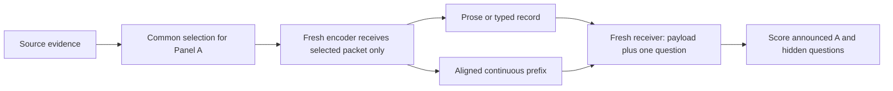

# Experiment 13: efficient and reusable non-language handoffs

**Status as of 8 September 2026:** a proposed protocol plus a prototype that passes 102
recorded offline checks. The prototype only calibrates vector norms; full StateBridge alignment
and validation on a real model on a GPU are still to do. See the companion
[research report](results/LATENT_COMMUNICATION_PIVOT_REPORT.md) and
[supervisor decision report](results/LATENT_PIVOT_NEXT_EXPERIMENT_2026-09-08.md). This is a
separate branch of the research programme and does not replace Experiment 12.

## Protocol clarifications before the first GPU run

Where the budget description further down is ambiguous, these clarifications take precedence.
They are requirements of the protocol; the current prototype does not necessarily enforce them
yet.

- **Budget.** B is the total number of extra positions the receiver reads, including any
  arm-specific schema, headers and anchors. The number of latent vectors is K = B minus that
  overhead. Development uses total caps of 32, 64 and 128. Before any test evaluation,
  confirmation fixes two shared caps, provisionally 32 and 64, and the 12-cell count refers to
  those two caps. The position-saving criterion is the ratio of the mean number of added
  positions actually used, and every message must also meet its hard cap on its own.
- **Text comparator.** On development data, pick the text format with the highest mean
  current-plus-orthogonal utility, among prose and records that keep at least half of the
  direct-source future utility, and break ties by lower measured cost. Both primary systems
  must also keep a meaningful future-utility floor in confirmation. Otherwise, being
  noninferior to a text baseline that is already uninformative would not support any claim
  about reusable communication. Add contrasts against half the direct-source future utility to
  the family of simultaneous intervals; with four contrasts, one-sided 98.75% Bonferroni bounds
  are a conservative choice. A different pair of rates may be chosen only on development data.
  Always include the generic text reference, whichever primary comparator is chosen.
- **Source-free replay.** Replaying without the source changes activation distributions,
  positions and alignment, not just what information is available. A drop in performance is
  therefore *consistent with* the source contributing, not proof of it. To attribute a specific
  fact, keep the visible transcript fixed, replace an omitted B fact in the source with a
  length-matched alternative, teacher-force the transcript, and compare how often the receiver
  follows the changed fact with a sham change to an irrelevant detail. Keep the position
  conventions and the mapping procedure fixed, and report any per-message alignment changes.
- **Source admission.** Fix the rules for admitting sources without looking at channel
  performance. No confirmation source may be excluded because one communication arm does badly
  on it.
- **Amortisation.** n is the total number of times a receiver uses the message, including the
  current question. Charge one transfer when a payload is stored once at one receiver, and
  charge repeated transfers only when it is actually sent again. Resetting a cache does not by
  itself mean the payload was sent over the network again.

## 1. Research question and scope

Can a non-language interface between agents reduce how much context the receiver uses, or the
end-to-end inference cost, while keeping the handoff useful both for its announced task and for
later questions that nobody announced?

Start with one handoff, one frozen backbone model and fixed sources. Questions and final answers
stay in natural language; only the payload passed between the agents changes. Keep three kinds
of payload apart: compact symbolic text, continuous prefixes and full KV-state transfer. They are
not interchangeable meanings of "latent token".

Hypotheses, to be tested rather than assumed:

- **H1, context efficiency:** a compact latent payload can match strong text on both current and
  hidden questions while adding fewer receiver positions.
- **H2, specialisation persists:** conditioning on A can still improve A and reduce orthogonal
  future utility when the channel is continuous.
- **H3, the source state contributes:** any advantage that source-conditioned states have on
  hidden questions can shrink when the same visible transcript is re-encoded without access to
  the source.
- **H4, resources diverge:** saving positions does not necessarily save bytes or total runtime.

The research report reviews Interlat, StateBridge and DiffMAS. This experiment starts from a
**one-handoff adaptation of StateBridge**, not a reproduction of any of their complete systems.

## 2. Two causal comparisons, kept separate

**Panel A: selection is fixed before encoding.** Reuse an evidence packet P that has already
been selected. Every prose, record and latent encoder starts fresh, receives only P and the same
permitted writing instruction, and cannot see the source cards that were left out. The receiver
gets only the declared message and the question being evaluated. This measures how well each
channel encodes and decodes, given the same available evidence.

**Panel B: full-source system comparison.** Every sender receives the same complete source E,
and each channel is run with both generic and A-conditioned writing. Encoding and selection can
both differ, as part of the policy. This measures practical end-to-end usefulness, not the pure
effect of the serialization format.

Do not pool the two panels. A latent advantage that shows up only in Panel B does not show that
the channel recovers from omitted evidence in Panel A.

## 3. Environment and frozen model

The first candidate is `Qwen/Qwen3-4B` in BF16, pinned to one exact weight and tokenizer
revision. Writer and reader share the same frozen weights, `enable_thinking=false` is set
explicitly, decoding is deterministic and answers are capped at 48 new tokens. Record the exact
prompt template and generation config. This model and mode must pass the direct-source
development check before confirmation.

Use a separate PyTorch/Transformers backend, because the text API in `src/llm.py` can neither
expose nor accept hidden states. Leave the existing dependencies and experiments untouched, and
pin a separate environment for the latent work once a smoke test runs. Do not quantize the
initial baseline, since quantization would be one more treatment.

The plan assumes Bunya as the execution platform. The saved SSH master connection was not
running when checked on 7 September, and it has not been checked again for this report. Before
running: open the normal interactive connection, check which GPU partitions, associations and
storage are available, and then request one 80 GB CUDA GPU for profiling. Do not assume access
to a special multi-GPU partition. The initial request is a resource plan, not evidence that this
much memory is needed.

Proposed hard limits: at most two GPU-hours for integration smoke tests, then at most eight more
GPU-hours for the first diagnostic batch. These are limits for the run, not runtime predictions,
and not reservations that have already been approved. Refine the full estimate from measured
batch throughput, and stop and checkpoint when a limit is reached. Do not launch the full matrix
before that estimate exists.

## 4. Development corpus and first matrix

Use `data/size_adaptation/fictional_items.jsonl` through `src/fictional_qa.py`: 20 dossiers,
each with six auditable evidence cards. At K=4 selected cards, take the existing generic
selection and the six A-conditioned selections for each dossier. Keep those selections and the
record of which selector made them fixed; this panel does not test the new model's own selection
policy. If a selection is missing or invalid, regenerate it once and record that before encoding.

This gives 20 × (1 + 6) = **140 source packets**. Generate the generic packets once and reuse
them across evaluation rotations, without treating the reuse as independent data. Deduplicate
identical answer requests by payload hash, but keep every evaluation record.

At the first cap of 32 total added receiver positions, including schema and headers, run:

| Arm | Encoder output | Role |
|---|---|---|
| `text_prose` | A concise, standalone prose message | Natural-language reference |
| `text_record` | Short typed key/value or relational records with literal values | A strong reference that is text but not prose |
| `latent_sb` | Aligned final-layer vectors from a shared sender transcript H | Frozen latent candidate |

All three arms receive the same selected cards and see the same questions. Records must be
understandable from what they contain plus a fixed public schema. Never send evaluator card IDs
in place of the facts themselves.

Score every packet on all six questions: **140 × 3 × 6 = 2,520 core answer evaluations** at
this first rate. That count leaves out diagnostic controls, retries and source checks. Cache
hits reduce the number of physical inference calls, not the number of evaluation rows. Record
requested and actual counts separately.

For `latent_sb`, generate H with a fixed cap of 256 new tokens and keep the states at its last
K valid message positions. H is an internal trajectory, and all of its generation counts toward
cost. If H has fewer than K valid positions, send what it has and flag it; do not pad by
repeating evidence, and do not quietly regenerate until the result looks better. Apply the
audited alignment, norm calibration and anchoring procedure, and record the algorithm version,
where normalisation is applied, and the parameters.

For both text arms, use a two-sided, tokenizer-aware target band, initially 85–100% of the
available message positions, with at most two correction attempts. Headers and schema count
toward the budget. Log every attempt and its cost. A maximum generation cap is not the same
thing as reaching equal length. Invalid or over-budget outputs count as failures in the system
analysis, and diagnostics restricted to valid outputs are reported separately.

## 5. Controls before expanding the grid

Run infrastructure checks on four fixed development dossiers, then run the important behavioural
controls on the full development set.

1. **Full source and selected packet given directly.** These show what the reader can do and
   whether the selected evidence answers the questions. Closed-book probes measure leakage for
   this new reader; earlier results with Llama do not carry over automatically.
2. **Token IDs versus token embeddings.** Feeding the same full input sequence as IDs or as
   embeddings should give the same next-token behaviour within stated numerical tolerances, with
   the template, mask and positions matched. This validates the wrapper for continuous inputs.
3. **Same-transcript controls.** Supply all of H as text, the last K tokens of H as text, and
   the embeddings of those same K tokens. These separate the effect of continuous content from
   the plumbing of prefixes and from the choice of suffix. The suffix-only arm is a diagnostic,
   not the only competitive text baseline.
4. **Shuffled and zeroed prefixes across dossiers.** These check whether answers depend on the
   latent content that was delivered. Use opaque receiver metadata and verify payload hashes so
   the cache cannot be contaminated. A zero vector is an ablation, not a neutral prompt.
5. **Source-free replay.** Re-encode exactly the same H in a fresh encoder that sees only the
   fixed public instructions and the same permitted view of A. Compare these states with the
   states produced while the encoder could see P or E. Any advantage of the latter is evidence
   that the states carry extra information from the source, not evidence that the visible H
   contains the missing fact.
6. **Known omission and restoration.** In Panel A, test questions whose answer-bearing card was
   left out. Compare restoring that card with swapping in a card of irrelevant evidence at the
   same card count, then re-encode. Track the realised bytes and positions separately, because
   equal card counts do not mean equal physical cost.

Suggested development gates, fixed before running the grid: direct-source EM of at least 0.90;
closed-book EM on the fictional data of at most 0.05; and latent accuracy at high capacity
within 0.10 of direct selected-packet accuracy on answerable questions. Answers must also change
measurably when payloads are shuffled. These are engineering thresholds, not significance tests.
If a gate fails, that starts a time-limited investigation of the implementation; it does not
justify choosing a test set on which the method wins.

Only after the gates pass, sweep total added-position caps of B=32/64/128 on development data and
choose one primary rate contrast. The number of payload vectors K does not include the schema
overhead, which is charged separately. Before blaming the method for a failure, check one-step
token/state alignment, final normalisation, output slicing with `inputs_embeds`, prompt
placement, attention masks, EOS handling and the actual generation limits.

## 6. Full-source panel and fresh confirmation

Use the existing relation dossiers only to develop Panel B. Every sender sees E; generic senders
see no question and conditioned senders see only A. Never put hidden questions or evaluator gold
answers into writer prompts or payload metadata. Evaluate one generated message against several
questions, with a new receiver cache each time.

Build a fresh confirmation set only after the codec and prompts are frozen. Choose the sample
size from the source-level variance on development data and the chosen noninferiority precision.
Plan for **at least 100 independent sources**, without assuming that 100 is enough. If the
required precision is beyond the available compute, revise the claim before opening the test
set, or report the result as exploratory.

Give each source four aspects and four A rotations. In each rotation, score A, a paraphrase, a
nearby but distinct question and an orthogonal question, balancing which hidden aspect is
probed. That is 16 scored instances per source, with the source as the sampling unit. New
entities, new values and held-out writing templates make template shortcuts less likely. For
learned extensions, split train and test by source and template before training; different
questions about the same source are not independent training and test data.

Fix two message rates, two sender policies and three channels. This gives 12 cells and **19,200
answer evaluations at n=100**, before baselines and controls. Identical generic messages and
identical reader requests can be reused by hash. The three channels are still prose, records and
the chosen latent interface; no depth, model-heterogeneity or noisy-demand grid is added here.

The primary future utility is accuracy on orthogonal questions. Report paraphrase and
nearby-question utility separately, so that how often each question type happens to occur does
not quietly define the target distribution. Add one fresh validation set of natural passages
only after there is a clear primary result, and do not pool synthetic and natural results.

## 7. Primary claim and statistical rule

Proposed primary comparison: **the A-conditioned latent channel at a total cap of 32 added
positions against the stronger text comparator, chosen on development data, at 64**. Count every
extra receiver position, including headers that differ between arms. The claimed saving rests on
the actual ratio, not on these nominal budgets. Freeze the comparator, the pair of rates and the
margins before confirmation, and publish every development result.

Claim context efficiency only if all of the following hold:

- the actual number of added receiver positions falls by at least 25%;
- accuracy on both the current and the orthogonal future questions is noninferior, within a
  prespecified margin of 0.03 absolute accuracy;
- both primary methods keep at least half of the direct-source orthogonal future utility.

Use paired bootstrap intervals clustered by source, resampling each source together with all its
questions and arms. Require conservative simultaneous lower bounds above -0.03 for both utility
differences, and above zero for each method's future utility minus half the direct-source future
utility. Four one-sided 98.75% Bonferroni bounds are a conservative option. These thresholds are
design choices, not effect sizes found in data. If the development diagnostic calls for a
different pair of rates, record the change before the test set exists.

Primary scoring is exact match against frozen gold aliases, since the fictional answers are
short. Report token F1 alongside it, and an independent semantic judge as a secondary metric, as
elsewhere in this repository. Audit a blinded sample of disagreements, and do not add convenient
aliases after seeing which channel produced an answer. Keep system failures in the denominator.

The secondary mechanism contrast is the channel × conditioning interaction in `U_now - U_future`.
Always show both utility changes: closing that gap by making current-task accuracy worse is not
a mitigation. Same-rate channel effects, byte comparisons and runtime comparisons are separate
outcomes.

To claim **runtime savings**, require a measured reduction in end-to-end inference time on the
same hardware and backend at comparable utility. A saving in positions alone is not enough.
Quantify uncertainty over both sources and repeated timing blocks, and keep the claim specific to
the software stack and workload.

## 8. Resource measurement

Record, for each handoff and each answered query:

- the sender's source prefill tokens and time, and every intermediate token decoded, including
  discarded tokens and correction attempts;
- compression, alignment and serialization time, and the payload's shape, dtype, precision and
  actual serialized size in bytes;
- the receiver's payload positions plus schema and headers, with query and shared prompt
  positions logged separately, and prefill and final decoding time;
- GPU-seconds, wall time, peak VRAM, model initialisation, and counts of failures and retries.
  CUDA timings must be synchronised correctly;
- training or setup cost where it applies, with model loading shown separately from steady-state
  inference.

The main deployment scenario is sequential inference on one machine, with shared frozen weights
and fresh per-agent state. Report serialization and memory movement in that setting without
claiming a network transfer that was never measured. A distributed scenario needs an actual
transfer measurement or a clearly labelled bandwidth model.

For n total uses of one message, including the current question, report
`C(n) = C_encode + C_actual_transfers(n) + sum(C_read_i)` plus amortised training and setup cost,
at n=1, 4 and 16. If the payload is sent once and kept at the receiver, charge one transfer; if
it is sent for every use, charge n. State whether a receiver prefix cache is reused, and if it
is, give the text and latent arms the same caching. Benchmark timings with result-cache
retrieval turned off, a fixed batching policy and randomised arm order, and report cold and warm
model execution separately. Caching evaluations to avoid unnecessary scoring is still fine.

Measure text in UTF-8 bytes, and optionally also as token-ID bytes; measure vectors as their
actual tensor storage plus metadata. A KV comparator must count every transferred layer and
source position. Do not apply the old hypervolume metric, which is based on delivered words, to
vectors. The existing bootstrap and frontier code can be reused only after defining a single
resource axis per plot and a fixed cost normalisation.

## 9. Isolation and implementation plan

The files below now exist as a scaffold. Their descriptions give the intended protocol, not
completed validation: the runner so far covers only Panel A, the codec only calibrates norms,
and the GPU checks have not run. `requirements-latent.txt` lists the separate dependencies, and
reported runs must pin the environment that actually worked. Bring the implementation in line
with the revised protocol before producing results for a report.

| File | Responsibility |
|---|---|
| `src/latent_backend.py` | Pinned local model, state extraction, and a fresh reader that takes continuous input |
| `src/latent_handoff.py` | Sealed serialized payload, validation, codec metadata and byte accounting |
| `src/run_latent_reusability.py` | Both panels, safe deduplication, baselines and writing artifacts |
| `src/latent_metrics.py` | Accounting for positions, bytes and runtime, and utility contrasts |
| `src/selftest_latent_offline.py` | Payload isolation, hashing, budgets, and tests on a deterministic fake backend |
| `src/selftest_latent_gpu.py` | Small token/embedding parity checks, and checks that fictional answers depend on the payload |
| `latent_reusability_config.yaml` | Full configuration of model, codec, budgets, dataset and compute |
| `hpc/latent_smoke.slurm` | GPU request, submitted only after checking the current account and partition |

Leave `SealedHandoff` unchanged. The new sealed payload holds immutable serialized bytes and
allowlisted schema metadata, never live references to the sender's tensors. A frozen dataclass
that contains a mutable tensor is not enough. Serialization, together with a test in a fresh
process and cache, must show that only the declared payload crosses the boundary. Evaluator IDs
stay out of the reader prompt and cannot be resolved into source files or answer tables.

The receiver can use only the evaluation question, the fixed public decoding instructions and
the payload. Information from the source that is encoded inside the permitted vectors is
allowed; a second KV cache of the source, the full source prompt, a per-instance dictionary or a
file lookup is not. Comparators that transfer full state must declare those channels and pay for
them separately.

Reuse the data loaders, frozen gold answers, EM/F1, provenance conventions and cluster
resampling. Hash the weight and tokenizer revision, the selection and source hashes, prompts,
transcript/state alignment, codec version and parameters, dtype, masks, seeds, generation
settings and payload bytes, plus training-data and adapter hashes if any are used. A dry run
writes nothing to data/, runs/ or results/, downloads no model and runs no inference.

## 10. When to train or test portability

If the frozen interface passes the causal checks but does not compress usefully, one time-boxed
learned alternative is justified. Start by freezing the reader and learning a bottleneck encoder
or bridge on separate synthetic training sources. That is a new learned adaptation, not Interlat
by default; a faithful Interlat reproduction would follow its own receiver and compressor
training procedure.

A useful follow-up crosses a training objective based only on the current question with a
multi-question objective, using the same training sources and compute budget, and tests on
completely unseen sources and hidden questions. It asks whether specialisation gets learned into
the protocol. Before claiming that latent representations are inherently better, include a text
system trained in a comparable way; otherwise, limit the conclusion to the trained system.

DiffMAS stays out of the first implementation unless official code, or an audited faithful
reimplementation, makes its training graph clear. Unrestricted KV sharing can be a high-capacity
reference whose cost is counted. It cannot quietly stand in for a small fixed message.

Portability across model families is a later experiment: freeze a trained encoder, change the
receiver, and report zero-shot transfer separately from recalibration or retraining. Successful
runs within each of two model families do not show that those families can exchange states
directly.

## 11. Deliverables and stopping rule

Produce a manifest of the model and environment, raw payloads and generation traces in storage
only the evaluator can access, answer records, exact resource logs, isolation and parity
results, paired utility tables, and plots of utility against positions, bytes and time. Show the
effects of original-source states and transcript-only states separately. Every empirical chart
must say whether it shows development or confirmation results.

Stop this first study after one trustworthy comparison of the frozen interface and its
prespecified confirmation, or when a documented integration or compute limit makes that
comparison impossible. If a valid latent channel does not beat strong compact text on the
declared resource objective, report that. Any later learned method needs its own fixed
hypothesis and compute budget, rather than turning into an open-ended search for a positive
result.
