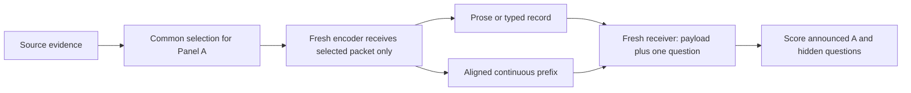

# Experiment 13 — Efficient and reusable non-language handoffs

**Status refreshed 8 September 2026:** proposed protocol plus a prototype with 102 recorded passing offline checks. The current implementation uses norm-only calibration; full StateBridge alignment and real-model GPU validation remain outstanding. Companion [research report](results/LATENT_COMMUNICATION_PIVOT_REPORT.md) and [supervisor decision report](results/LATENT_PIVOT_NEXT_EXPERIMENT_2026-09-08.md). This is a separate pivot branch of the research programme; it does not overwrite Experiment 12.

## Protocol clarifications before the first GPU run

These clarifications take precedence where the original nominal-budget description below is ambiguous. They are protocol requirements, not assertions that the current prototype enforces them.

- Define B as total incremental receiver positions, including arm-specific schema, headers and anchors. The latent vector count is K = B minus that overhead. Development uses total caps 32/64/128; confirmation freezes two shared caps before test evaluation, initially proposed as 32/64. The 12-cell count refers to those two caps. The position-saving criterion refers to the ratio of mean realized added positions, with every message independently required to satisfy its hard cap.
- Select the text comparator on development data by highest mean current-plus-orthogonal utility among prose and records that retain at least half the direct-source future utility; tie-break by lower measured cost. Both primary systems must retain a meaningful future-utility floor in confirmation. Otherwise noninferiority against an already uninformative text baseline cannot support a reusable-communication claim. Add floor contrasts against half the direct-source future utility to the simultaneous interval family; with four contrasts, one-sided 98.75% Bonferroni bounds are a conservative option. Choose a different rate pair only on development data. Include the generic text reference regardless of the selected primary comparator.
- Source-free replay changes activation distributions, positions and alignment as well as information access. Interpret a decline as consistent with a source-conditioned contribution. For factual attribution, hold the visible transcript fixed, substitute an omitted B fact in the source with a length-matched alternative, teacher-force that transcript, and compare whether the receiver follows the changed fact versus an irrelevant-change sham. Hold position conventions and the mapping procedure fixed; report any per-message alignment changes.
- Freeze source-quality admission rules independently of channel performance. No confirmation source may be excluded because one communication arm performs poorly.
- In amortization, n means total receiver uses including the current question. Charge one transfer when a payload is persisted once at one receiver, and repeated transfers only when it is actually sent again. Cache resets do not themselves imply a network retransmission.

## 1. Research question and scope

Can a non-language communication interface reduce receiver context use or end-to-end inference cost while retaining the utility of a handoff for both its announced task and unannounced later questions?

Start with one handoff, one frozen backbone and fixed sources. Natural-language questions and final answers remain allowed; the intervention concerns the inter-agent payload. Distinguish compact symbolic text, continuous prefixes and full KV-state transfer. They are not interchangeable definitions of a latent token.

Hypotheses, not assumed results:

- **H1 — context efficiency:** a compact latent payload can match strong text on current and hidden queries using fewer added receiver positions.
- **H2 — specialization persists:** conditioning on A can improve A and reduce orthogonal future utility even when the channel is continuous.
- **H3 — source-state contribution:** any hidden-query advantage of source-conditioned states can decline when the same visible transcript is re-encoded without source access.
- **H4 — resource divergence:** position savings need not produce byte or total-runtime savings.

The report reviews Interlat, StateBridge and DiffMAS. This experiment begins with a **StateBridge-derived one-handoff adaptation**, not a reproduction of their complete systems.

## 2. Separate the two causal comparisons

**Panel A: selection fixed before encoding.** Reuse a selected evidence packet P. Every prose, record and latent encoder starts fresh and receives only P plus the same allowed writing instruction. It cannot see omitted source cards. The receiver gets only the declared message and its evaluation question. This measures encoding/decoding performance conditional on the same available evidence.

**Panel B: full-source system comparison.** Every sender receives the same complete source E. Compare generic and A-conditioned writing for each channel. Encoding and selection can differ as part of the policy. This measures practical end-to-end utility, not a pure serialization effect.

Do not pool the panels. A latent advantage in Panel B alone does not demonstrate recovery after omission in Panel A.

## 3. Environment and frozen model

Initial candidate: `Qwen/Qwen3-4B`, BF16, one exact pinned weight/tokenizer revision, shared frozen weights for writer and reader, explicit `enable_thinking=false`, deterministic decoding and a fixed answer cap of 48 new tokens. Record the exact prompt template and generation configuration. This model/mode choice must pass the direct-source development check before confirmation.

Use a separate PyTorch/Transformers backend. The current `src/llm.py` text API cannot expose or consume these states. Keep existing dependencies and experiments intact; define a separate pinned latent environment after a working smoke test. Avoid quantization in the initial baseline, since it would add another treatment.

Bunya is the assumed execution platform. The saved SSH master was absent when checked on 7 September; it has not been rechecked for this report. Before running: establish the normal interactive connection, inspect permitted GPU partitions/associations and storage, then request one 80 GB CUDA GPU for profiling. No assumption of permission for a special multi-GPU partition. The initial request is a resource plan, not proof that this memory is necessary.

Suggested hard envelopes: at most two GPU-hours for integration smoke testing, then at most eight additional GPU-hours for the first diagnostic batch. These are proposed run limits, not runtime predictions or already authorized reservations. Refine the full estimate using measured batch throughput; stop and checkpoint at the limit. Do not launch the complete matrix before that estimate exists.

## 4. Development corpus and first matrix

Use `data/size_adaptation/fictional_items.jsonl` through `src/fictional_qa.py`: 20 dossiers, each with six auditable evidence cards. At K=4 selected cards, take the existing generic selection and six A-conditioned selections for each dossier. Keep the selection artifacts and their original selector provenance fixed; this panel is not a test of the new model's selection policy. If any artifact is absent or invalid, regenerate that selection once and record it before encoding.

This yields 20 × (1 + 6) = **140 source packets**. Generate generic packets once and reuse them across evaluation rotations; do not treat that reuse as independent data. Deduplicate identical answer requests by payload hash, while keeping all evaluation records.

At the first total added-context cap of 32 receiver positions, including schema and headers, run:

| Arm | Encoder output | Role |
|---|---|---|
| `text_prose` | A concise standalone prose message | Natural-language reference |
| `text_record` | Short typed key/value or relational records with literal values | Strong non-prose, text-compatible reference |
| `latent_sb` | Aligned final-layer vectors from a common sender transcript H | Frozen latent candidate |

All three receive the same selected cards and query visibility. Records must be understandable from their transmitted content and fixed public schema. Never send evaluator card IDs as substitutes for factual content.

Score every packet on all six questions: **140 × 3 × 6 = 2,520 core answer evaluations** at this first rate. This excludes diagnostic controls, retries and source checks. Cache hits reduce physical inference requests, not the number of evaluation rows. Save requested and actual counts separately.

For `latent_sb`, generate H with a fixed cap of 256 new tokens and retain its last K valid message states. H is an internal trajectory; include all of its generation in cost. If H has fewer than K valid positions, transmit its actual length and flag it; do not pad by repeating evidence or silently regenerate until favorable. Apply the audited alignment, norm calibration and anchoring procedure. Record algorithm version, normalization point and parameters.

For both text arms, use a tokenizer-aware two-sided target band, initially 85–100% of the total available message positions, with at most two correction attempts. Include headers/schema in the budget. Log every attempt and its cost. Never equate a maximum generation cap with achieved equal length. Invalid or over-budget outputs count as failures in the system analysis; valid-only diagnostics are separate.

## 5. Controls before expanding the grid

Run infrastructure checks on four fixed development dossiers, then retain important behavioral controls on the full development set.

1. **Full source and selected packet directly:** establish reader ability and selected-evidence answerability. Closed-book probes establish leakage for this new reader; old Llama results do not transfer automatically.
2. **Token-ID versus token-embedding replay:** the exact same entire input sequence should produce equivalent next-token behavior within declared numerical tolerances. Match template, mask and positions. This validates the continuous-input wrapper.
3. **Same-transcript controls:** supply all of H as text, the final K tokens of H as text, and embeddings of those same K tokens. They distinguish continuous content from prefix plumbing and suffix selection. The suffix-only arm is a diagnostic, not the sole competitive text baseline.
4. **Cross-dossier shuffled and zeroed prefixes:** check whether answers depend on the delivered latent content. Use opaque receiver metadata and verify payload hashes to prevent cache contamination. A zero vector is an ablation, not an assumed neutral prompt.
5. **Source-free replay:** re-encode the exact H in a fresh encoder with only fixed public instructions and the same allowed A visibility. Compare its states with states generated while viewing P/E. Any benefit of the latter is evidence for additional source-conditioned information, not evidence that the visible H alone contains the missing fact.
6. **Known omission and restoration:** in Panel A, test questions whose answer-bearing card was excluded. Restore that card versus replace a card with irrelevant evidence at the same card count, then re-encode. Track realized bytes/positions separately; equal card count alone does not imply equal physical cost.

Suggested development gates, fixed before running the grid: direct-source EM at least 0.90; closed-book fictional EM at most 0.05; and high-capacity latent accuracy within 0.10 of direct selected-packet accuracy on answerable questions. Also require positive causal sensitivity to shuffled payloads. These are engineering thresholds, not significance claims. Failure triggers a bounded implementation investigation; it does not license selecting a test dataset that makes the method win.

Only after the gates pass, sweep total added-position caps B=32/64/128 on development data and choose one primary rate contrast. The latent payload vector count K excludes separately charged schema overhead. Diagnose one-step token/state alignment, final normalization, `inputs_embeds` output slicing, prompt placement, attention masks, EOS handling and actual generation limits before attributing failure to the method.

## 6. Full-source panel and fresh confirmation

Use existing relation dossiers only for development of Panel B. Every sender sees E; generic senders see no query, conditioned senders see A only. Never include hidden questions or evaluator golds in writer prompts or payload metadata. Evaluate one identical generated message against multiple questions with a new receiver cache each time.

Build a fresh confirmation set after freezing the codec and prompts. Select the sample size from development source-level variance and the chosen noninferiority precision; plan around **at least 100 independent sources**, but do not claim that 100 is necessarily sufficient. If the required precision exceeds feasible compute, revise the proposed claim before opening the test set, or report an exploratory result.

Give each source four aspects and four A rotations. At each rotation score A, a paraphrase, a nearby distinct question and an orthogonal question. Balance which hidden aspect is probed. This is 16 scored instances per source, with source as the sampling unit. Fresh entities, values and held-out writing templates reduce template shortcuts. For learned extensions, split by source/template before training; different questions from the same source are not independent train/test data.

Freeze two message rates, two sender policies and three channels. This gives 12 cells and **19,200 answer evaluations at n=100**, before baselines and controls. Identical generic messages and identical reader requests can be reused by hash. The initial three channels remain prose, records and the chosen latent interface; no depth, heterogeneity or noisy-demand grid is added here.

Primary future utility is orthogonal-query accuracy. Report paraphrase and nearby-question utility separately. This prevents the numerical frequency of question categories from silently defining the target distribution. Add one fresh natural-passage validation set only after a clear primary result; do not pool synthetic and natural results.

## 7. Primary claim and statistical rule

Proposed primary comparison: **A-conditioned latent at a 32-position total added-context cap versus the stronger development-selected text comparator at 64**. Count all additional receiver positions, including differing headers. The actual ratios, not just these nominal budgets, determine the claimed saving. Freeze the comparator, rate pair and margins before confirmation; publish all development outcomes.

Claim context efficiency only if:

- Actual added receiver positions are reduced by at least 25%; and
- Both current and orthogonal-future accuracy are noninferior at a prespecified margin of 0.03 absolute accuracy; and
- Both primary methods retain at least half the direct-source orthogonal-future utility.

Use paired source-clustered bootstrap intervals, resampling each source with all its questions and arms. Require conservative simultaneous lower bounds above -0.03 for both utility differences and above zero for each method's future utility minus half the direct-source future utility. Four one-sided 98.75% Bonferroni bounds are a conservative option. These thresholds are proposed design choices, not discovered effect sizes. If the development diagnostic requires a different rate pair, record that change before the test set exists.

Primary scoring: exact match against frozen gold aliases for fictional short answers. Report token F1 alongside it and independent semantic judging as a secondary metric, consistent with repository conventions. Audit a blinded sample of disagreements; do not introduce favorable aliases after examining channel labels. Report system failures in the denominator.

Secondary mechanism contrast: the channel × conditioning interaction in `U_now - U_future`. Always show the two utility changes: narrowing this gap by degrading current-task accuracy does not constitute mitigation. Same-rate channel effects, byte comparisons and runtime comparisons are separate outcomes.

To claim **runtime savings**, require a reduction in measured end-to-end inference time on the same hardware/backend at comparable utility. A position result alone is insufficient. Quantify uncertainty over both sources and repeated timing blocks. Keep claims stack- and workload-specific.

## 8. Resource measurement

Record per handoff and per answered query:

- Sender source-prefill tokens/time; every decoded intermediate token, including discarded tokens and correction attempts.
- Compression/alignment and serialization time; payload shape, dtype, precision and actual serialized bytes.
- Receiver payload positions plus schema/headers; query and common prompt positions logged separately; prefill and final decoding time.
- GPU-seconds, wall time, peak VRAM, model initialization, and failure/retry counts. CUDA timing must synchronize correctly.
- Training/setup cost where applicable, with model loading shown separately from steady-state inference.

Primary deployment is sequential colocated inference with shared frozen weights and fresh per-agent state. Report serialization/memory movement there without pretending that an unmeasured network transfer occurred. A distributed scenario needs an actual transfer measurement or an explicitly labeled bandwidth model.

For n total uses of one message, including the current question, report `C(n) = C_encode + C_actual_transfers(n) + sum(C_read_i)` plus amortized training/setup. Evaluate n=1, 4 and 16. If the payload is sent once and retained at the receiver, charge one transfer; if sent on every use, charge n. State whether a receiver prefix cache is reused; if enabled, apply the same admissible caching optimization to text and latent arms. Benchmark timings with result-cache retrieval disabled, use a fixed batch policy and randomized arm order, and report cold versus warm model execution separately. Evaluation caching can still avoid unnecessary scoring work.

Measure text UTF-8 bytes and optional token-ID bytes; vectors use actual tensor storage plus metadata. A KV comparator must count all transferred layers and source positions. Do not apply the old delivered-word hypervolume metric to vectors. Existing bootstrap/frontier code can be reused only after defining a single resource axis per plot and fixed cost normalization.

## 9. Isolation and implementation plan

The following files now exist as a scaffold. The responsibilities below describe the target protocol, not completed validation: the runner currently covers Panel A, the codec is norm-only, and GPU checks have not run. `requirements-latent.txt` provides separate dependencies; reported runs must pin the working environment. Reconcile the implementation with the revised protocol before generating reportable results.

| File | Responsibility |
|---|---|
| `src/latent_backend.py` | Pinned local model, state extraction and fresh continuous-input reader |
| `src/latent_handoff.py` | Sealed serialized payload, validation, codec metadata and byte accounting |
| `src/run_latent_reusability.py` | Two panels, safe deduplication, baselines and artifact emission |
| `src/latent_metrics.py` | Position/byte/runtime accounting and utility contrasts |
| `src/selftest_latent_offline.py` | Payload isolation, hashing, budgets and deterministic fake-backend tests |
| `src/selftest_latent_gpu.py` | Small token/embedding parity and fictional payload-dependence checks |
| `latent_reusability_config.yaml` | Complete model, codec, budgets, dataset and compute configuration |
| `hpc/latent_smoke.slurm` | GPU request only after current account/partition verification |

Preserve `SealedHandoff` unchanged. A new sealed payload contains immutable serialized bytes and allowlisted schema metadata, never live references to sender tensors. A frozen dataclass containing a mutable tensor is not sufficient. Serialization and a fresh process/cache test must show that only the declared payload survives the boundary. Evaluator IDs stay outside the reader prompt and cannot resolve into source files or answer tables.

The receiver can access the evaluation question, fixed public decoding instructions and that payload only. Source-dependent information encoded inside permitted vectors is allowed; a second source KV cache, full source prompt, instance-specific dictionary or file lookup is not. Explicit full-state comparators must declare and charge those channels separately.

Reuse data loaders, frozen golds, EM/F1, provenance conventions and cluster resampling. Hash weights/tokenizer revision, selection/source hashes, prompts, transcript/state alignment, codec version and parameters, dtype, masks, seeds, model generation settings and payload bytes. Include training-data and adapter hashes if used. Dry-run performs no writes to data/runs/results, model downloads or inference.

## 10. When to train or test portability

If the frozen interface passes causal checks but offers no useful compression, one bounded learned alternative is justified. Initially freeze the reader and learn a bottleneck encoder/bridge on disjoint synthetic training sources. This is a new learned adaptation, not automatically Interlat. A faithful Interlat reproduction would follow its receiver and compressor training procedure separately.

A useful follow-up crosses a current-query-only training objective with a multi-query objective, using the same training sources and compute envelope. Test on entirely unseen sources and hidden questions. This asks whether specialization is learned into the protocol. Include a comparably trained text system before claiming an inherent advantage of latent representation; otherwise restrict the conclusion to the trained system.

DiffMAS stays outside the first implementation unless official code or an audited faithful implementation resolves its training graph. Unrestricted KV sharing can be a counted high-capacity reference. It cannot silently serve as a fixed small message.

Cross-family portability is a subsequent experiment: freeze a trained encoder, change the receiver, and report zero-shot transfer separately from recalibration/retraining. Successful homogeneous runs on two different model families are not evidence that those families can exchange states directly.

## 11. Deliverables and stopping rule

Produce a model/environment manifest, raw payloads and generation traces in evaluator-only storage, answer records, exact resource logs, isolation/parity results, paired utility tables, and plots for utility versus positions, bytes and time. Show original-source versus transcript-only state effects separately. All empirical charts must say whether they are development or confirmation results.

Stop this first study after one trustworthy frozen-interface comparison and its prespecified confirmation, or after a documented integration/compute limit prevents that comparison. If a valid latent channel does not beat strong compact text on the declared resource objective, report that result. A subsequent learned method must have its own fixed hypothesis and compute budget, rather than becoming an open-ended search for a positive result.
