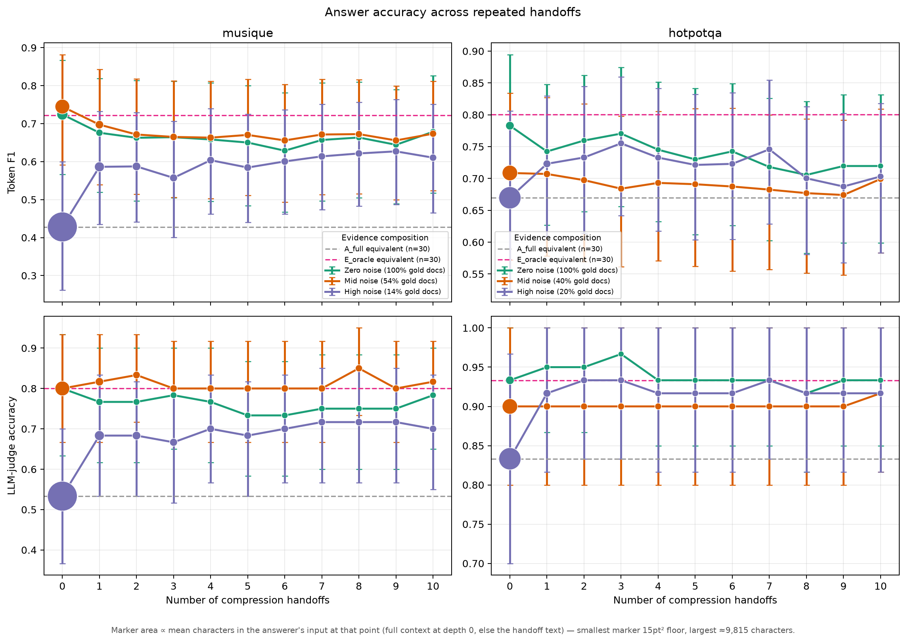
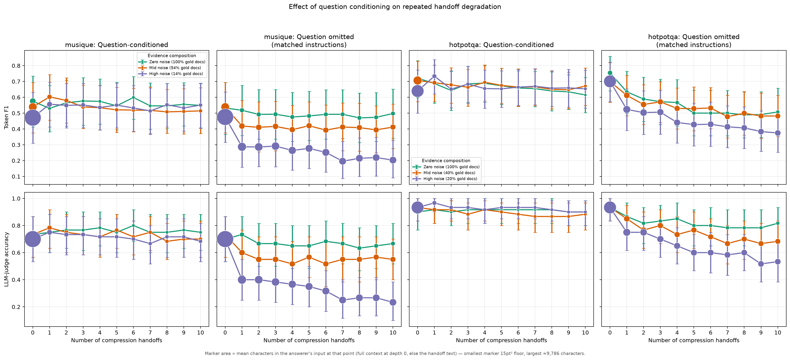
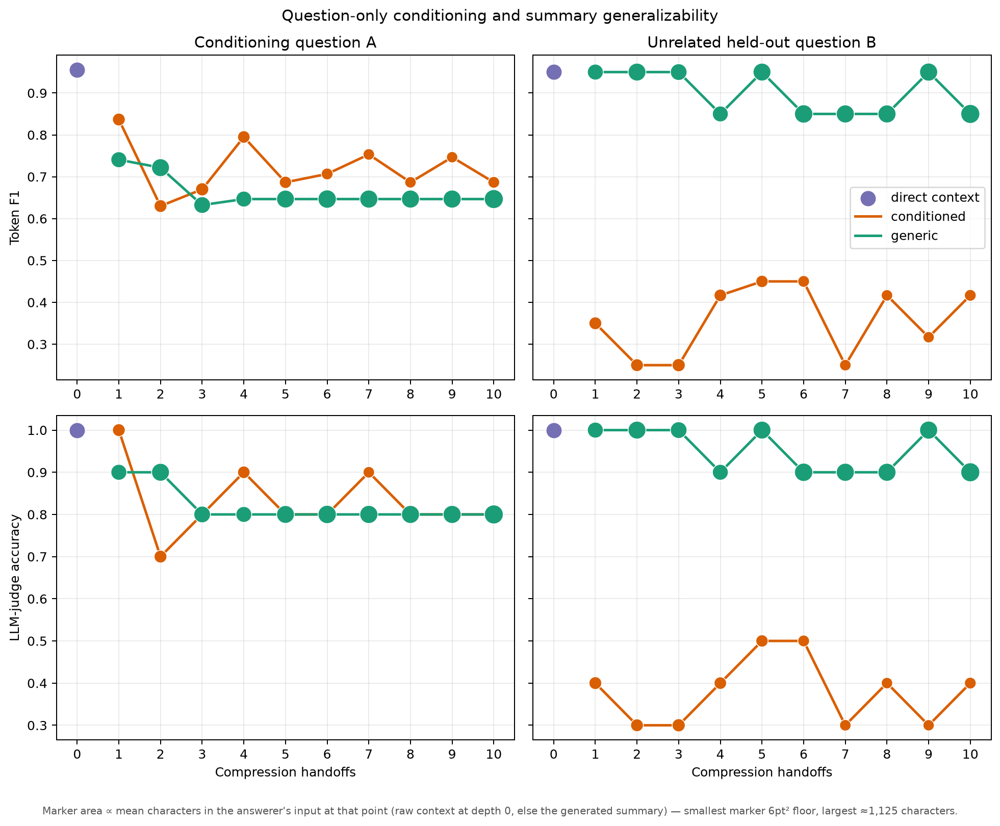

# Core findings: task-conditioned information bottlenecks in agent handoffs

This is the concise research narrative for the completed experiments. The
[full experimental report](HANDOFF_EXPERIMENTS_REPORT.md) is the audit trail;
the [focused literature landscape](../../research-os/outputs/literature-reviews/2026-08-19-multi-agent-handoff-communication-only.md)
and its [semantic graph](../../research-os/outputs/graphs/2026-08-19-multi-agent-handoff-communication.md)
cover the broader evidence base. The literature scope is **inter-agent
communication** (not generic RAG, single-agent memory, or query-focused
summarization). The local crawl is current to 19 August 2026; the primary pages
for the key 2026 papers below were rechecked on 24 August 2026.

## Bottom line

> **A handoff is not a fixed per-hop accuracy tax. It is a task-conditioned
> information bottleneck: task visibility can make compression useful by
> removing noise, but the same selection can discard information needed by an
> unannounced future task.**

The work therefore shifts the question from *“How many handoffs are safe?”* to
*“Which task contract and evidence units survive each handoff?”*

## What the experiments show

### 1. Repeated rewriting is not universally destructive

- **Evidence.** With the task visible at every hop, semantic correctness was
  broadly stable across ten repeated handoffs. The clearest cross-model example
  is Qwen3-32B on MuSiQue full context: depth 10 is **+0.182 F1** and **+0.167
  judged accuracy** relative to direct context. Conversely, HotpotQA gold-only
  falls **−0.107 F1** without a judged-correctness drop (0.900 at both depths).
- **Interpretation.** Compression can remove distracting context, while token
  F1 can register answer-form drift that is not factual loss. There is no
  supported universal degradation curve.
- **Boundary.** This is directional robustness evidence, not a model-scale
  causal claim: the Llama and Qwen samples have model-specific leakage filters.

### 2. The task contract is a causal part of the channel

- **Evidence.** In the matched question-omission replication, only the
  compressor's access to the question changes; the final answerer always sees
  it. At depth 10 on full contexts, MuSiQue changes from **+0.080** F1 when the
  question is visible to **−0.272** when it is omitted; HotpotQA changes from
  **+0.014** to **−0.326**.
- **Interpretation.** A bounded compressor cannot reliably identify
  answer-relevant evidence without the task that defines relevance. Apparent
  “relay loss” can therefore include loss of task side-information.
- **Design implication.** Treat the question, output format, and other task
  constraints as an immutable handoff contract rather than content to be
  reconstructed from prose.

### 3. Optimizing for the known task can reduce future reuse

- **Evidence.** In a gold-only SQuAD design, one short passage answers both A
  and B. The compressor sees A or no question; B is unannounced until
  evaluation. Question conditioning gives no reliable gain on A, but lowers B
  by **0.433–0.600 F1** and **0.500–0.600 judged accuracy** across depths 1,
  5, and 10. At the first handoff, B's answer string survives in **3/10**
  conditioned summaries versus **9/10** generic summaries.
- **Interpretation.** This is task-induced narrowing, not denoising: there are
  no distractors, competing documents, length request, or token-cap hits. A
  representation can be sufficient for today's task yet poor for an
  unannounced one.
- **New outcome.** *Future-query regret*—the gap between answering a future
  probe from original evidence versus the final handoff—captures this loss of
  optionality. This is the most distinctive result, but also the least mature:
  `n=10`, one seed, one 8B model.

## Important boundary conditions

- **Rewriting alone is not the demonstrated cause.** In the pass-through →
  generic paraphrase → generic compression → question-conditioned selection
  ladder, only adding question-conditioned selection produces the large,
  persistent held-out loss. The paraphrase arm is question-blind. See
  [Experiment 5a](HANDOFF_EXPERIMENTS_REPORT.md#5a-rewriting-versus-selection).
- **New evidence changes what depth means.** In the incremental-evidence chain,
  specialists receive a new supporting paragraph while relays receive none.
  Adding 1/3/5 relays yields no reliable final-F1 decrease relative to zero
  relays. This does **not** negate fixed-payload loss: it shows that fresh
  evidence and specialist re-encoding can compensate for it. See
  [Experiment 7](HANDOFF_EXPERIMENTS_REPORT.md#7-incremental-evidence-handoff-chain).
- **Accuracy alone is insufficient.** Token F1, answer judging, literal
  answer-string survival, and hidden probes answer different questions. A
  correct answer may be inferred despite missing evidence; a surviving answer
  string need not preserve the supporting relation or provenance.

## How this fits the current research

- **It supports the information-bottleneck account, rather than a universal
  “multi-agent benefit” or “handoff loss” claim.** [Yu et al. (2026,
  preprint)](https://arxiv.org/abs/2607.16133) argue that bounded relays trade
  context reduction against loss of downstream-relevant information. Finding 1
  is the denoising side of that account; Findings 2–3 identify task visibility
  and future-task coverage as concrete determinants of what is
  downstream-relevant.

- **It qualifies the strongest serial-relay degradation result.** [Ao, Gao, and
  Simchi-Levi (2026, preprint)](https://arxiv.org/abs/2603.26993) show severe
  loss in delegated prose relays, but downstream stages do not retain the
  question. The matched omission experiment does not refute that result; it
  shows why its depth effect should be read as a mixture of message compression
  and task reconstruction. The question-omitted arm here behaves much more like
  a degrading relay.

- **It separates fixed-payload relay from evidence acquisition.** [Chain of
  Agents (NeurIPS 2024)](https://proceedings.neurips.cc/paper_files/paper/2024/hash/ee71a4b14ec26710b39ee6be113d7750-Abstract-Conference.html)
  improves long-context tasks by giving each worker a new chunk. Experiment 7
  makes the same distinction explicit: chains that acquire evidence along the
  way cannot be interpreted as pure repeated-rewriting experiments.

- **It complements edge-failure work with a preventative control.**
  [AgentAsk (ACL 2026)](https://aclanthology.org/2026.acl-long.1294/) identifies
  Data Gap and Referential Drift as major handoff failures and repairs selected
  edges with clarification. Finding 2 suggests that pinning the task contract
  can prevent one source of those failures before a repair step is necessary;
  it does not test clarification itself.

- **It motivates retaining inspectable evidence units when reuse is uncertain.**
  [BANDMAS (2026, preprint)](https://arxiv.org/abs/2608.00458) uses typed,
  value-aware packets to reduce traffic, and [GAVEL (Findings of ACL
  2026)](https://aclanthology.org/2026.findings-acl.1789/) uses an evidence
  contract for auditable fact checking. The future-query result supplies a
  complementary reason for provenance-bearing or bypassable evidence: a
  task-specific summary can be accurate now while hiding useful source facts
  later.

- **It should not be framed as a general victory for structured messages.**
  [Handoff Debt (2026, preprint)](https://arxiv.org/abs/2606.02875) finds
  reliable efficiency gains from context-bearing handoffs, but small,
  model-dependent solve-rate differences among raw, free-form, and structured
  handoffs. This project has not run its structured and extractive mechanisms
  at scale, so no representation-ranking claim is justified.

- **The future-query result currently has no direct comparator in the focused
  crawl, not no prior art.** The closest mechanism is Yu et al.'s warning that
  a locally sufficient relay can omit information required later in the same
  task. Query-focused summarization lies outside this communication-only review
  and must be searched before claiming novelty for the A-versus-unannounced-B
  asymmetry.

## Defensible contribution and evidence posture

- **Contribution now:** a code-enforced sealed-evidence test bed that isolates
  task visibility, repeated transformation, and evidence acquisition; plus a
  future-query evaluation that exposes losses hidden by announced-task accuracy.
- **Not a contribution claim:** the first handoff-loss study, first repeated
  relay, first structured message, first provenance-bearing handoff, or first
  bandwidth-constrained MAS. These are already covered by the papers above and
  the broader literature review.
- **Evidence status:** the question-omission result is the strongest matched
  causal comparison. The future-query effect is scientifically interesting but
  pilot-scale. Cross-dataset/model claims require common samples, more seeds,
  and multiplicity-aware inference.

## The next experiment that matters most

Replicate the gold-only A/B future-query design with at least 100 independently
constructed pairs, two seeds, and a stronger second model. Predeclare four
outcomes: announced-A accuracy, unannounced-B accuracy, per-edge support
survival for both facts, and handoff length/truncation. Add an extractive or
provenance-preserving bypass condition to test whether it reduces future-query
regret without sacrificing the known task.

## Key references

- Yu et al. (2026, preprint), [*When Do Multi-Agent Systems Help? An
  Information Bottleneck Perspective*](https://arxiv.org/abs/2607.16133).
- Ao, Gao, and Simchi-Levi (2026, preprint), [*On the Reliability Limits of
  LLM-Based Multi-Agent Planning*](https://arxiv.org/abs/2603.26993).
- Zhang et al. (2024), [*Chain of Agents: Large Language Models Collaborating
  on Long-Context Tasks*](https://proceedings.neurips.cc/paper_files/paper/2024/hash/ee71a4b14ec26710b39ee6be113d7750-Abstract-Conference.html).
- Lin et al. (2026), [*AgentAsk: Multi-Agent Systems Need to Ask*](https://aclanthology.org/2026.acl-long.1294/).
- Dong and Lin (2026, preprint), [*BANDMAS: Causality-Inspired Semantic Packet
  Scheduling for Bandwidth-Efficient Multi-Agent Collaboration*](https://arxiv.org/abs/2608.00458).
- Xu, Li, and Sheng (2026), [*GAVEL: Evidence-Contract Debate with Mechanized
  Scrutiny for Provenance-Grounded Fact-Checking*](https://aclanthology.org/2026.findings-acl.1789/).
- KC and Budathoki (2026, preprint), [*Handoff Debt: The Rediscovery Cost When
  Coding Agents Take Over Interrupted Tasks*](https://arxiv.org/abs/2606.02875).
