# Agent handoff information-loss experiments

- **Status:** evidence through 31 August 2026; Experiments 5b, 8b, and 9
  completed their configured runs, while most benchmark studies remain pilots
- **Primary metrics:** exact match (EM) and SQuAD-style token F1
- **Secondary metric:** binary answer correctness from `openai/gpt-4o-mini` (temperature 0), a different model family from the systems under test
- **Scope:** nine experiment families plus focused causal follow-ups on
  fixed-capacity reuse and source-selector bottlenecks

## Executive summary

The experiments do **not** support a universal rule that every handoff causes a fixed amount of accuracy loss. Handoffs can remove noise, change wording without changing the asserted fact, or selectively discard information that is irrelevant to the current task but valuable later.

The clearest findings are:

1. **Compression can denoise.** A free-form MuSiQue handoff improved F1 over direct full-context answering by +0.264 [95% CI +0.010, +0.525] in the initial `n=10` pilot. Longer chains also improved on some noisy full contexts.
2. **Token drift is not necessarily factual loss.** HotpotQA gold-only F1 fell by 0.107 after ten handoffs, but judged correctness stayed at 0.900. Repeated rewriting often changes answer form while preserving meaning.
3. **Task information is powerful but narrows reuse.** Hiding the question from compressors severely hurts noisy-context chains. Conversely, conditioning on Question A can remove facts needed for future queries. In the fixed-capacity fictional replication, conditioning raises announced-A judged accuracy by **+0.317** but lowers mean unannounced-query accuracy by **−0.062** at K=4.
4. **The narrowing occurs during selection, not ordinary rewriting.** Pass-through and paraphrase-only controls show no reliable held-out judge loss at the main landmark depths. The fictional K=6 all-card control is exactly zero difference, while K=2 and K=4 show the immediate/reusable trade-off.
5. **Retrieval quality dominates weak distractor effects.** Retaining less labelled evidence reliably lowers QA performance. After candidate distractors are independently screened for relevance, BM25-hard versus BM25-easy differences no longer reliably exclude zero.
6. **Language switching is unresolved, not harmful by default.** In the corrected gold-only multilingual pilot, every fixed-versus-switching F1 and judge interval includes zero.
7. **Changing model family mid-chain is nearly free at the answer, but not at the message.** Cross-family handoffs roughly halve verbatim carry-over and expand the message by about a quarter, and cost a small reliable amount of judged preservation per edge — yet six handoffs with five family switches leave final accuracy indistinguishable from a single-model chain. The spread between two equally-sized families is wider than any heterogeneity penalty.
8. **New evidence can compensate for relay loss.** In the incremental-evidence chain, adding 1/3/5 relay-only agents between specialists does not reliably reduce final QA relative to zero relays. Specialist re-encoding can offset communication loss, so depth must be interpreted together with the evidence-acquisition schedule.
9. **Evidence availability, not parameter count alone, limits a downstream relay.** In Experiment 8b, selector-tier effects reverse direction between Llama and Qwen. On matched sealed packets containing no annotated B answer or alias, both relay tiers score zero; restoring B's exact card at the same width restores accuracy, while a matched sham does not.

10. **What the prompt says about the next reader changes the handoff, but the
model does not match the stated number.** Merely mentioning a 2k window made
notes about 120–189 words longer and kept 15–36 percentage points more of the
extra facts. “Fit within 2k” removed only part of that added length. “Fill 10k”
often triggered a repetition loop: 102 of 230 responses were cut off by the
common 12k output limit, and 91.2% of their five-word sequences were repeats.
The limit stopped the loops; it did not cause them. “Keep your handoff concise”
was the only instruction that made notes shorter than giving no size
information, and it also removed more extra facts.

Most results remain pilot-scale. The two fictional follow-ups ran their full
configured 20-dossier designs, with repeated roles clustered by dossier; their
bootstrap intervals are still exploratory rather than multiplicity-corrected.

## How to read the report

- **Change** identifies the experimental variable added relative to the preceding design.
- **Key result** states the narrow conclusion supported by the data.
- Bracketed ranges show uncertainty in an average caused by the limited item
  sample. They are calculated by repeatedly rebuilding the average from the
  observed items; Experiment 9 explains this in plain language.
- EM/F1 remain the deterministic primary metrics. The judge is a semantic complement, not a replacement.
- An interval containing zero is treated as inconclusive, even when the point estimate is large.
- Full prompts are in [PROMPTS.md](../PROMPTS.md); detailed tables and answer-level records are linked under [Result artifacts](#result-artifacts).

## Experiment inventory

| ID | Experiment | Dataset and sample | System model | Main comparison |
|---:|---|---|---|---|
| 1 | Single handoff mechanisms | MuSiQue, `n=10` | Llama 3.3 70B | Direct context vs free-form handoff vs oracle evidence |
| 2 | Fixed-evidence serial chain | MuSiQue + HotpotQA, `n=30`/dataset, two seeds | Llama 3.3 70B | Context noise × depths 0–10 |
| 2a | Qwen replications | MuSiQue + HotpotQA, `n=10` (8B) and `n=30` (32B) | Qwen3 8B/32B, non-thinking | Cross-model directional replication |
| 2b | Question-omission replication | Same `n=30` Llama sample | Llama 3.3 70B | Identical chain with compressor question block removed |
| 3 | Retrieval-quality propagation | MS MARCO, `n=20` | Llama 3.1 8B | Gold recall × screened BM25-hard/easy candidates |
| 4 | Fixed-width evidence redundancy | SQuAD packs, `n=20` | Llama 3.1 8B | 10/5/1 answer-sufficient passages in ten-document contexts |
| 5 | Cross-question generalization | SQuAD A/B pairs, `n=10–20` | Llama 3.1 8B | Question-conditioned vs generic summaries; evaluate target A and held-out B |
| 5a | Rewriting-selection ladder | Same gold-only `n=10` pairs | Llama 3.1 8B | Pass-through → paraphrase → compression → question selection |
| 5b | Fictional fixed-capacity replication *(complete)* | 20 fictional dossiers × 6 rotations | Llama 3.1 8B | Conditioned vs generic selection at 2/4/6 evidence slots; evaluate all hidden queries |
| 6 | Multilingual handoffs | Same gold-only `n=10` passages | Llama 3.1 8B | Fixed vs switching language; conditioned vs generic |
| 7 | Incremental-evidence chain | MuSiQue, `n=30`, two seeds | Llama 3.3 70B | 0/1/3/5 evidence-free relays between packet specialists |
| 8 | Model heterogeneity | SQuAD A/B pairs, `n=20` | 4 open-weight families x 2 size tiers; fixed answerer | Homogeneous vs cross-family chains; small/large size trajectories |
| 8b | Source-selector bottleneck *(complete)* | 20 fictional dossiers × 4 rotations | Llama/Qwen small-large factorial; fixed Mistral reader | A-aware selector → sealed B-aware relay; restoration, sham and source-reopen controls |
| 9 | Telling the writer about the next reader's space *(complete)* | 26 changed real-world + 20 invented items | Llama 3.3 70B | No size information vs stated 2k/10k space vs a request to fit or fill it; same actual output limit |
| 10 | Communication regret under a hard budget *(complete)* | 24 SQuAD paragraphs x 4 questions; relation dossiers | Llama 3.1 8B sender and answerer | Generic vs conditioned vs reusable vs oracle at 20/40/80/160 delivered words; full per-context utility matrix |
| 10a | Relation-labelled replication *(complete)* | 16 invented dossiers x 4 aspects x 4 roles; 64 rotations | Llama 3.1 8B sender and answerer | Same four policies and budgets; future-query regret by designed distance from the conditioning query |
| 12 | Anticipatory context management *(complete)* | Same 16 relation dossiers; 64 rotations x 16 policies x 2 budgets | Llama 3.1 8B sender and answerer; BM25 store | True future-use distribution `P` vs harness estimate `P-hat`; six-action space with retrieval against static compression |

## 1. Single-handoff mechanism pilot

> **Model:** Llama 3.3 70B Instruct · **Dataset:** MuSiQue-Answerable validation, `n=10` · **Configuration:** one handoff; full supplied context vs free-form handoff vs oracle gold evidence

> **Change:** Insert one sealed evidence handoff before answering while holding retrieval fixed.

The answerer either saw the full supplied context (`A_full`), a free-form summary from a subagent (`B_freeform`), or deterministic gold evidence sentences (`E_oracle`). Structured and extractive mechanisms are implemented but were not included in this API pilot.

| Mechanism | EM | F1 |
|---|---:|---:|
| Direct full context | 0.400 | 0.484 |
| Free-form handoff | 0.600 | 0.748 |
| Oracle evidence | 0.600 | 0.740 |

> **Key result:** Free-form handoff minus direct context was **+0.264 F1** [+0.010, +0.525], `p=0.0304`. The handoff performed approximately as well as oracle evidence, consistent with useful evidence selection or denoising.

**Boundary:** `n=10`; the direction is informative, but the magnitude is unstable.

**Audit:** reported API cost $0.0151. Prompts and mechanisms: [PROMPTS.md § Experiment 1](../PROMPTS.md#experiment-1).

## 2. Fixed-evidence repeated handoffs

> **Model:** Llama 3.3 70B Instruct · **Dataset:** MuSiQue-Answerable + HotpotQA distractor validation, `n=30`/dataset, two seeds · **Configuration:** fixed evidence; gold-only, five-document, or full context; depths 0–10; question shown at every compressor

> **Change:** After one compressor sees the source documents, up to ten later agents receive only the sealed previous message and the original question. No new evidence enters the chain.

Each dataset used gold-only evidence, a five-document medium context, and the full dataset context. Examples, evidence, order, model, budgets, and two seeds were fixed across depths.

| Dataset | Context | Depth-10 F1 change | Judge change |
|---|---|---:|---:|
| MuSiQue | Gold-only | −0.027 | +0.017 |
| MuSiQue | Five documents | −0.025 | −0.033 |
| MuSiQue | Full context | +0.080 | −0.017 |
| HotpotQA | Gold-only | **−0.107** | **0.000** |
| HotpotQA | Five documents | −0.035 | −0.050 |
| HotpotQA | Full context | +0.014 | −0.033 |

> **Key result:** No condition loses more than 0.05 judged accuracy over ten handoffs. The largest F1 decline—HotpotQA gold-only, −0.107—is absent under semantic judging: correctness is 0.900 at both depths 0 and 10.

Repeated handoffs cause **surface-form drift**, visible in F1, while most answer facts survive. Noisy contexts can also improve because the model has distractors to remove; HotpotQA full context shrinks from about 5,530 characters at depth 0 to 720 after one handoff and 413 by depth 10.

**Boundary:** The judge does not prove perfect preservation; it shows that the strongest token-overlap loss is not corroborated as factual loss at `n=30`.

**Audit:** confirmed depth-extension cost $0.2436.

### 2a. Qwen replications

> **Model:** Qwen3 8B and Qwen3 32B, non-thinking · **Dataset:** MuSiQue-Answerable + HotpotQA distractor validation · **Configuration:** same three fixed-evidence contexts; 8B uses `n=10`/dataset, one seed, depths 0/1/3/5; 32B uses `n=30`/dataset, two seeds, depths 0–10

> **Change:** Rerun the chain with non-thinking Qwen models. Model-specific leakage filtering means the retained question IDs need not match Llama's.

| Model | Sample/depth | Main result |
|---|---|---|
| Qwen3 8B | `n=10`/dataset, one seed, depth 5 | HotpotQA F1: −0.110/−0.086/−0.108 across gold/medium/full; MuSiQue: +0.127/+0.077/+0.117. Every interval includes zero. |
| Qwen3 32B | `n=30`/dataset, two seeds, depth 10 | No reliable negative F1 change. MuSiQue full improves **+0.182 F1** [+0.064, +0.312] and **+0.167 judge** [+0.017, +0.317]. |

> **Key result:** The replications support context-dependent denoising more strongly than universal serial degradation. They are not paired model comparisons because filtering is model-specific.

**Audit:** Qwen3 8B cost $0.0443. Qwen3 32B cost $0.3866 plus $0.0088 for judging.

### 2b. Matched question-omission replication

> **Model:** Llama 3.3 70B Instruct · **Dataset:** same MuSiQue + HotpotQA `n=30` samples as Experiment 2, two seeds · **Configuration:** identical gold-only/five-document/full contexts and depths 0–10; the final answerer sees the question, but no compressor does

> **Change:** Remove only the final-question block from every compressor. The final answerer still sees the question; all other settings match the main Llama experiment.

| Dataset | Context | Conditioned F1 Δ | Omitted F1 Δ | Conditioned judge Δ | Omitted judge Δ |
|---|---|---:|---:|---:|---:|
| MuSiQue | Gold-only | −0.027 | −0.035 | +0.017 | −0.033 |
| MuSiQue | Five documents | −0.025 | −0.127 | −0.033 | −0.183 |
| MuSiQue | Full context | **+0.080** | **−0.272** | −0.017 | **−0.467** |
| HotpotQA | Gold-only | −0.107 | −0.247 | 0.000 | −0.117 |
| HotpotQA | Five documents | −0.035 | −0.218 | −0.050 | −0.250 |
| HotpotQA | Full context | +0.014 | **−0.326** | −0.033 | **−0.400** |

> **Key result:** Omitting the question is worse in all six cells, with the largest gaps in full contexts. Unlike the main chain's F1-only drift, the judge corroborates this loss.

The pattern is consistent with task-guided denoising: a compressor cannot reliably separate signal from distractors without knowing the downstream task. The complementary risk—conditioning too narrowly—is tested in Experiment 5.

**Audit:** generation cost $0.9564; judge pass $0.0105.

## 3. Retrieval quality through repeated handoffs

> **Model:** Llama 3.1 8B Instruct · **Dataset:** MS MARCO QA v2.1 validation, `n=20`, one seed · **Configuration:** ten passages/context; all, half, or 3/22 BM25-findable gold passages; screened BM25-top hard versus BM25-bottom easy candidates; depths 0/1/3/5

> **Change:** Hold context width at ten passages while varying retained BM25-findable gold recall and screened BM25-hard versus BM25-easy candidate distractors.

The active MS MARCO design retains all, half, or 3/22 of the findable gold passages across 20 queries (Recall@10 = 1.000/0.500/0.136). Of 1,200 hard/easy candidates, only those independently judged `IRRELEVANT` were eligible. This reduces relevance contamination but is not human verification.

| Gold retention | Hard F1 d0 → d5 | Easy F1 d0 → d5 | Hard judge d0 → d5 |
|---|---:|---:|---:|
| All gold | 0.443 → 0.465 | 0.538 → 0.449 | 0.75 → 0.85 |
| Half gold | 0.380 → 0.361 | 0.353 → 0.318 | 0.50 → 0.60 |
| 3 of 22 gold | 0.189 → 0.166 | 0.157 → 0.141 | 0.15 → 0.30 |

> **Key result:** All-gold minus low-recall hard-arm F1 is +0.254 [+0.132, +0.387] at depth 0 and +0.299 [+0.151, +0.459] at depth 5. After screening, every hard-minus-easy comparison at depths 3 and 5 includes zero.

Retrieval quality remains a persistent determinant of QA, but the active run does not support an independent effect of BM25 candidate difficulty. The earlier unscreened interpretation is retired.

**Boundary:** Cross-query candidates lack exhaustive human non-relevance labels. `n=20`, one seed.

**Audit:** cost $0.006587.

## 4. Fixed-context redundant-evidence signal ratio

> **Model:** Llama 3.1 8B Instruct · **Dataset:** SQuAD validation packs, `n=20`, one seed · **Configuration:** ten passages/context with 10 gold + 0 distractors, 5 gold + 5 distractors, or 1 gold + 9 distractors; screened hard/easy fillers; depths 0/1/3/5

> **Change:** Replace retrieval recall with a fixed-width redundancy manipulation: 10/5/1 answer-sufficient passages and 0/5/9 screened candidate distractors.

The gold variants share one answer-bearing SQuAD paragraph plus different same-article material. This controls answer sufficiency, not independent-source corroboration.

| Composition | Hard F1 d0 → d5 | Easy F1 d0 → d5 | Hard judge d0 → d5 |
|---|---:|---:|---:|
| 10 gold / 0 distractor | 0.896 → 0.801 | identical | 1.00 → 0.85 |
| 5 gold / 5 distractors | 0.887 → 0.891 | 0.921 → 0.847 | 0.95 → 1.00 |
| 1 gold / 9 distractors | 0.787 → 0.776 | 0.778 → 0.767 | 0.90 → 0.90 |

> **Key result:** Ten-gold minus one-gold F1 is +0.109 [+0.009, +0.235] at depth 0 but only +0.025 [−0.134, +0.180] at depth 5. Screened hard-minus-easy effects also include zero at the key later depths.

At `n=20`, redundancy provides a modest direct-answer advantage but no reliable protection after five handoffs. This is a null for shared-source redundancy, not evidence against independent corroboration.

**Audit:** cost $0.009382.

## 5. Question conditioning and cross-question generalization

> **Model:** Llama 3.1 8B Instruct · **Dataset:** SQuAD validation A/B pairs · **Configuration:** depths 0–10; question-conditioned versus generic summaries; separate-passage `n=20`, same-passage-with-distractors `n=20`, and same-passage-gold-only `n=10`

> **Change:** Evaluate every handoff on both the conditioning target (Question A) and a held-out but answerable Question B.

| Design | Context | Main result |
|---|---|---|
| Separate passages, `n=20` | A gold + B gold + 8 distractors | Early A benefit; persistent B loss |
| Same passage + distractors, `n=20` | 1 shared A/B gold + 9 distractors | Every A/B interval includes zero |
| Same passage, gold-only, `n=10` | 1 short shared A/B passage | No A benefit; large persistent B loss |

### Separate-passage design

Conditioned summaries are 3–4 times shorter than generic summaries despite the same 700-token cap, indicating active task selection.

| Evaluation | Depth 1 | Depth 5 | Depth 10 |
|---|---:|---:|---:|
| Target A F1 | **+0.295** [+0.125, +0.476] | +0.024 [−0.156, +0.208] | −0.076 [−0.309, +0.160] |
| Held-out B F1 | **−0.392** [−0.600, −0.192] | **−0.323** [−0.540, −0.117] | **−0.497** [−0.700, −0.283] |
| Target A judge | **+0.400** [+0.200, +0.600] | +0.150 [−0.050, +0.350] | −0.100 [−0.350, +0.150] |
| Held-out B judge | **−0.400** [−0.600, −0.200] | **−0.400** [−0.600, −0.200] | **−0.450** [−0.650, −0.250] |

> **Key result:** Conditioning helps A for the first two handoffs, but not reliably by depth 3. Damage to B persists through depth 10 on both metrics.

### Same-passage controls

With one shared gold passage among nine distractors, every conditioned-minus-generic A/B interval includes zero (`p>0.22`). Removing the competing document removes the clear effect.

| Evaluation | Depth 1 | Depth 5 | Depth 10 |
|---|---:|---:|---:|
| Target A F1 | +0.096 [−0.137, +0.367] | +0.040 [−0.253, +0.333] | +0.040 [−0.180, +0.300] |
| Held-out B F1 | **−0.600** [−0.900, −0.300] | **−0.500** [−0.800, −0.200] | **−0.433** [−0.800, 0.000] |
| Held-out B judge | **−0.600** [−0.900, −0.300] | **−0.500** [−0.800, −0.200] | **−0.500** [−0.900, −0.100] |

At stage 1, conditioned summaries retain A in 8/10 and B in 3/10; generic summaries retain A in 8/10 and B in 9/10. No handoff hits the token guard.

> **Key result:** Conditioning narrows to the named task even when the source is one short passage and there is no noise or length pressure. This is distinct from discarding a competing document.

### 5a. Rewriting versus selection

> **Model:** Llama 3.1 8B Instruct · **Dataset:** same SQuAD gold-only A/B pairs, `n=10`, one seed · **Configuration:** one shared A/B gold passage, no distractors, depths 0–10; pass-through, paraphrase-only, generic compression, and question-conditioned selection

> **Change:** Add pass-through and paraphrase-only controls. The ladder is: no rewriting → rewriting without compression → generic compression → question-conditioned selection.

**Question visibility and evaluation.** Only the **conditioned** compressor receives Question A. The **generic**, **paraphrase**, and **pass-through** arms receive neither Question A nor Question B: paraphrase is explicitly instructed to restate every fact without shortening, selecting, or adding content; pass-through copies its input without an LLM call. At each depth, the same resulting handoff is then answered twice by the final answerer—once for target Question A and once for held-out Question B. Thus, B is an evaluation-only query, not information available while the handoff is written.

**How to read the figures.** The first figure is a *transition diagnostic*, not just an end-task comparison. From left to right, top to bottom, it shows: lexical overlap between a message and its immediate predecessor; an independent judge's semantic-preservation verdict for that rewrite; whether a gold-answer string for B is still present; and final answer accuracy for A. Edge 1 is source passage → first handoff; later edges are handoff → handoff. It therefore separates surface rewriting, judged meaning preservation, direct B-answer retention, and the answer consequence for the conditioned task.

**Operational definitions.** “Held-out fact B present” is a deterministic answer-string survival probe: it is 1 when any annotated gold answer or alias for B (excluding strings shorter than three characters) appears as a case-insensitive contiguous substring of the handoff, and 0 otherwise. It does **not** establish that the handoff semantically entails B, nor that it retained the entire supporting proposition; it tracks the observable answer-bearing span. “Lexical similarity” is the symmetric bag-of-words token F1 between consecutive messages. Before matching, both are lowercased, stripped of punctuation and articles (*a*, *an*, *the*), and whitespace-normalized; token multiplicities count. Thus, it measures shared normalized vocabulary rather than word order, syntax, or semantic equivalence.

The second figure is the *end-task view* of the same four arms. Its left column evaluates Question A and its right column evaluates held-out Question B; the top row is token F1 and the bottom row is LLM-judge accuracy. Depth 0 is direct access to the original passage, while depths 1–10 use only the handoff. Marker area represents the mean number of characters given to the answerer (larger markers are longer messages), not statistical uncertainty. Comparing columns tests whether a message useful for its conditioning question remains useful for an unprovided future query.

| Held-out B judge | Depth 1 | Depth 2 | Depth 5 | Depth 10 |
|---|---:|---:|---:|---:|
| Pass-through | 1.00 | 1.00 | 1.00 | 1.00 |
| Paraphrase-only | 0.90 | 1.00 | 0.90 | 0.90 |
| Generic compression | 1.00 | 1.00 | 1.00 | 0.90 |
| Question-conditioned | 0.40 | 0.30 | 0.60 | 0.40 |

At depths 1/2/5/10, paraphrase-minus-pass-through and generic-minus-pass-through judge intervals include zero. Conditioned-minus-generic judge is −0.600 [−0.900, −0.300], −0.700 [−1.000, −0.400], −0.400 [−0.700, −0.100], and −0.500 [−0.900, −0.100]. F1 shows the same selective-loss pattern.

Later messages are near copies (mean lexical similarity across stages 2–10: paraphrase 0.958, generic 0.907, conditioned 0.914). The fact is usually excluded during the first narrowing step and then faithfully propagated. Paraphrase judge accuracy remains 0.90–1.00 even when token F1 is lower.

> **Key result:** Ordinary rewriting and generic compression do not explain the large held-out loss. Question-conditioned selection does.

**Boundary:** `n=10`, one seed. The original gold-only run and four-arm follow-up are separate cached runs; the mechanistic conclusion uses within-follow-up contrasts.

**Audit:** separate-passage/depth extension about $0.0235; same-passage $0.031; gold-only $0.005; four-arm follow-up $0.036.

### 5b. Fictional fixed-capacity replication

> **Model:** Llama 3.1 8B selector and fixed answerer · **Dataset:** 20 invented dossiers, six QA facts each, six A rotations per dossier · **Configuration:** generic versus A-conditioned selection into exactly K=2/4/6 cards; every unannounced query evaluated from the same sealed packet

> **Change:** Equalize the evidence-slot capacity, eliminate benchmark memory,
> and evaluate all five future queries rather than one chosen B.

At the primary K=4 capacity, conditioning spends the four slots on announced
A: judged A accuracy rises from 0.675 to 0.992. That gain is paired with lower
mean accuracy across the five hidden queries, from 0.675 to 0.613.

| Conditioned − generic | K=2 | K=4 | K=6 ITT |
|---|---:|---:|---:|
| Announced-A judge accuracy | +0.608 [0.567, 0.650] | +0.317 [0.292, 0.333] | −0.017 [−0.042, 0.000] |
| Mean hidden-query judge accuracy | −0.147 [−0.163, −0.133] | −0.062 [−0.077, −0.048] | −0.017 [−0.042, 0.000] |

The K=6 ITT difference comes from two conditioned schema failures. Among the
118 rotations where both outputs obey the fixed-K schema, generic and
conditioned packets contain the identical six cards and the accuracy delta is
**0.000 [0.000, 0.000]**. This is the required no-selection control, not a
post-hoc success metric.

Full-card judged accuracy is **1.000** and three-sample closed-book accuracy is
**0.000**; direct-source accuracy is 0.992. The selector is valid in 418/420
calls. Identical answer prompts are single-flighted by request hash; an audit
reconciled 82 cache-race groups from the original concurrent run, eliminating
the artificial K=6 between-arm noise without making a new paid call.

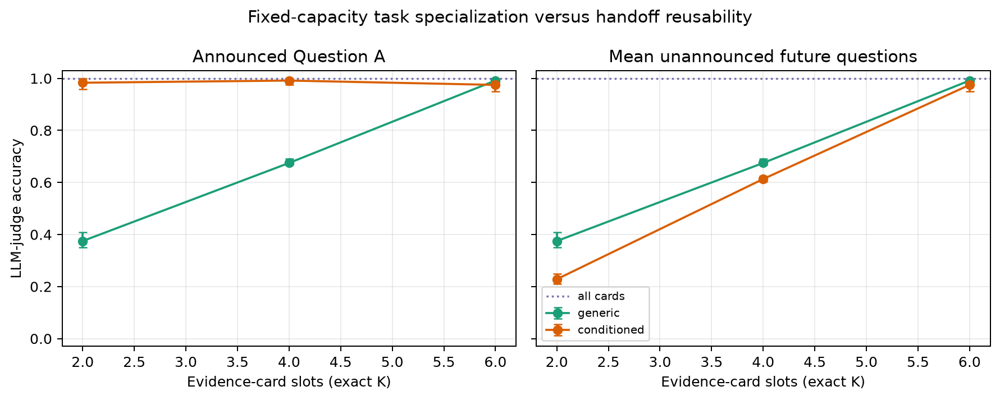

> **Key result:** With the channel width held fixed, optimizing which evidence
> is sent for the known question produces an immediate-utility gain and a
> future-query utility loss. The effect grows under a tighter bottleneck and
> vanishes when selection is removed.

**Boundary:** Effective `n=20` dossiers, not 120 independent rotations; one
selector/answerer stack; invented dossiers and atomic evidence cards. This is
stronger causal evidence than the natural-prose `n=10` pilot, not yet a broad
population estimate.

**Audit:** initial selector/answerer plus judge cost **$0.046603**.
[`report.md`](fictional_summary_generalization/n20/report.md),
[`contrasts.csv`](fictional_summary_generalization/n20/contrasts.csv), and
[`rotation_rows.csv`](fictional_summary_generalization/n20/rotation_rows.csv).

## 6. Multilingual fixed versus switching handoffs

> **Model:** Llama 3.1 8B Instruct · **Dataset:** same SQuAD gold-only A/B passages, `n=10` passages / 20 question IDs, one seed · **Configuration:** one shared A/B gold passage and no distractors; depths 1–6; conditioned/generic × fixed/switching schedule across six languages

> **Change:** Compare keeping one handoff language with rotating through English, German, French, Italian, Portuguese, and Spanish on the same gold-only A/B passages.

Fixed and switching schedules share stage 1; the treatment begins at stage 2. Final questions and answers remain English.

**How to read the figure.** Orange is question-conditioned and green is generic; solid lines keep one assigned language and dashed lines rotate languages. Both schedules share the stage-1 handoff, so only depths 2–6 test the language treatment. The columns compare target A with held-out B; the rows show token F1 and LLM-judge accuracy. Direct context at depth 0 is the shared baseline.

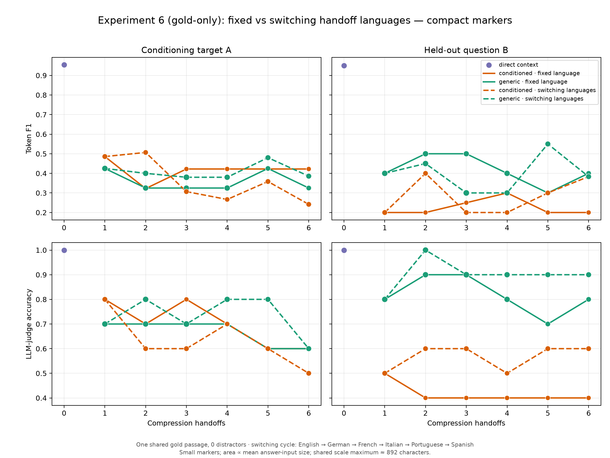

| Depth-6 switching − fixed F1 | Conditioned | Generic |
|---|---:|---:|
| Target A | −0.181 [−0.550, +0.183] | +0.061 [−0.225, +0.332] |
| Held-out B | +0.183 [0.000, +0.400] | −0.017 [−0.267, +0.183] |

Every F1 and judge interval from depths 2–6 includes zero. Language compliance is 237/240; no handoff reaches the token guard. Observed summaries average 583–804 characters, with generic summaries generally longer.

> **Key result:** No reliable cost or benefit from language switching is detected. This is not an equivalence result; `n=10` leaves wide intervals.

**Boundary:** Mostly high-resource Latin-script languages. Meta does not publish per-language pretraining shares. [Llama 3.1 model card](https://github.com/meta-llama/llama-models/blob/main/models/llama3_1/MODEL_CARD.md).

**Audit:** $0.0078 generation/answering, $0.0085 language auditing, $0.0026 judging.

## 7. Incremental-evidence handoff chain

> **Model:** Llama 3.3 70B Instruct · **Dataset:** MuSiQue-Answerable validation, `n=30`, two seeds · **Configuration:** 2–4 supporting paragraphs delivered one at a time; counterbalanced packet order; 0/1/3/5 evidence-free relays between specialists; question-conditioned versus question-omitted chains

> **Change:** Deliver one new MuSiQue supporting paragraph to each specialist while inserting 0/1/3/5 evidence-free relays between specialists.

The 30 examples contain 2–4 packets. Order is counterbalanced and fixed across conditions, depths, and two seeds. Relays receive only the sealed prior message. Conditions differ only in whether chain agents see the main question. Hidden decomposition probes measure packet-fact survival.

**How to read the figure.** The upper-left panel is final multi-hop token F1: its dotted line is direct access to all original evidence, and error bars are 95% bootstrap intervals. The upper-right panel is future-query regret, defined as original-evidence probe F1 minus final-handoff probe F1: positive values would mean the handoff is worse; values below zero mean probes were easier to answer from the handoff. In both panels, intervals overlap the relevant zero/baseline reference, so the figure does not establish a relay-depth effect.

The lower panels follow individual packet probes after their evidence first arrives. Their x-axis is **handoff age**, the number of later transformations the packet has experienced; colour gives relay depth (0, 1, 3, 5) and solid/dashed lines give question-conditioned/question-omitted chains. Lower-left is hidden-probe F1; lower-right is literal answer-string survival (a gold answer or alias appears in the message). These lines are descriptive, not a clean causal age curve: high ages contain only earlier packets, have fewer examples, and combine packet position with relay count. They show high observed retention, not proof that repeated relays are lossless.

| Relays | Conditioned F1 / judge | Question omitted F1 / judge |
|---:|---:|---:|
| 0 | 0.601 / 0.667 | 0.624 / 0.700 |
| 1 | 0.629 / 0.700 | 0.655 / 0.733 |
| 3 | 0.634 / 0.717 | 0.655 / 0.717 |
| 5 | 0.651 / 0.683 | 0.578 / 0.633 |

The complete-evidence baseline is F1/judge = 0.610/0.667. No relay-depth-minus-zero-relay F1 interval excludes zero. At five relays, the contrast is +0.050 [−0.050, +0.152] when conditioned and −0.046 [−0.174, +0.067] when omitted.

Future-query F1 regret—original evidence minus final handoff—is negative in every cell (−0.069 to −0.018), with every interval including zero. Specialists can make evidence easier to query without creating information. Literal answer-string survival in the five-relay conditioned chain is 0.986 at age 0 and about 0.91 at ages 11–12.

> **Key result:** Relay-only depth does not reliably degrade this incremental-acquisition system. Fresh specialist updates can compensate for communication loss; Experiment 2 remains the cleaner isolation of pure serial degradation.

**Boundary:** One model, `n=30`; high handoff age is correlated with early packet position and higher hop count.

**Audit:** generation/answering spend $0.6942; 7,019 live and 1,693 cached calls.

## 8. Model heterogeneity across sequential handoffs

> **Models:** four open-weight dense families at two size tiers (table below) · **Dataset:** SQuAD same-passage A/B pairs, `n=20`, one seed · **Configuration:** question-conditioned compression, depths 0–6, one shared gold passage among nine screened distractors; every arm answered by the *same* fixed model

> **Change:** Vary which model writes each handoff. Task, evidence, prompts, decoding, token budget and the final answerer are all held fixed.

### Research question

Every earlier chain experiment runs one model at every stage. Real multi-agent systems do not: subagents are routinely different models from the orchestrator and from each other, chosen for cost or availability. Two questions follow. Does repeatedly passing notes *between* model families cost more than passing them within one family at the same size? And when size changes too, does a later larger model recover what an earlier smaller one dropped — or does an early small model impose a bottleneck the rest of the chain inherits?

### Design

The comparison is only meaningful if three things are controlled, and they are:

- **The answerer is constant.** Every arm and depth is answered by `meta-llama/llama-3.1-8b-instruct` at temperature 0 — the model `pairs_n20.jsonl` was leakage-filtered against, so the C1 filter still applies to the model producing the scored answer. A second answerer, `mistralai/ministral-8b`, scores every row in parallel to test whether a Llama answerer simply reads Llama-written notes more easily. Had the last chain model also answered, a "large models late" trajectory would win because a large model answered, and nothing about the handoff would have been measured.
- **The prompts never name a model.** Stage-1 and stage ≥2 prompts are imported from Experiment 2 / Experiment 5's `conditioned` arm and asserted byte-identical at startup; a startup check also asserts neither prompt contains any family name. The decoder is the only thing that differs between arms. Stage ≥2 receives a frozen `SealedHandoff`, so source passages cannot re-enter a chain.
- **Start models are stratified and matched.** Each pair's start family is its index modulo the family cycle, so every family starts five of the twenty pairs. Each cross-family arm is compared against `homog_*_matched`: for that pair, the homogeneous chain built from *that pair's* start family. The two share a byte-identical stage 1 and diverge only from stage 2.

Because the questions come from prebuilt pairs rather than a per-model C1 filter, every arm sees the same questions. Unlike the Qwen replications in Experiment 2a, this is a genuinely paired cross-model comparison.

### Selected models and rationale

Open weights with a published parameter count (so the size axis is a documented number), dense rather than mixture-of-experts (so "parameter size" has no total-versus-active ambiguity), non-reasoning, and drawn from one release window so "family" is not silently "model vintage".

| Tier | Llama | Qwen | Mistral | Gemma |
|---|---|---|---|---|
| small | `llama-3.1-8b-instruct` (8B) | `qwen3-8b` (8.2B) | `ministral-8b` (8B) | `gemma-3-12b-it` (12.2B) |
| large | `llama-3.3-70b-instruct` (70.6B) | `qwen3-32b` (32.8B) | `mistral-small-3.2-24b` (24B) | `gemma-3-27b-it` (27.4B) |

Counts are vendor-published and stored with their basis and source URL; a model with an undisclosed count would be recorded as unknown and excluded from size contrasts rather than given an invented figure. Live OpenRouter metadata is snapshotted per run.

Seventeen generated arms plus two derived start-matched controls, over depths 0–6: four homogeneous families plus forward and reverse cross-family cycles at each tier, and a 3×2 factorial of size trajectory (`up` / `down` / `alt`) against family regime (held / rotating). All three trajectories hold the same tier multiset at depth 6, so comparing them there is an ordering comparison and nothing else.

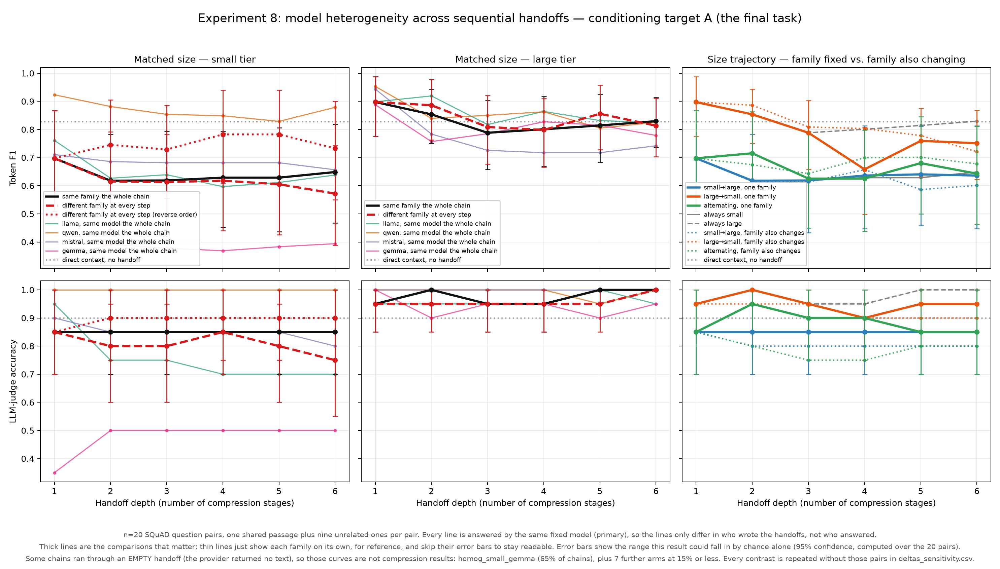

**How to read the primary figure.** Columns are the three blocks; rows are token F1 and judged accuracy on the conditioning target. Heavy black is the start-matched homogeneous control, heavy red the cross-family chains, thin coloured lines the individual homogeneous families, and the dotted horizontal line the shared depth-0 baseline (0.828 F1 / 0.900 judge). Homogeneous and heterogeneous chains are told apart by line weight rather than legend order.

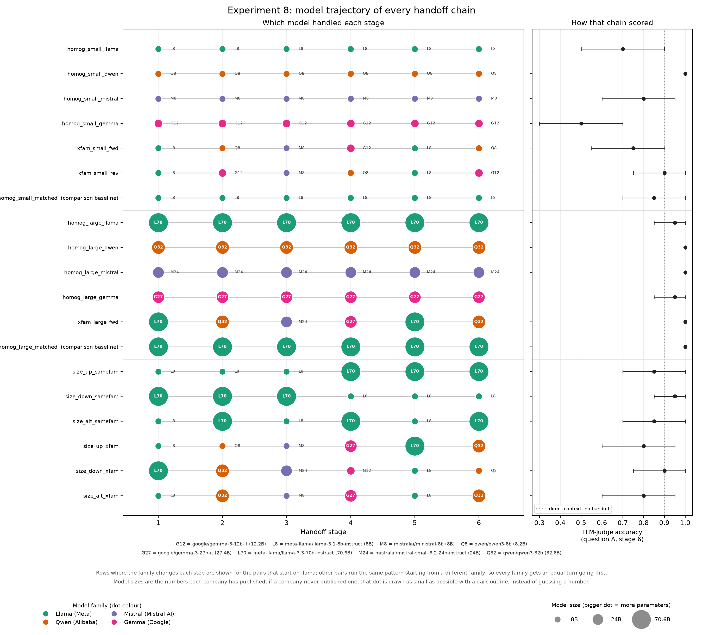

**How to read the trajectory figure.** Each row is one arm; each dot is the model that wrote that stage, coloured by family with dot **area** proportional to parameter count. The right-hand panel carries the same row's depth-6 judged accuracy on the same y axis, so chain architecture and chain outcome can be read together. Rows whose family rotates are drawn for the pairs starting on Llama; the rest run the same pattern rotated.

### Results

**A provider defect, found first.** `google/gemma-3-12b-it` returned an *empty* body — `content: null` with a non-zero completion-token count and `finish_reason: stop` — on 13 of 20 stage-1 prompts. DeepInfra is its only OpenRouter provider and the failure is deterministic at temperature 0, so it cannot be routed around. `homog_small_gemma` therefore measures a generation failure, not Gemma's compression quality, and is excluded from interpretation. Every contrast is reported twice: once on all pairs, once excluding — per contrast — the pairs its own arms degraded ([`deltas_sensitivity.csv`](model_heterogeneity/n20/deltas_sensitivity.csv)). This matters: it changes a conclusion below.

**Crossing model families costs nothing measurable in final accuracy.**

| Contrast, depth 6, target question | All pairs | Degenerate pairs dropped |
|---|---:|---:|
| Cross-family − homogeneous, small tier (judge) | −0.100 [−0.300, +0.100] | **+0.000 [−0.176, +0.176]** |
| Cross-family − homogeneous, large tier (judge) | +0.000 [+0.000, +0.000] | +0.000 [+0.000, +0.000] |
| Cross-family − homogeneous, small tier, second answerer (judge) | −0.050 [−0.200, +0.100] | +0.000 [−0.176, +0.176] |

> **Key result:** The apparent small-tier penalty for crossing families was carried entirely by the three pairs whose chains began with an empty Gemma message. With those removed it is exactly zero, on both answerers. At the large tier it is exactly zero regardless. Five family switches over six handoffs cost nothing detectable.

Pooling arms by switch count at depth 6 agrees: judged accuracy is 0.868 [0.809, 0.918] with zero switches and 0.858 [0.750, 0.950] with five.

**But crossing families changes the message a great deal.** The per-edge measurements are where heterogeneity shows up, and there the effects are large and consistent. Pairing within pair, cross-family edges against same-family edges at matched size:

| Per-edge measure | Cross-family | Same family | Paired delta |
|---|---:|---:|---:|
| Verbatim 5-gram copy rate | 0.340 | 0.607 | **−0.267 [−0.314, −0.219]** |
| Lexical similarity to previous message | 0.710 | 0.873 | **−0.163 [−0.200, −0.131]** |
| Length ratio (chars out / chars in) | 1.278 | 1.014 | **+0.263 [+0.140, +0.394]** |
| Judged semantic preservation | 0.940 | 0.989 | **−0.049 [−0.088, −0.015]** |
| Target answer string still present | 0.705 | 0.821 | **−0.116 [−0.238, −0.006]** |
| Held-out answer string still present | 0.157 | 0.254 | **−0.097 [−0.173, −0.020]** |

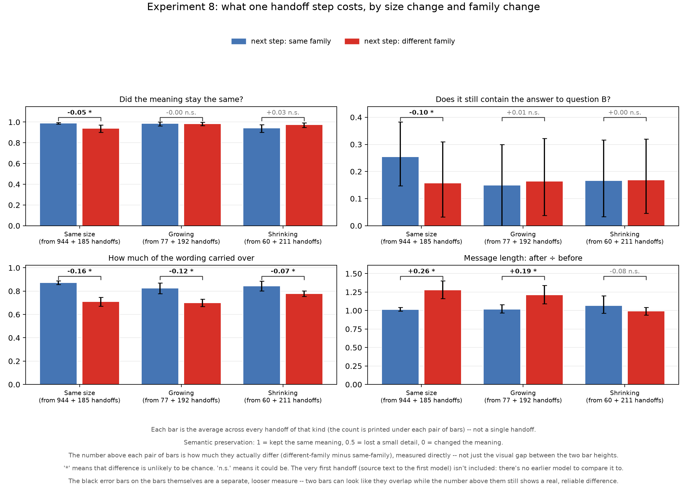

> **Key result:** A model of a different family rewrites rather than copies — verbatim copying nearly halves — and *expands* the message by about a quarter. Judged semantic preservation and literal fact survival both fall by a small but reliable amount. None of it reaches the answer to the question the chain was told about.

**How much of that is the *family* changing, and how much is simply a different model?** The control above is a model rewriting its own output, so the two are bundled. Two further contrasts partly unbundle them. When both sides already involve a model change — cross-family versus same-family edges that also change size — the lexical effect survives (−0.124 [−0.167, −0.079] when growing, −0.066 [−0.112, −0.018] when shrinking) but the *semantic* effect disappears entirely (−0.004 [−0.030, +0.030] and +0.033 [−0.015, +0.083]). And changing size within one family, with no family change at all, still reduces lexical similarity (−0.048 [−0.088, −0.009]) and held-out fact survival (−0.104 [−0.198, +0.003]). The reading that fits all three: **handing to a different model at all is what breaks verbatim carry-over; the drop in judged preservation is not specifically attributable to the family boundary.**

**What it may reach is the question the chain was *not* told about.** Every handoff is also answered against held-out Question B, which the compressors never see. There the small-tier cross-family contrast is the one effect that survives dropping the degenerate pairs rather than being erased by it: −0.150 [−0.300, +0.000] judged on all pairs and −0.176 [−0.353, +0.000] with them dropped (`p=0.097`). At the large tier it is +0.050 [−0.100, +0.200]. This is consistent with the per-edge finding that held-out answer strings survive a cross-family edge less often (0.157 vs 0.254), but the interval touches zero and this is one of many contrasts, so it is a direction to test rather than a result. It would matter if it held: it would mean heterogeneity costs *reusability* while leaving the current task intact — the same asymmetry Experiment 5 found for task conditioning.

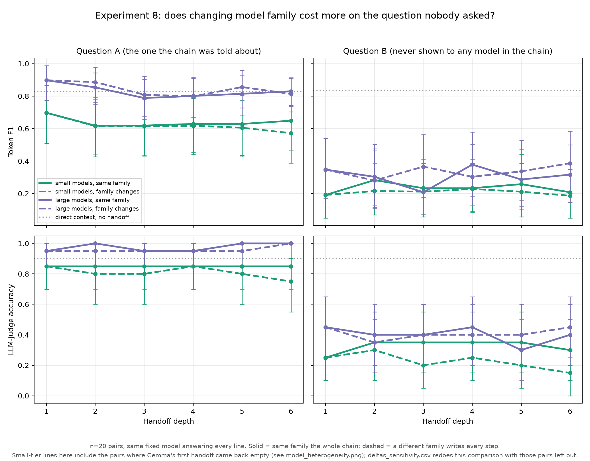

The small-tier homogeneous and cross-family lines (solid vs. dashed green) sit on top of each other in the left column and separate in the right one, at every depth from 1 to 6 rather than only at the depth-6 point estimate quoted above — so the gap is not an artifact of picking one landmark depth. The large-tier pair (purple) shows no such split on either question.

> **Comment on the conclusions.** This is the clearest visual evidence in the experiment for the report's headline claim — *heterogeneity costs form, not the answer it was asked for* — and for where that claim has a boundary. The two green lines being indistinguishable on target A is what licenses "crossing families is free" at all; the same two lines separating on held-out B is what keeps that claim from being read as "crossing families is free, full stop." Both readings sit side by side in one figure instead of two separately-quoted numbers, which is why the pattern is more persuasive here than the depth-6 table alone: a coincidence at one depth would not reproduce across five independent depths in the same direction. It does not change the report's epistemic status — the held-out interval still touches zero at `p=0.097`, and one is comparing lines built from the same at-risk small-tier pairs described above — but it is the strongest reason in this experiment to take the reusability asymmetry as directional signal rather than noise, and it reproduces the exact shape of Experiment 5's task-conditioning result on a completely different manipulation (which model writes, not what it is told).

**Size matters more than family, but not decisively at `n=20`.** The large tier sits at 0.95–1.00 judged accuracy at depth 6 while the small tier spans 0.50–1.00. The tier contrast is directionally positive in all four answerer × analysis combinations, but only the all-pairs version excludes zero:

| Large − small homogeneous, depth 6 | All pairs | Degenerate pairs dropped |
|---|---:|---:|
| Token F1, primary answerer | +0.181 [+0.030, +0.352] | +0.125 [−0.013, +0.294] |
| Judged accuracy, second answerer | +0.250 [+0.050, +0.450] | +0.176 [+0.000, +0.353] |

**Neither recovery nor bottleneck is detectable.** `size_up` (three small then three large) and `size_down` (three large then three small) hold the same models at depth 6 and differ only in order. A larger downstream model does not recover what a smaller upstream one dropped: the difference-in-differences from depth 3 is +0.000 [+0.000, +0.000] judged. The reverse — a smaller model late spoiling a good early summary — is −0.050 [−0.150, +0.000], also inconclusive. The direct order contrast points towards "large models first" (−0.115 F1 [−0.317, +0.083] for up minus down) but shrinks to −0.047 [−0.259, +0.152] once degenerate pairs are dropped.

Adding family rotation on top of a fixed size trajectory changes nothing: −0.050 [−0.150, +0.000], −0.050 [−0.200, +0.100] and −0.050 [−0.200, +0.100] judged for up, down and alternating respectively.

**The largest effect in the experiment is between families, not across them.** At the small tier, homogeneous Qwen3-8B reaches 0.879 F1 / 1.000 judge at depth 6 while homogeneous Llama-3.1-8B reaches 0.638 / 0.700 — a gap far wider than any heterogeneity contrast, at nominally the same size. At the large tier that spread closes almost entirely (0.742–0.830 F1, 0.950–1.000 judge). Mean handoff length differs by a factor of two across models at the same tier (Ministral 8B writes 276 characters at depth 6, Llama 3.1 8B 713), and no arm ever hit the 1,500-token guard.

### Interpretation

Heterogeneity is not free, but what it costs is *form*, not *facts that reach the answer*. Handing a note to a different model roughly halves verbatim carry-over and expands the message, and at matched size it also reduces judged preservation and literal answer-string survival — though that semantic component tracks *changing model* rather than *crossing a family boundary* specifically. Six handoffs and five family switches nonetheless leave final accuracy indistinguishable from a chain that never changed model. This extends the project's recurring surface-drift finding: repeated rewriting changes wording without changing the asserted fact, and changing the writer's family mostly increases how much the wording changes.

The practical implication inverts the intuitive worry. Choosing *which* model writes the handoffs matters considerably; choosing whether they are all the *same* model does not. A pipeline is better served by picking a capable compressor than by keeping the family uniform.

### Limitations and confounds

- **"Same family, same size" is always the same model.** Each family has one model per tier, so a same-family edge is a model rewriting *its own* output while a cross-family edge is always a different model. The per-edge contrast therefore measures "a different model writes the next turn" and cannot separate family change from model change. A follow-up needs two same-family, same-tier models (for example Qwen3-8B and Qwen2.5-7B) as a within-family, different-model control.
- **Families differ in far more than parameter count** — pretraining corpus, instruction-tuning recipe, tokenizer, and output style. Gemma emits bulleted notes, Ministral terse prose. "Family effect" bundles all of this.
- **The Qwen entries carry an extra system-prompt line** (`/no_think`) that the other six do not. It is a necessary control for a thinking-by-default model, but it is a real prompt asymmetry.
- **The size tiers are bands, not points.** The large tier spans 24B–70.6B, so "large" is not one size; Llama 3.3 70B is nearly three times Mistral Small 24B.
- **The large tier is near ceiling** on judged accuracy (0.95–1.00), leaving little room for a heterogeneity effect to appear there even if one existed.
- **`n=20`, one seed, one dataset, one task shape.** Compression is deterministic at temperature 0, so within-model sampling variance is not estimated. Intervals are exploratory and not multiplicity-corrected — the per-edge table alone reports six measures.
- **Provider routing varied within the run** (Llama 3.3 70B was served by nine different providers), and the on-disk cache, not the seed, is what makes a rerun exact.
- **One model in the pool was defective through its only provider,** contaminating three of twenty pairs in every small-tier arm and thirteen in the homogeneous Gemma arm.

> **Concise takeaway:** Heterogeneous agent handoffs are cheaper than they look. Repeatedly passing a research note to a different model roughly halves verbatim carry-over, lengthens the message, and costs a small but reliable amount of judged preservation and literal fact survival at every edge — yet after six handoffs and five family switches the answer to the chain's own question is no worse than a single-model chain. What does move that outcome is *which* models are in the chain, not whether they match: the spread between two equally-sized families is wider than any heterogeneity penalty measured here, and a bigger model downstream does not repair what a weaker one upstream discarded. The one place heterogeneity might still be charged is reusability — held-out questions do worse after cross-family chains, directionally and not conclusively — which is the same asymmetry task conditioning shows in Experiment 5 and the natural target for a larger replication.

**Audit:** chain models $0.1836 (7,934 live calls, 646 cached); answer judge $0.0127; preservation judge $0.1142. Total $0.3105. Prompts — all inherited unchanged — are listed in [PROMPTS.md § Experiment 8](../PROMPTS.md#experiment-8); per-stage records with model, family, parameter count and its basis are in [`stage_records.csv`](model_heterogeneity/n20/stage_records.csv).

### 8b. Evidence availability after a source selector

> **Models:** Llama 3.1 8B/Llama 3.3 70B and Qwen3 8B/32B selectors and relays; fixed Mistral Small 3.2 24B reader; GPT-4o-mini judge · **Dataset:** 20 invented dossiers × four A→B rotations (80 repeated tasks) · **Channel:** six source cards → three-card sealed packet → one-card relay output

> **Change:** Reveal Question B only after the A-aware source selection is
> sealed, then vary model tier and B-evidence availability separately from
> channel width.

#### Design and hypotheses

Stage 1 sees the full six-card fictional dossier and Question A, then selects
exactly three cards. Only after that packet is sealed is a different Question B
revealed. Stage 2 sees B and the three-card packet—but not the source—and selects
one card for the fixed Mistral reader. Small and large selector and relay tiers
are crossed separately within Llama and Qwen. Intervals and paired tests resample
dossiers, not the four rotations; intention-to-treat (ITT) is primary.

This separates two possible bottlenecks. A **model-tier bottleneck** predicts that
a large selector or relay should outperform its small counterpart. An
**availability bottleneck** predicts that relay tier should stop mattering once
the sealed packet contains no B-bearing text, while restoring B evidence at the
same width should restore the answer.

#### Results: tier effects do not replicate across families

| Judged B accuracy, ITT | S→S | S→L | L→S | L→L |
|---|---:|---:|---:|---:|
| Llama | 0.300 | 0.350 | 0.338 | 0.388 |
| Qwen | 0.388 | 0.400 | 0.350 | 0.362 |

At a fixed large relay, replacing the small selector with the large selector
changes B accuracy by **+0.037** [−0.037, +0.125] for Llama but **−0.037**
[−0.125, +0.062] for Qwen. The direction reverses. This run therefore provides
no family-replicated evidence for a monotonic selector-tier advantage.

The relay contrast needs a second distinction. Across all tasks, the observed
large-minus-small relay difference after a small selector is **+0.050** [+0.013,
+0.100] for Llama and **+0.013** [+0.000, +0.037] for Qwen. Those comparisons
include packets that still carry B-bearing text. Among the **98 matched,
schema-valid omissions**—51 Llama and 47 Qwen—in which the small selector's
delivered text contains no annotated B answer or alias, both relay tiers score
zero on all 196 sealed evaluations. Large-minus-small is **0.000 [0.000,
0.000]** for each family, inside the configured ±0.05 equivalence margin.

#### Results: same-width restoration localizes the failure

For those same omissions, the restoration control replaces one packet slot with
B's exact source card. The sham replaces the same slot with a different non-B
card, so packet width and the removal operation are held fixed. Restoration
yields 51/51 correct answers for Llama and 47/47 for Qwen; the sham yields 1/51
and 1/47. Because the estimand gives each dossier equal weight, the paired
deltas are not simply the pooled raw-proportion differences.

| Contrast on matched omissions | Llama | Qwen |
|---|---:|---:|
| Exact restoration − sham | **+0.983** [+0.950, +1.000] | **+0.950** [+0.850, +1.000] |
| Exact restoration − sealed | **+1.000** [+1.000, +1.000] | **+1.000** [+1.000, +1.000] |
| Source reopened − sealed | **+1.000** [+1.000, +1.000] | **+1.000** [+1.000, +1.000] |

All six paired tests have `p<0.001`. The fixed reader scores 1.000 when given all
source cards and 0.000 closed-book, providing positive and negative controls.

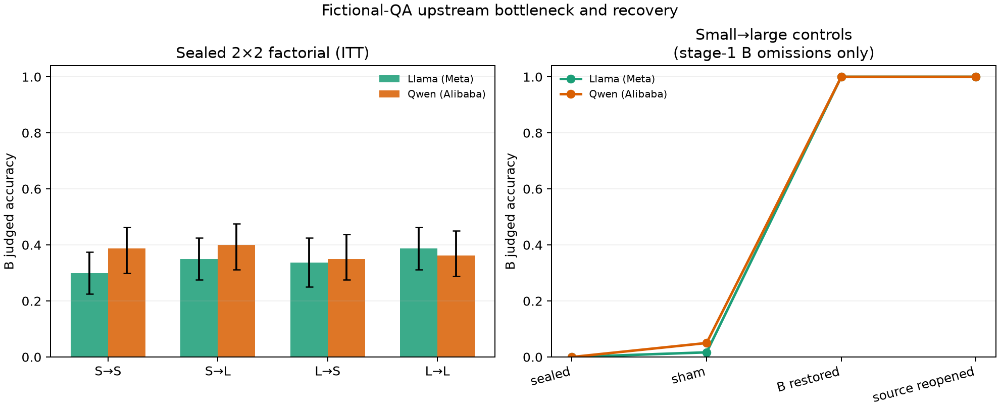

*Left: ITT accuracy with dossier-bootstrap 95% intervals. Right: equal-dossier-weighted point estimates on the 51 Llama and 47 Qwen matched omissions; the panel does not show uncertainty bars. “Source reopened” is an unsealed positive ceiling, not a factorial treatment.*

> **Key result:** Experiment 8b supports an **evidence-availability bottleneck
> under this protocol**, not a general parameter-count bottleneck. Increasing
> relay tier did not help after a valid sealed packet lacked annotated
> answer-bearing text; restoring that text without widening the packet restored
> accuracy and strongly outperformed the matched sham.

**Boundary and audit.** “Absent” means that no annotated answer string or alias
appears in the delivered text; it is not proof that an answer is semantically
impossible to infer, and each sham arm produced one plausible correct guess. The
effective sample is 20 dossiers, the cards are synthetic and atomic, and the
Llama tier contrast changes both size and model generation. Eight answer strings
also occur outside their designated card, so eligibility is checked against the
delivered text rather than card id. Fifty-seven of 1,120 relay arm-task rows are
schema-invalid, all from Qwen and all with no B-bearing text in the relay input;
ITT keeps them, and compliant-only analyses preserve the conclusion. Total generation and
judging cost was **$0.061026**. See
[`report.md`](fictional_model_bottleneck/n20/report.md),
[`contrasts.csv`](fictional_model_bottleneck/n20/contrasts.csv), and
[`records.csv`](fictional_model_bottleneck/n20/records.csv).

## 9. Does telling the writer about the next reader's space change the handoff?

> **Model:** Llama 3.3 70B Instruct
> **Data:** 26 changed real-world documents and 20 invented dossiers. Each item
> has one fact needed now and five extra facts that could be useful later.
> **Setup:** The note is handed on three times. Every response has the same
> 12,000-token output safety limit.

#### What changed?

Only the wording about the next reader changed:

| Short name | What the writer is told |
|---|---|
| **No size information** | Nothing about the next reader's available space |
| **Just told 2k** | The next reader has a 2,000-token context window |
| **Told to fit 2k** | The same 2k statement, plus “Make your handoff fit within it” |
| **Just told 10k** | The next reader has a 10,000-token context window |
| **Told to fill 10k** | The same 10k statement, plus a request to expand and use the space |
| **Told to be concise** | “Keep your handoff concise,” with no number |

Three additional chains changed the instruction across the three steps to test
recovery: just-told-10k → just-told-2k → just-told-10k; fill-10k → fit-2k →
fill-10k; and fit-2k → fit-2k → fill-10k.

The next reader's **real** context window never changes. The experiment changes
only what the writer is told. The 2k and 10k numbers are therefore prompt
messages, not API limits.

The normal chain prompt used elsewhere in this project begins “Write concise
prose research notes.” We removed “concise” from the no-size version so that it
would not already contain a shortening request. The separate “told to be
concise” version measures that request openly.

The two datasets make forgotten information easier to identify. In the changed
real-world documents, a familiar fact is deliberately replaced with a new
value, so the document conflicts with what the model remembers. The invented
dossiers contain facts the model could not have known beforehand. After the
first handoff, each writer sees only the previous note—not the source.

The main results compare the final note after three handoffs. The same
instruction is used at all three steps. Thus, “just told 2k versus no size
information” compares two complete three-step chains, not only the last writer.

#### Result 1: “Fill 10k” often makes the model repeat itself

The **10k** in this instruction describes the supposed space of the next
reader. It is not the output limit. All conditions have the same, separate
**12k output-token safety limit**.

Across all stages and instruction sequences, 230 responses were told to fill a
10k window:

| How the API labelled the ending | Responses | Typical length (middle response) | Repeated five-word sequences | Typical share of the five extra facts kept |
|---|---:|---:|---:|---:|
| Reached the length limit | 102 | 9,687 words | **91.2%** | 100% |
| Reported a normal stop | 127 | 784 words | 8.8% | 80% |
| No size information, for comparison | 138 | 169 words | 0.0% | 40% |

One additional fill-10k response ended with an error.

These ending labels come from the API. A “normal stop” label does not prove that
the model intentionally chose a sensible length. Two of the 127 stop-labelled
responses also used exactly 12,000 tokens and were highly repetitive. The 44.3%
length-limit rate is therefore a conservative count of the cap-running,
loop-like behavior.

The 102 length-limit responses were not long because they contained thousands of
words of new detail. A 91.2% repetition score means that almost every sequence
of five words had already appeared earlier in the same response. They were
mostly repetition loops.

The output limit decided **where the loop was cut off**, but it did not cause
the loop. Raising the limit did not fix the behavior. With a 4,096-token limit,
50.9% reached the limit; with 12,000 tokens, 44.3% did. In a separate eight-item
test with a 32,000-token limit, five responses ended after 631–1,006 tokens,
while three kept looping until all 32,000 tokens were used, producing roughly
24,000–27,000 words.

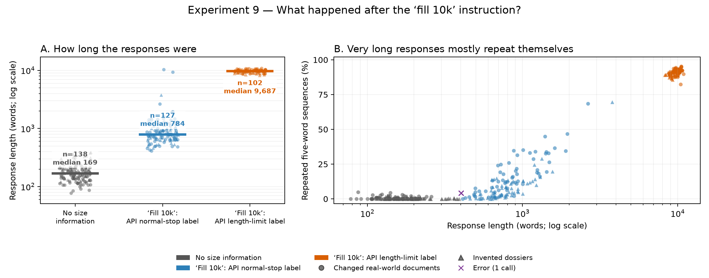

*Each mark is one response. The left side shows its length. The right side
shows how much text was repeated. The word-length axes use a compressed scale
so that responses near 100 and 10,000 words can appear in the same plot.
Circles are changed real-world documents, triangles are invented dossiers, and
the purple cross is the one error.*

An average for the fill-10k condition would mix roughly 800-word responses with
roughly 10,000-word loops and would describe neither group well. A loop can keep
repeating a passage that contains all five facts, so a 100% fact-presence score
does not mean the extra length added useful detail. We therefore treat fill-10k
as a failure pattern, not as a clean test of whether useful extra detail helps.

Across all fill-10k calls, the scan found 5.8 source-unsupported terms per
changed-real-world response, compared with 2.4 with no size information. For
invented dossiers the corresponding numbers were 4.9 and 2.4. “Unsupported”
means absent from the source; it does not prove that every term is false.
Because the rise also occurs on invented dossiers, and the model's memorised
replacement value appears in only 2 of 130 changed-real-world fill-10k calls
(1.5%), there is little sign that expansion recovered missing dossier facts.
A separate judge found 2.80 unsupported claims in the 102 length-labelled calls
and 3.83 in the 127 stop-labelled calls. This is a descriptive split, not a
same-item comparison between two prompts.

#### How to read the next results

The earlier phrase “paired depth-3 contrast with a 95% bootstrap interval”
means the following in plain language:

1. **After three handoffs:** the result comes from the final note, after three
   writers have passed it on.
2. **Same-item comparison:** every source item was run under both instructions.
   We compared each item with itself, then averaged those differences. This is
   what “paired” meant.
3. **Difference between two instructions:** this is all “contrast” meant. For
   example, **119.5 more words** means that “just told 2k” produced 119.5 more
   words than “no size information,” on average, for the same items.
4. **Uncertainty range:** because there are only 26 changed-real-world items and
   20 invented items, we rebuilt the average 10,000 times from different
   same-sized draws of those observed items. The brackets show the middle 95%
   of those recalculated averages. This method is often called bootstrapping.

The bracketed range describes uncertainty in the **average**, not the range of
individual responses. If the whole range says “more” or the whole range says
“fewer,” the estimated average stayed on the same side of zero in this
resampling check. That does not mean every individual item changed in the same
direction, or prove the result for a wider population. If the range spans both
sides, this run does not clearly establish the direction. It also does not
cover other sources of uncertainty, such as choosing a different model or
prompt.

None of the final, third-handoff rows used in the next comparisons hit the 12k
output limit. One invented-dossier response in the fit-2k version ended with an
error.

#### Result 2: simply mentioning 2k or 10k makes the handoff longer

| Comparison after three handoffs | Changed real-world documents (26) | Invented dossiers (20) |
|---|---:|---:|
| **Just told 2k instead of no size information:** length | **119.5 more words** (range: 99.6–140.8 more) | **189.3 more words** (150.5–229.3 more) |
| **Just told 10k instead of no size information:** length | **104.8 more words** (82.9–128.0 more) | **211.5 more words** (163.7–261.7 more) |
| **Told to fit 2k instead of only being told 2k:** length | **42.8 fewer words** (21.2–66.9 fewer) | **87.6 fewer words** (37.2–145.1 fewer) |
| **Told to fit 2k instead of no size information:** length | **76.7 more words** (55.3–99.3 more) | **101.7 more words** (68.3–132.6 more) |
| **Just told 2k instead of no size information:** extra facts kept | **15.4 percentage points more** (6.9–25.4 more) | **36.0 points more** (24.0–49.0 more) |
| **Just told 10k instead of no size information:** extra facts kept | **11.5 percentage points more** (0.8–23.1 more) | **29.0 points more** (17.0–42.0 more) |
| **Told to be concise instead of no size information:** length | **114.1 fewer words** (98.6–130.7 fewer) | **157.6 fewer words** (130.9–187.9 fewer) |
| **Told to be concise instead of no size information:** extra facts kept | **27.7 percentage points fewer** (13.8–42.3 fewer) | **15.0 points fewer** (4.0–25.0 fewer) |

A percentage-point change is a direct change in the share of facts kept. For
example, moving from 40% to 55.4% is **15.4 percentage points more**.

The pattern is simple:

- Merely mentioning either “2k” or “10k” made the notes longer.
- Adding “fit within 2k” removed some of the extra length caused by mentioning
  2k, but the notes were still longer than when no size was mentioned.
- In the bare 2k and 10k comparisons, the longer notes also kept more of the
  five extra facts.
- “Keep your handoff concise” was the only tested instruction that made notes
  shorter than the no-size version. It also caused more extra facts to be lost.

The 2k and 10k statements caused broadly similar changes, but this does not
show that the model understood or precisely followed the numbers.

The effect also grew across the chain rather than fading away. For the changed
real-world documents, “just told 2k” added 71.8 words after the first handoff,
92.0 after the second, and 119.5 after the third. Each new writer appears to
respond to the instruction again.

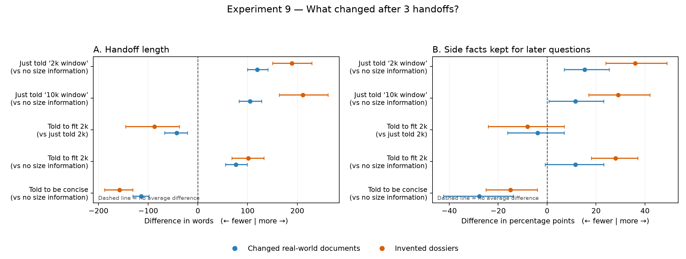

*Each dot shows the average difference on the same items after three handoffs.
A dot to the right of the dashed line means more words or more extra facts; a
dot to the left means fewer. The horizontal line through each dot is the 95%
uncertainty range explained above. The fill-10k instruction is omitted because
combining ordinary responses and repetition loops would give a misleading
average.*

#### Result 3: the extra text did not improve answer accuracy

No clean comparison shows that writing more improved the answer to the current
question. Compared with no size information, the fit-2k instruction produced
longer notes, but:

- judge-rated accuracy was **15.4 percentage points lower** for changed
  real-world documents; the uncertainty range was 3.8–30.8 points lower;
- it was **15.0 points lower** for invented dossiers, but the range went from
  35 points lower to 5 points higher, so the direction is unclear there.

Because the sample is small and the report checks many comparisons, the first
result is a reason to test again, not final proof. The fill-10k average was also
lower, but its mix of ordinary responses and repetition loops prevents a clean
conclusion about useful added detail.

For scale, answers from the source were judged correct on 96.2% of changed
real-world items and 100% of invented items. After three no-size handoffs, the
judge-rated rates were 80.8% and 90.0%. Under fill-10k they were lower again, at
65.4% and 60.0%, but that condition cannot separate useful expansion from the
looping failure.

#### The recovery question remains unanswered

The experiment also asked whether a fact lost under a small-space instruction
could return when a later writer was told that more space was available. Too
few facts disappeared to answer this: depending on the instruction, only
0–15% of tracked facts were lost, usually leaving fewer than ten cases to
inspect.

None of those few lost facts came back as either the document's value or the
different value remembered by the model. That zero does **not** show that
recovery is impossible; there were simply too few lost facts to estimate a
recovery rate. Some prompted chains used the model's memorised answer more
often than the no-size chain, but those counts were also too small for a firm
comparison.

> **Main finding:** Telling the writer that the next reader has a 2k or 10k
> window makes the handoff longer and preserves more extra facts. The model
> does not reliably size its writing to the stated number. “Fit within 2k”
> removes only part of the added length. “Fill 10k” frequently produces a long
> repetition loop. None of the clean comparisons shows that the extra text
> improves answer accuracy.

**What this experiment cannot establish.** This is one model at temperature 0.
The next reader's real capacity never changed; only the prompt did.
The uncertainty ranges measure variation across these items, not across models,
prompts, or judges. The changed-real-world set also combines 20 shorter passages
(mean 1,102 characters) with six longer passages (mean 7,471 characters). Both
sources show the same broad pattern at the third handoff, so the pooled result
is not driven only by the longer passages.
Source-separated results are in
[metrics_by_source.csv](size_adaptation/metrics_by_source.csv). Full tables and
diagnostics are in [report.md](size_adaptation/report.md),
[contrasts.csv](size_adaptation/contrasts.csv),
[expansion_content.png](size_adaptation/expansion_content.png), and
[recovery.csv](size_adaptation/recovery.csv). The all-condition overview is
[size_adaptation.png](size_adaptation/size_adaptation.png).

## 10. Communication regret under a hard communication budget

> **Model:** Llama 3.1 8B Instruct as sender and answerer; GPT-4o-mini judge and group auditor · **Dataset:** 24 SQuAD paragraphs, four human-written questions each, all four leak-free closed-book (`n=24` contexts, 96 questions, 96 rotations) · **Configuration:** four communication policies plus two extractive controls, at 20/40/80/160 delivered words, every question rotated through the conditioning role and every message answered on every question

> **Change:** Every earlier conditioning experiment either let the arms choose
> their own length (Experiment 5) or gave up free text to fix capacity
> structurally (Experiment 5b). This one keeps free-text handoffs and makes the
> *channel* the controlled variable, then reads the trade-off off a full
> per-context utility matrix instead of one held-out question.

### What is controlled, and how it is verified

**The budget is a two-sided word band, not a `max_tokens`.** A cap-only pilot
produced fill ratios of 0.61 (`conditioned`), 0.75 (`reusable`), 0.83
(`oracle`) and 0.88 (`generic`) at a 40-word cap — the conditioned arm quietly
spent a third less channel than its control. `src/budget.py` therefore contracts
both sides, corrects out-of-band drafts with wording identical across policies,
and truncates to the cap unconditionally. Realised fill across all four budgets
is then 0.88–0.96 with a 1.0–5.5 word standard deviation, zero deliveries over
the cap, and internal repetition ≤ 0.005 — so the floor was not met by padding.

**Length is additionally tested, not just audited.** Paired context-clustered
length deltas between `conditioned` and `generic` are −0.24, −0.47, +1.32 and
+1.70 words at the four budgets, all with intervals spanning zero. A
length-matched subsample (arms within 6 words in the same context) and a trimmed
arm (every abstractive message in a cell cut to that cell's shortest delivered
length, then re-answered) both reproduce the headline result.

**Rotation removes the question-difficulty confound.** Each question is the
conditioning query once and a hidden query three times. `generic`, `oracle` and
`extractive_generic` hold one message per (context, budget) shared by every
rotation, so their `U_now` and `U_future` are equal by construction — the
baseline for a specialisation claim cannot itself specialise.

### Result

Direct-context ceiling **0.875 [0.812, 0.938]**; three-sample closed-book
baseline **0.031 [0.010, 0.059]**.

| `conditioned` − `generic` | 20 w | 40 w | 80 w | 160 w |
|---|---:|---:|---:|---:|
| ΔU_now (present query) | **+0.625** [0.552, 0.698] | **+0.448** [0.354, 0.542] | **+0.281** [0.167, 0.396] | +0.104 [0.000, 0.208] |
| ΔU_future (hidden queries) | **−0.063** [−0.122, −0.003] | **−0.115** [−0.201, −0.028] | **−0.194** [−0.274, −0.118] | **−0.170** [−0.292, −0.052] |
| Specialisation gap, DiD | +0.688 [0.604, 0.774] | +0.562 [0.448, 0.667] | +0.476 [0.372, 0.580] | +0.274 [0.156, 0.396] |

Both directions exclude zero at 20, 40 and 80 words. At 160 words — roughly the
length of the source paragraph, so nearly a no-compression control — the present
gain no longer clears zero while the future loss persists. Exact match and token
F1 agree with the judge on every one of these cells except the 20-word future
delta, where they are negative but not significant.

The conditioning-induced specialisation gap grows as bandwidth falls:
**+0.413 [0.326, 0.503]**, p < 0.001, dz = 1.84 between the 160-word and 20-word
budgets. That is the scarcity prediction, tested directly rather than read off
the trend.

### The channel was not the constraint

`oracle`, shown all four questions and held to the same band, scores
**0.823 [0.740, 0.896]** on *every* question at 40 words — matching
`conditioned`'s present-query score with the same ~37 words while giving up
nothing on the other three. What `conditioned` drops is not information the
budget could not hold. It is information the sender had no reason to keep.

| policy at 40 w | U_now | U_future | delivered words |
|---|---:|---:|---:|
| `generic` | 0.375 | 0.375 | 37.1 |
| `conditioned` | 0.823 | 0.260 | 36.7 |
| `reusable` | 0.802 | 0.271 | 36.3 |
| `oracle` | 0.823 | 0.823 | 37.9 |

### Asking for reusability barely helps

`reusable` is `conditioned` plus an explicit instruction that unknown further
questions may follow and that reusable evidence should be preserved within the
same limit. It still loses future utility against `generic`
(−0.066 / −0.104 / −0.108 / −0.097 across the four budgets, every interval
excluding zero) and is statistically indistinguishable from `conditioned` on
`U_future` at 20 and 40 words. Telling a sender to stay general is not a
substitute for telling it what will be asked.

### It is selection, not rewriting

The extractive arms copy source sentences verbatim, so no abstractive rewriting
can occur. They reproduce the pattern:
`extractive_conditioned` − `extractive_generic` is **+0.385 / −0.198** at 20
words and **+0.292 / −0.156** at 80 words. The loss is in *which* evidence is
sent, not in how it is worded.

### Pareto structure

With cost measured as mean delivered words, the nondominated set is
`oracle` at every budget, `conditioned` at 20 and 40 words,
`extractive_conditioned` at 40 and 80 words, and `reusable` at 40 and 160 words.
Every `generic` configuration is dominated by an `oracle` configuration of equal
or lower cost. The unconditioned arms sit exactly on the no-specialisation
diagonal; the conditioned arms sit far below it.

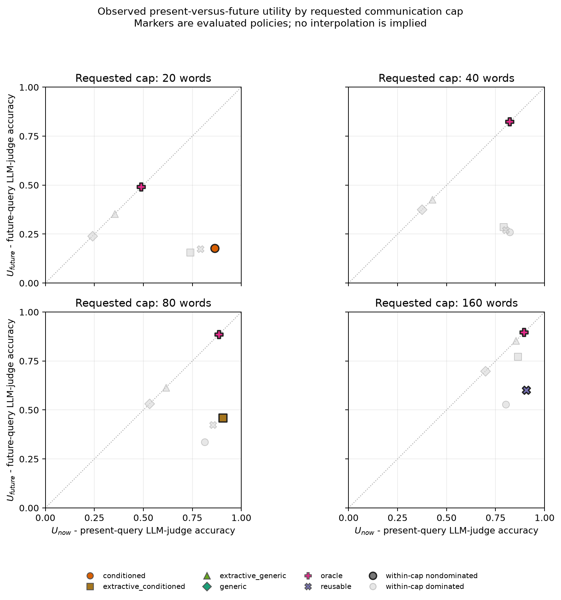

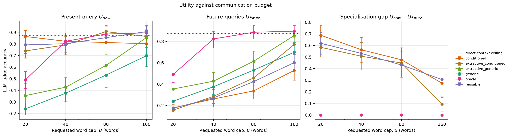

> **Key result:** Under a length-matched channel, conditioning a handoff on the
> currently known question raises present-query accuracy and lowers
> future-query accuracy, and the trade-off sharpens as the channel narrows. An
> oracle handoff of the same length carries every answer, so this is
> allocation, not capacity.

**Boundary:** One sender/answerer model, one dataset, `n=24` contexts with
`k=4` questions each. `U_future` is bounded below by how much the `generic`
baseline itself achieved, which is only 0.240 at 20 words — the absolute future
loss is therefore compressed at the tightest budget even though the
specialisation gap is largest there. The floor half of the budget contract is
best-effort and missed in 0–16% of messages depending on the arm, concentrated
in `extractive_conditioned` where verbatim sentences cannot be lengthened.

**Audit:** sender and answerer **$0.0798**, judge **$0.0654**, dataset build
**$0.0115**. [`report.md`](communication_regret/squad_groups/n24/report.md),
[`example.md`](communication_regret/squad_groups/n24/example.md) (one context's
full utility matrix with the messages that produced it),
[`contrasts.csv`](communication_regret/squad_groups/n24/contrasts.csv),
[`length_audit.csv`](communication_regret/squad_groups/n24/length_audit.csv),
[`pareto.csv`](communication_regret/squad_groups/n24/pareto.csv),
[`utility_matrix.csv`](communication_regret/squad_groups/n24/utility_matrix.csv).

### 10a. Replication and distance structure on relation-labelled dossiers

> **Model:** same Llama 3.1 8B sender and answerer · **Dataset:** 16 invented dossiers, four aspects x {anchor, paraphrase, same-entity, same-topic} = 16 questions each, `n=16` contexts, 64 rotations, 640 messages, 11,264 answers · **Configuration:** `generic` / `conditioned` / `reusable` / `oracle` at the same four budgets; each rotation's 15 hidden questions carry a designed distance label

SQuAD supports no clean labelling of *how far* a hidden question sits from the
conditioning one, and inferring the label from embeddings would replace a
controlled variable with an estimate. This corpus builds the distance in:
conditioning on an aspect's anchor, exactly one hidden question is a paraphrase
of it (same answer, different wording), one is a second fact about the same
subject in the same aspect, one is a fact about a different named entity in that
aspect, and the twelve questions of the other three aspects are orthogonal.

Direct-context ceiling **0.992 [0.977, 1.000]**; closed-book **0.000** — a
dossier was discarded if *any* of its sixteen questions leaked, which cost 12 of
28 built pages. Realised fill 0.90–0.95, sd 1.0–6.6 words, zero over-cap
deliveries, repetition ≤ 0.002. Paired `conditioned` − `generic` length deltas
are −0.47, −0.66, −0.38 and +0.33 words, all spanning zero.

The main effect replicates and is larger:

| `conditioned` − `generic` | 20 w | 40 w | 80 w | 160 w |
|---|---:|---:|---:|---:|
| ΔU_now | **+0.859** [0.797, 0.922] | **+0.641** [0.547, 0.719] | **+0.516** [0.406, 0.609] | **+0.359** [0.250, 0.469] |
| ΔU_future | −0.026 [−0.051, +0.001] | **−0.110** [−0.152, −0.070] | **−0.198** [−0.257, −0.136] | **−0.342** [−0.396, −0.292] |

Both directions exclude zero at 40, 80 and 160 words; at 20 words the future
loss is the right sign but the generic baseline has almost nothing left to lose
(`U_future` = 0.103 against a 0.992 ceiling), which is a floor, not an absence.

### Regret rises with distance, and only under conditioning

Future-query regret `R(q | conditioning query)`, by designed distance:

| policy | budget | paraphrase | same entity | same topic | orthogonal |
|---|---:|---:|---:|---:|---:|
| `conditioned` | 20 w | 0.000 | 0.953 | 0.984 | 0.983 |
| `conditioned` | 80 w | 0.016 | 0.734 | 0.688 | 0.975 |
| `conditioned` | 160 w | 0.016 | 0.422 | 0.516 | **0.952** |
| `generic` | 160 w | 0.375 | 0.438 | 0.719 | 0.477 |
| `oracle` | 160 w | 0.094 | 0.219 | 0.234 | 0.160 |

`R(orthogonal) − R(paraphrase)` for `conditioned` is **0.983 / 0.996 / 0.960 /
0.936** across the four budgets, every interval excluding zero, dz between 9 and
30. The same statistic for `generic` is 0.04–0.15 and for `oracle` 0.06–0.09.
The gradient is a property of *conditioning*, not of the corpus: unconditioned
handoffs are roughly equally bad everywhere, conditioned handoffs are perfect at
zero distance and near-total losses at maximum distance.

The most striking cell is `conditioned` at the 160-word budget. That budget is
about a third of the ~450-word dossier, and it is enough for `generic` to cut
orthogonal regret to 0.477 and for `oracle` to cut it to 0.160. The conditioned
handoff still leaves it at **0.952**. Extra bandwidth does not spread a
conditioned message across the source; it deepens the aspect it already chose.

`reusable` behaves almost identically to `conditioned` at 20 and 40 words and
only begins to diverge at 80–160, where it recovers part of the same-entity and
same-topic tiers (regret 0.328 and 0.562 at 80 words, against 0.734 and 0.688)
but still leaves orthogonal regret at 0.922. Being told that unknown further
questions may follow moves the message a little way outward from the
conditioning query; it does not make the message general.

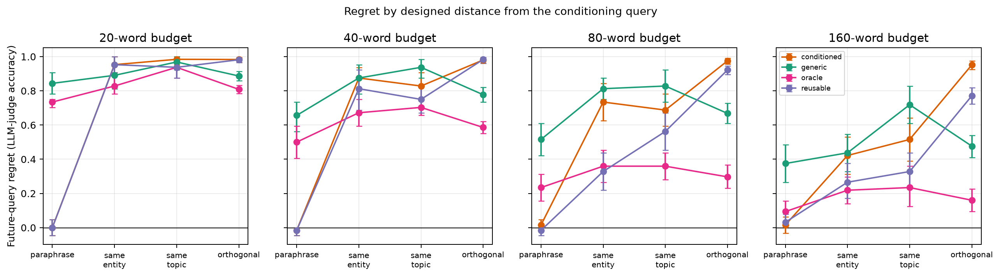

> **Key result:** Future-query regret increases monotonically with the designed
> distance between the hidden information need and the conditioning query, from
> zero at paraphrase to near-total at an orthogonal aspect, and the gradient
> appears only in the conditioned arms. Widening the channel does not flatten
> it.

**Boundary:** 16 invented dossiers with one sender/answerer stack; the
paraphrase tier is by construction the easiest possible case (the answer string
is identical), so its near-zero regret is a sanity check on the design rather
than a finding. The same-entity and same-topic tiers are close enough to each
other that the corpus supports "near versus far", not a four-point ordering.

**Audit:** sender and answerer **$0.0883**, judge **$0.1246**, dossier build
**$2.5155** (a strong writer at high reasoning effort, 28 pages, 12 discarded
for closed-book leakage).
[`report.md`](communication_regret/relation_dossiers/n16/report.md),
[`relation_regret.csv`](communication_regret/relation_dossiers/n16/relation_regret.csv),
[`relation_tests.csv`](communication_regret/relation_dossiers/n16/relation_tests.csv).

## 12. Anticipatory context management under uncertain future demand

**Change:** Experiments 10 and 10a give the writer one irreversible message and
perfect knowledge of nothing about the future. This experiment gives it a
harness action space — `keep`, `compress`, `externalize`, `pointer`,
`retrieve`, `discard` — and an explicit *estimate* `P-hat` of where future
demand will land, separated from the true distribution `P`. Policies decide
under the estimate and are scored under the truth. The channel, corpus, answer
isolation, scoring and judge are inherited unchanged.

Future demand is modelled over **aspects, not question strings**, which the
corpus supports exactly: all 256 golds are located verbatim in a source
sentence, and of 264 sentences 191 are claimed by exactly one aspect and
**none by two** (mean pairwise aspect Jaccard 0.000). `P-hat` is perturbed
along two deliberately separate axes — dilution toward uniform (uncertain,
unbiased) and displacement toward the least likely aspect (systematically
wrong). Both are linear interpolations, so total variation is exactly linear
in each knob, which is what makes any threshold in the regret curve a property
of the policy rather than of the noise parameterisation.

16 dossiers x 4 rotations x 16 policies x 2 budgets = 2,048 messages and
32,768 answers. Retrieval is the project's existing Okapi BM25 over each
policy's own store, queried with the live question at answer time.

### Key result: retrieval makes prediction quality almost irrelevant

`V_anticipation` is measured against `blind`, which provides for the future but
spreads uniformly because it holds no belief. Paired by rotation.

| | 40-word budget | 80-word budget |
|---|---:|---:|
| `preserve` (predict, no recall) spread across TV | **0.324** | **0.351** |
| `pointer` (predict + recall) spread across TV | **0.022** | **0.034** |

Without retrieval, degrading the estimate from perfect (`TV=0.00`) to
maximally wrong (`TV=0.90`) moves `V_anticipation` by 0.32–0.35. With
retrieval available it moves by 0.02–0.03. **Making the discarded evidence
recallable absorbs roughly 90% of the cost of predicting badly.** Every
`pointer` arm sits at +0.87 to +0.90 (40 words) or +0.56 to +0.60 (80 words),
flat across the whole mismatch range with overlapping intervals.

### Wrong anticipation is worse than no anticipation, but only when there is
### enough budget to misallocate

At 80 words, `preserve__sigma1` (confidently wrong) scores
`V_anticipation = -0.236` [-0.303, -0.171] — reliably **worse than not
predicting at all** — while perfect prediction buys only +0.114
[0.052, 0.169]. Being wrong costs about twice what being right earns, and the
zero crossing falls between `TV = 0.45` and `TV = 0.90`.

At 40 words the same arm is +0.041 [-0.006, 0.089], inconclusive. The harmful
regime therefore appears at the *larger* budget: with 40 words there is too
little discretionary allocation for a wrong belief to do real damage; with 80
there is enough to spend on the wrong aspect.

### Equal mismatch, different consequence

At `TV = 0.45`, dilution gives exactly 0.000 [-0.008, 0.008] while displacement
gives +0.054 [0.015, 0.097]. The magnitude of the mismatch does not determine
the harm — its direction does. Dilution at `tau=1` *is* the uniform strategy,
so it reproduces `blind` by construction; displacement retains some true mass
while concentrating elsewhere. This is the result that justifies carrying two
noise axes rather than one scalar "prediction quality".

### The frontier moves outward, not along

Incremental hypervolume from adding retrieval-enabled policies to the
static-only achievable set, bootstrapped over contexts, with cost scalarised as
`C = beta*C_context + gamma*C_retrieval`:

| budget | gamma=0.25 | gamma=0.5 | gamma=1.0 |
|---:|---:|---:|---:|
| 40 | +0.245 [0.228, 0.262] | +0.191 [0.178, 0.204] | +0.135 [0.125, 0.144] |
| 80 | +0.291 [0.267, 0.311] | +0.213 [0.196, 0.227] | +0.167 [0.152, 0.178] |

All six cells exclude zero, and the shift survives at `gamma = 1.0`, where a
retrieved word is charged the same as a context word. Retrieval roughly doubles
the achievable hypervolume (static 0.20–0.29, all arms 0.42–0.50). This is an
outward shift of what is achievable, not a different operating point on the
existing specialization–reusability curve.

### Surprising regimes

- **More precise prediction is not better.** `oracle_exact`, which is told the
  actual future question, scores `V_anticipation = +0.040` [-0.029, 0.109] —
  inconclusive, and below aspect-level prediction's +0.114. Its budget goes to
  the units answering one question, while demand is spread across that
  aspect's four roles. Precision beyond the granularity at which demand
  actually varies is wasted, not merely unhelpful. Note this follows from
  demand being aspect-spread by construction; it is not a paradox.
- **The map is nearly worthless; the recall is what matters.** `pointer` arms
  beat `retrieval_only` by only +0.04 (0.595 vs 0.555 at 80 words). Spending
  context to say *what* was deferred adds little over simply making it
  recallable. The `pointer`/`externalize` contrast was built to separate these
  and the separation is small.
- **Static conditioning remains the worst arm.** `static_conditioned` scores
  `-0.310` [-0.376, -0.243] with `U_future = 0.04`, replicating Experiment 10's
  specialization cost inside the new action space.

### Boundary

One corpus, one model pair, one true-distribution shape (0.7 concentration on a
single aspect), and a retrieval query equal to the live question — which is
realistic for a harness but makes retrieval strong. A degraded-query control is
the obvious next test before concluding that recall beats preservation in
general. `U_future` is aspect-averaged before weighting, so an arm targeting
sub-aspect structure is penalised by construction; that is the intended
demand model, but it is a modelling choice rather than a fact about agents.

**Audit:** sender and answerer **$0.2303** across 33,000 calls (37.7% cache
hits). Figures and tables in
[`anticipatory_context/`](anticipatory_context/), design in
[`EXPERIMENT_12_DESIGN.md`](../EXPERIMENT_12_DESIGN.md). Experiment 11's
preference-frontier results live separately in
[`bounded_communication_frontier/REPORT.md`](bounded_communication_frontier/REPORT.md).

## Cross-experiment interpretation

| Mechanism | Supported conclusion | Boundary |
|---|---|---|
| Denoising | Compression can improve QA when contexts contain removable distractors. | Context- and model-dependent. |
| Surface drift | Rewriting can lower EM/F1 while preserving judged correctness. | Report both metrics; the judge may miss subtle errors. |
| Retrieval quality | Missing relevant evidence remains harmful through later handoffs. | BM25 rank is not a relevance label. |
| Task conditioning | A known question guides filtering but can remove facts needed later. | Target benefit may be brief; held-out harm depends on context. |
| Rewriting vs selection | Large held-out loss appears when question-conditioned selection is added; equal-capacity fictional cards reproduce the immediate/reusable trade-off. | Natural-prose ladder has ten pairs; controlled replication has 20 synthetic dossiers. |
| Evidence availability | When a sealed fictional packet contains no annotated B answer or alias, increasing relay tier adds nothing; exact same-width restoration restores accuracy. | Literal text-absence criterion; does not imply semantic impossibility or rule out world-knowledge recall. |
| Language | Switching among six languages has no detected effect. | Wide intervals do not establish equivalence. |
| Anticipation vs recall | Making discarded evidence retrievable absorbs ~90% of the cost of predicting future demand badly, and shifts the achievable frontier outward rather than along it. Confidently wrong anticipation is reliably worse than none once the budget is large enough to misallocate. | One corpus and one true-demand shape; the retrieval query is the live question, which makes recall strong. |
| Incremental acquisition | Packet-specific updates can offset relay loss. | Depth no longer isolates communication when evidence arrives. |
| Model heterogeneity | Crossing model families changes the message far more than it changes the answer. | Same-family edges are the same model rewriting itself, so family change and model change are not separated. |
| Compressor choice | Which model compresses matters more than whether the chain is uniform. The focused size factorial does not show a family-replicated selector-size advantage. | One dataset, `n=20`, and the large tier is near ceiling. |
| Communication regret under a hard budget | With delivered length matched to within a word or two, conditioning a handoff on the known query raises present-query accuracy and lowers hidden-query accuracy, and an oracle handoff of the same length carries the hidden answers. | One sender/answerer stack; the future loss is bounded below by how much the generic baseline itself achieved. |
| Distance from the conditioning query | Future-query regret rises monotonically from ~0 at a paraphrase to ~0.95 at an orthogonal aspect, only in the conditioned arms, and extra bandwidth does not flatten it. | 16 invented dossiers; the corpus supports near-versus-far, not a four-point ordering. |
| What the writer is told about the reader | Simply mentioning 2k or 10k makes notes longer and keeps more extra facts; “fit 2k” removes part of that extra length, while “fill 10k” often loops. | Only the prompt changed; the reader's real window did not. One model was tested with deterministic generation. |

The systems implication is that a handoff can improve the current task while reducing future reuse. Evaluation should distinguish factual correctness, lexical form, task specificity, evidence acquisition, and fact age.

## Limitations

- Most benchmark runs are pilots (`n=10–30`); the fictional follow-ups are
  complete at their configured `n=20`, but remain small synthetic studies.
- Bootstrap intervals are exploratory and not multiplicity-corrected.
- The LLM judge is not human adjudication and may share benchmark knowledge.
- Public benchmarks risk pretraining exposure; leakage filters select harder, model-specific subsets.
- Candidate distractors in Experiments 3–4 are LLM-screened, not exhaustively human-labelled.
- Experiment 4 uses shared-source redundancy, not independent corroboration.
- Experiment 5a's natural-prose control has ten pairs. Experiment 5b fixes
  length but uses invented dossiers and atomic cards with one model stack.
- Experiment 6 covers six mostly high-resource languages with depth coupled to order.
- Experiment 7 correlates handoff age with packet position and hop count.
- Cross-model replications in Experiment 2a are not paired because leakage filtering is model-specific; Experiment 8 avoids this by running every arm on one prebuilt question set.
- Experiment 8's same-family edges are always a model rewriting its own output, and one pooled model was defective through its only provider.
- Experiment 8b has only two size contrasts, one model per family/tier, and one
  fixed reader; size still bundles training data, tuning, tokenizer, and model
  vintage.
- Experiment 9 varies asserted recipient capacity, not the receiver's actual
  window. Its depth-3 effects are cumulative schedules, and its requested-expand
  arms are contaminated by a greedy-decoding repetition mode.

## Recommended next steps

1. Scale the fixed-capacity A/B design to at least 100 dossiers, varied source
   styles, two selector/answerer stacks, and preregistered K=4 endpoints; retain
   the natural-prose ladder as an external-validity arm.
2. Add a second judge or human audit for major metric disagreements, especially HotpotQA gold-only and paraphrase-only chains.
3. Scale the incremental-evidence chain with independent evidence orders and within-packet age comparisons; add extractive/oracle specialist updates.
4. Scale retrieval and redundancy experiments, then test independently sourced answer-sufficient evidence.
5. Expand multilingual testing with balanced Latin-square orders and separately preregistered script-diverse languages.
6. Keep prompt-equivalence, isolation, truncation, and distractor-relevance audits as required controls; add an empty-generation audit after Experiment 8 found a provider returning empty bodies with a normal finish reason.
7. Add a within-family, different-model control to Experiment 8 (two models of one family at one size) so family change can be separated from model change, and rerun without the defective Gemma endpoint.
8. Replicate Experiment 8b with more families and independently varied channel
   width. Treat the current result as evidence for availability, not for a
   monotonic parameter-count effect.
9. Replicate Experiment 9 across model families and decoding regimes; redesign
   the recovery arm to produce enough stage-2 losses before estimating recovery.

## Result artifacts

- Single handoff: [`report.md`](report.md), [`summary.csv`](summary.csv), [`contrasts.csv`](contrasts.csv)
- Fixed-evidence chain: [`chain/report.md`](chain/report.md), [`chain/stage_metrics.csv`](chain/stage_metrics.csv), [`chain/degradation.png`](chain/degradation.png)
- Qwen3 8B: [`chain_qwen/report.md`](chain_qwen/report.md), [`chain_qwen/degradation.png`](chain_qwen/degradation.png)
- Qwen3 32B: [`chain_qwen32/report.md`](chain_qwen32/report.md), [`chain_qwen32/degradation.png`](chain_qwen32/degradation.png)
- Question omitted: [`chain_generic/report.md`](chain_generic/report.md), [`chain_generic/stage_metrics.csv`](chain_generic/stage_metrics.csv), [`chain_generic/conditioning_comparison.png`](chain_generic/conditioning_comparison.png)
- Retrieval: [`retrieval_quality/n20/metrics.csv`](retrieval_quality/n20/metrics.csv), [`retrieval_quality/n20/deltas.csv`](retrieval_quality/n20/deltas.csv), [`retrieval_quality/n20/retrieval_quality.png`](retrieval_quality/n20/retrieval_quality.png)
- Redundancy: [`redundant_signal_ratio/n20/metrics.csv`](redundant_signal_ratio/n20/metrics.csv), [`redundant_signal_ratio/n20/deltas.csv`](redundant_signal_ratio/n20/deltas.csv), [`redundant_signal_ratio/n20/redundant_signal_ratio.png`](redundant_signal_ratio/n20/redundant_signal_ratio.png)
- Cross-question, separate passages: [`summary_generalization_v2_depth10/n20/metrics.csv`](summary_generalization_v2_depth10/n20/metrics.csv), [`summary_generalization_v2_depth10/n20/deltas.csv`](summary_generalization_v2_depth10/n20/deltas.csv), [`summary_generalization_v2_depth10/n20/summary_generalization.png`](summary_generalization_v2_depth10/n20/summary_generalization.png)
- Same passage with distractors: [`squad_same_passage/n20/metrics.csv`](squad_same_passage/n20/metrics.csv), [`squad_same_passage/n20/deltas.csv`](squad_same_passage/n20/deltas.csv), [`squad_same_passage/n20/summary_generalization.png`](squad_same_passage/n20/summary_generalization.png)
- Gold-only: [`squad_same_passage_goldonly/n10/metrics.csv`](squad_same_passage_goldonly/n10/metrics.csv), [`squad_same_passage_goldonly/n10/deltas.csv`](squad_same_passage_goldonly/n10/deltas.csv), [`squad_same_passage_goldonly/n10/summary_generalization.png`](squad_same_passage_goldonly/n10/summary_generalization.png)
- Rewriting-selection ladder: [`squad_same_passage_paraphrase/n10/deltas.csv`](squad_same_passage_paraphrase/n10/deltas.csv), [`squad_same_passage_paraphrase/n10/transition_metrics.csv`](squad_same_passage_paraphrase/n10/transition_metrics.csv), [`squad_same_passage_paraphrase/n10/paraphrase_transitions.png`](squad_same_passage_paraphrase/n10/paraphrase_transitions.png)
- Fictional fixed capacity: [`fictional_summary_generalization/n20/report.md`](fictional_summary_generalization/n20/report.md), [`fictional_summary_generalization/n20/contrasts.csv`](fictional_summary_generalization/n20/contrasts.csv), [`fictional_summary_generalization/n20/rotation_rows.csv`](fictional_summary_generalization/n20/rotation_rows.csv), [`fictional_summary_generalization/n20/fixed_capacity_generalization.png`](fictional_summary_generalization/n20/fixed_capacity_generalization.png)
- Multilingual: [`multilingual_handoff_gold_only/n10/metrics.csv`](multilingual_handoff_gold_only/n10/metrics.csv), [`multilingual_handoff_gold_only/n10/deltas.csv`](multilingual_handoff_gold_only/n10/deltas.csv), [`multilingual_handoff_gold_only/n10/diagnostics.csv`](multilingual_handoff_gold_only/n10/diagnostics.csv)
- Incremental evidence: [`incremental_chain/report.md`](incremental_chain/report.md), [`incremental_chain/stage_metrics.csv`](incremental_chain/stage_metrics.csv), [`incremental_chain/future_query_regret.csv`](incremental_chain/future_query_regret.csv), [`incremental_chain/survival_by_age.csv`](incremental_chain/survival_by_age.csv), [`incremental_chain/incremental_chain.png`](incremental_chain/incremental_chain.png)
- Model heterogeneity: [`model_heterogeneity/n20/report.md`](model_heterogeneity/n20/report.md), [`model_heterogeneity/n20/metrics.csv`](model_heterogeneity/n20/metrics.csv), [`model_heterogeneity/n20/deltas.csv`](model_heterogeneity/n20/deltas.csv), [`model_heterogeneity/n20/deltas_sensitivity.csv`](model_heterogeneity/n20/deltas_sensitivity.csv), [`model_heterogeneity/n20/transition_deltas.csv`](model_heterogeneity/n20/transition_deltas.csv), [`model_heterogeneity/n20/stage_records.csv`](model_heterogeneity/n20/stage_records.csv), [`model_heterogeneity/n20/model_registry.csv`](model_heterogeneity/n20/model_registry.csv), [`model_heterogeneity/n20/model_heterogeneity.png`](model_heterogeneity/n20/model_heterogeneity.png), [`model_heterogeneity/n20/model_heterogeneity_target_vs_heldout.png`](model_heterogeneity/n20/model_heterogeneity_target_vs_heldout.png), [`model_heterogeneity/n20/model_trajectories.png`](model_heterogeneity/n20/model_trajectories.png)
- Fictional selector bottleneck: [`fictional_model_bottleneck/n20/report.md`](fictional_model_bottleneck/n20/report.md), [`fictional_model_bottleneck/n20/contrasts.csv`](fictional_model_bottleneck/n20/contrasts.csv), [`fictional_model_bottleneck/n20/records.csv`](fictional_model_bottleneck/n20/records.csv), [`fictional_model_bottleneck/n20/fictional_model_bottleneck.png`](fictional_model_bottleneck/n20/fictional_model_bottleneck.png)
- Handoff size adaptation: [`size_adaptation/report.md`](size_adaptation/report.md), [`size_adaptation/contrasts.csv`](size_adaptation/contrasts.csv), [`size_adaptation/metrics.csv`](size_adaptation/metrics.csv), [`size_adaptation/metrics_by_source.csv`](size_adaptation/metrics_by_source.csv), [`size_adaptation/recovery.csv`](size_adaptation/recovery.csv), [`size_adaptation/answer_origin.csv`](size_adaptation/answer_origin.csv), [`size_adaptation/expansion_modes.png`](size_adaptation/expansion_modes.png), [`size_adaptation/headline_contrasts.png`](size_adaptation/headline_contrasts.png), [`size_adaptation/size_adaptation.png`](size_adaptation/size_adaptation.png), [`size_adaptation/expansion_content.png`](size_adaptation/expansion_content.png), [`size_adaptation/recovery.png`](size_adaptation/recovery.png)

Raw records remain under [`../runs/`](../runs/); retired exploratory variants remain on disk but are not used for the active conclusions.
