# Agent handoff information-loss experiments

**Status:** pilot-scale evidence through 24 August 2026
**Primary metrics:** exact match (EM) and SQuAD-style token F1  
**Secondary metric:** LLM-judge answer correctness (`openai/gpt-4o-mini`, temperature 0, binary vs gold; a different model family from the systems under test)  
**Judging:** deterministic string metrics remain primary; an LLM judge is reported alongside them, never in place of them

## Executive summary

The evidence does **not** support a universal “each handoff loses a fixed amount of accuracy” rule. A handoff is both a lossy communication channel and a possible denoiser: whether it helps or harms depends on distractor load, the number of facts that must survive, and whether the next task is the one the summary was optimized for.

The current synthesis is:

1. **Compression can help the immediate task when it removes noise.** In the initial MuSiQue pilot, a free-form handoff beat direct full-context answering by 26.4 F1 points. In the longer chains, noisy full contexts often improved after early summaries, whereas compact HotpotQA gold-only evidence showed the clearest serial loss (−10.7 F1 by depth 10).
   **Metric caveat added 20 August 2026:** that −10.7 F1 result is **0.000** under an LLM judge scoring answer correctness against the gold (0.900 at both depth 0 and depth 10). Token F1 penalises correct-but-reworded answers, which repeated compression reliably produces. Read as "the asserted fact survives ten handoffs, but its surface form drifts from the gold string." No serial-loss claim in this report should now be made on token F1 alone.
2. **BM25 rank is not a relevance label.** The initial hard/easy result was driven partly by topic-adjacent candidate passages. After a conservative independent LLM relevance screen removes any passage judged useful for the target answer, hard–easy effects at depths 3–5 no longer exclude zero in either experiment. This is evidence that the original contrast mixed distractor difficulty with weak evidence; the screened rerun is labelled *LLM-screened*, not human-verified.
3. **Question conditioning narrows a summary by two distinct mechanisms, and only one of them needs noise to work.** Three designs isolate them. (a) *Separate passages* (20 pairs, A and B each with their own gold document plus 8 distractors): conditioning gets +0.295 F1 on the target at depth 1 (p=0.0009), decaying to non-significant by depth 3, while the held-out question is damaged at every depth (-0.392 to -0.497 F1, p<=0.0023) -- consistent with conditioning discarding a whole competing document. (b) *Same passage, 9 distractors* (20 pairs, one shared gold passage): removing the competing document removes the effect entirely -- every target and held-out interval spans zero at every depth. (c) *Same passage, gold-only, no length request* (10 pairs, replicating Experiment 6's correction): with no distractors and no competing document, a **different, larger, more durable** held-out effect reappears -- F1 -0.60 to -0.43 at every depth 1-10, p<=0.038 throughout, both metrics -- while the target shows no benefit at all (every interval spans zero). With nothing to filter, generic already keeps both facts almost losslessly (held-out F1 0.85-0.95 vs a 0.95 direct ceiling); conditioning drops the held-out fact anyway, for no compression reason, simply because it was told which question mattered. Document-competition narrowing and this task-induced narrowing are not the same mechanism appearing and disappearing -- they are two separate effects, and removing noise from the design reveals the second one rather than eliminating the first.
4. **Neither rewriting alone nor adding compression accounts for the held-out damage; question-conditioned selection does.** A pass-through control (no model call, message forwarded unchanged) and a paraphrase-only control (rewrite everything, forbidden to condense or select) added to the gold-only design (§5) decompose conditioning into a ladder. Rewriting alone and adding compression each move held-out judged accuracy by at most one pair's worth of noise at every depth — every interval spans zero. Only the step that adds question-conditioned selection is significant at every depth on both metrics (judge accuracy −0.60 to −0.40, F1 −0.70 to −0.40). Per-edge measurement shows why: lexical similarity between consecutive messages collapses to near-copying after stage 1 in every arm (mean similarity 0.91–0.96 across stages 2–10), so the loss is one narrowing decision at the first compression, not accumulating rewrite damage.
5. **Withholding the question from every compressor is far more damaging than repeated compression itself.** The matched question-omission replication (same model, questions, contexts, depths, seeds, system prompt, and handoff instructions as the main serial chain — the sole difference is that no compressor ever sees the question) degrades at every depth, in every evidence condition, including full context — the one condition that *improved* under question-conditioned compression. MuSiQue full context goes from +0.080 F1 at depth 10 (conditioned) to **−0.272 F1** (question omitted) on the identical question set.
6. **The corrected gold-only multilingual pilot no longer tests document retrieval, and it finds no robust language-switching effect.** Experiment 6 gives every arm only the one SQuAD passage that supports A and B—zero distractors—and restores Experiment 5's length-neutral prompt. At depth 6, switching-minus-fixed target F1 is −0.181 when conditioned and +0.061 when generic; held-out F1 is +0.183 and −0.017. Every F1 and LLM-judge interval includes zero. At stage 1, generic exceeds conditioned on B (0.400 F1 / 0.800 judge vs 0.200 / 0.500); generic fixed also has higher B judge accuracy at depth 3 (0.900 vs 0.400; conditioned-minus-generic −0.500 [−0.800, −0.200]). The prompt asks for no target length: observed handoffs average 583–804 characters (87–122 words) across arms, with zero API truncations and 237/240 requested-language matches.
7. **Incremental evidence can compensate for relay-only loss.** In the new MuSiQue chain, each specialist receives exactly one new supporting paragraph while 0/1/3/5 relay-only agents receive no evidence. Adding relays produces no reliable decline in final multi-hop F1 relative to zero relays in either question-visibility condition; the fifth relay is +0.050 F1 [−0.050, +0.152] when conditioned and −0.046 [−0.174, +0.067] when omitted. Hidden-probe regret is negative in every cell: the final handoff is, if anything, easier to query than the complete original evidence. This does **not** mean handoffs create facts. It shows that repeated, packet-specific specialist updates can re-encode or compensate for relay loss, so a raw depth effect cannot be interpreted without separating communication from evidence acquisition.
8. **These are directional pilots, not final effect sizes.** The Llama 3.3 70B and Qwen3 8B chain runs agree that dataset and context composition matter, but most low-cost experiments use 20 questions and one seed. The strongest next step is replication at larger sample sizes with independently sourced redundant evidence.

## Experiment inventory

| Experiment | Dataset | Sample | Model | Handoff depths | Input context at depth 0 | Main comparison |
|---|---|---:|---|---|---|---|
| Single-handoff mechanisms | MuSiQue | 10 | Llama 3.3 70B Instruct | 0/1 | `A_full`/`B_freeform`: full supplied MuSiQue context; `E_oracle`: gold evidence sentences only (no noise) | Full context vs free-form handoff vs oracle evidence |
| Serial handoff degradation | MuSiQue + HotpotQA | 30 per dataset | Llama 3.3 70B Instruct | 0–10 | No noise: gold-only; medium noise: all gold plus filler to five documents; high noise: complete dataset context | Context composition × chain depth |
| Serial handoff degradation, question omitted | MuSiQue + HotpotQA | 30 per dataset | Llama 3.3 70B Instruct | 0–10 | Same no-/medium-/high-noise inputs as above | Same chain; only the compressor question block is omitted |
| Serial handoff degradation (replication) | MuSiQue + HotpotQA | 10 per dataset | Qwen3 8B, non-thinking | 0/1/3/5 | Same no-/medium-/high-noise inputs as above | Low-cost one-seed replication |
| Incremental-evidence handoff chain | MuSiQue | 30, two seeds | Llama 3.3 70B Instruct | 0/1/3/5 relays between specialists | 2–4 supporting paragraphs, delivered one per specialist; identical complete evidence and order across relay depths | Relay-only transformation separated from staged evidence acquisition; question visible vs omitted |
| Retrieval-quality propagation | MS MARCO QA v2.1 | 20 | Llama 3.1 8B Instruct | 0/1/3/5 | Low noise: all retriever-found gold retained + filler; medium noise: half retained + filler; high noise: 15% retained + filler. Every context has ten passages. | Noise level × BM25-top hard or bottom easy candidate distractors |
| Redundant-evidence signal-ratio propagation | SQuAD same-article packs | 20 | Llama 3.1 8B Instruct | 0/1/3/5 | No noise: 10 answer-sufficient gold / 0 distractor; medium: 5 / 5; high: 1 / 9 | Signal/noise ratio × BM25-top hard or bottom easy candidate distractors |
| Cross-question generalization | SQuAD | 20 pairs (separate passages) + 20 pairs (same passage, distractors) + 10 pairs (same passage, gold-only) | Llama 3.1 8B Instruct | 0–10 | Separate: A's gold + B's gold + 8 distractors. Same-passage: 1 shared gold + 9 distractors. Gold-only: the shared passage alone, 0 distractors | Question A present vs absent; evaluate A and B at every depth; document competition vs distractor noise vs neither |
| Cross-question generalization, rewriting-vs-selection ladder | SQuAD | 10 pairs (same shared-passage pairs as the gold-only design) | Llama 3.1 8B Instruct | 0–10 | Gold-only: the shared passage alone, 0 distractors (identical to the design above) | Pass-through vs paraphrase-only vs generic vs question-conditioned; isolates rewriting from compression from question-conditioned selection |
| Multilingual fixed/switching handoffs | Same corrected SQuAD A/B questions | 10 passages / 20 question IDs | Llama 3.1 8B Instruct | 0–6 | **Gold-only:** one shared passage answering A and B, 0 distractors | Conditioned/generic × fixed/switching language; evaluate A and B |

## 1. Single-handoff mechanism pilot

> **Model:** `meta-llama/llama-3.3-70b-instruct` · **Dataset:** MuSiQue-Answerable (validation) · **Prompts:** [PROMPTS.md § Experiment 1](../PROMPTS.md#experiment-1) — `ANSWER_SYSTEM`, `SUBAGENT_SYSTEM`, `FREEFORM_INSTRUCTION`, `STRUCTURED_INSTRUCTION`, `EXTRACTIVE_INSTRUCTION` (`src/handoffs.py`)

### Design

The original probe isolates what happens when evidence is summarized once before a final answerer sees it. Retrieval is held constant. Five mechanisms are implemented:

- `A_full`: one model answers directly from all supplied evidence.
- `B_freeform`: a subagent writes a prose handoff; a fresh answerer sees only that handoff and the question.
- `C_structured`: the handoff is a structured claim representation.
- `D_extractive`: the handoff contains selected verbatim evidence sentences.
- `E_oracle`: the answerer receives deterministically derived gold evidence sentences.

The real 10-question pilot ran `A_full`, `B_freeform`, and `E_oracle`; `C_structured` and `D_extractive` are implemented and offline-tested but were not included in this API pilot.

### Results

| Mechanism | EM | Token F1 | Interpretation |
|---|---:|---:|---|
| `A_full` | 0.400 | 0.484 | Direct answer from full context |
| `B_freeform` | 0.600 | 0.748 | Free-form handoff improved F1 by 0.264 |
| `E_oracle` | 0.600 | 0.740 | Approximately tied with free-form handoff |

The paired `B_freeform − A_full` F1 contrast was +0.264 with a 95% bootstrap interval of +0.010 to +0.525 (`p = 0.0304`). Because `n = 10`, the magnitude is uncertain. The result suggests that a handoff can act as evidence selection or denoising rather than merely destroying information.

Reported API cost: **$0.0151**.

## 2. Repeated handoff degradation

> **Model:** `meta-llama/llama-3.3-70b-instruct` · **Dataset:** MuSiQue-Answerable + HotpotQA (distractor, validation) · **Prompts:** [PROMPTS.md § Experiment 2](../PROMPTS.md#experiment-2) — `QUESTION_CONDITIONED_SYSTEM`/`_INITIAL_INSTRUCTION`/`_RECOMPRESS_INSTRUCTION` + shared `ANSWER_SYSTEM` (`src/run_chain.py`)

### Design

The same question was supplied at every compression stage:

`documents → summary 1 → summary 2 → … → summary 10 → fresh answerer`

Only the first compressor could see source documents. Later compressors received a sealed previous handoff and the original question. Two seeds were run. Each dataset used three evidence conditions:

- **No noise (gold-only; formerly “Short”):** all and only gold documents (mean 2.7 documents for MuSiQue; 2 for HotpotQA).
- **Medium noise (formerly “Medium”):** all gold documents plus distractors up to five documents.
- **High noise (full; formerly “Full”):** the complete dataset context (20 MuSiQue paragraphs; 10 HotpotQA paragraphs).

### Results

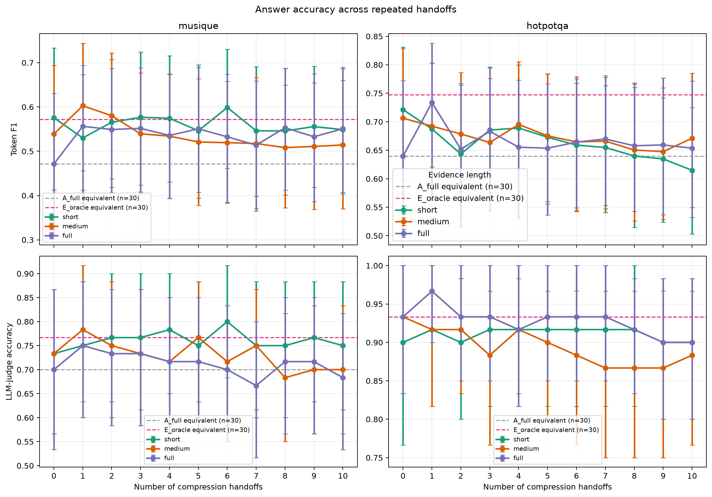

Depth-10 change from direct depth 0:

| Dataset | Context | Token F1 change | LLM-judge change |
|---|---|---:|---:|
| MuSiQue | No noise (gold-only) | −0.027 | +0.017 |
| MuSiQue | Medium noise | −0.025 | −0.033 |
| MuSiQue | High noise (full) | +0.080 | −0.017 |
| HotpotQA | No noise (gold-only) | **−0.107** | **+0.000** |
| HotpotQA | Medium noise | −0.035 | −0.050 |
| HotpotQA | High noise (full) | +0.014 | −0.033 |

BERTScore was replaced by an LLM judge (`openai/gpt-4o-mini`, temperature 0, binary correct/incorrect against the gold answer, deliberately a different model family from the llama systems under test). EM and token F1 remain primary and are reported unchanged alongside it.

**The judge materially changes the headline reading of this experiment.** The single largest serial-degradation signal in the probe — HotpotQA no-noise gold-only, −10.7 token-F1 points by depth 10 — is **0.000** under the judge: 0.900 correct at depth 0 and 0.900 at depth 10. Absolute levels also sit far above F1 (HotpotQA no-noise holds ~0.90–0.92 across all ten handoffs; MuSiQue no-noise holds ~0.73–0.75). That gap is the expected signature of token F1 penalising answers that are correct but reworded or more verbose, which is exactly what repeated compression produces. Under the judge no evidence variant loses more than 5 points across ten handoffs, and MuSiQue no-noise is numerically flat-to-positive.

This does not erase the F1 result, and the two should be read together: F1 says the *surface form* of answers drifts steadily away from the gold string under repeated compression, while the judge says the *fact being asserted* mostly survives. The conclusion that gold-only evidence is the most fragile condition is supported by F1 but is not corroborated by the judge at this sample size.

The high-noise full-context conditions often improved after the first handoff, consistent with denoising. Summary length also collapsed rapidly: for example, HotpotQA full context averaged 5,530 characters at depth 0, 720 after one handoff, and 413 by depth 10.

The main conclusion is not that long contexts are inherently safer. Rather, high-noise full contexts provide an opportunity for useful selection, while already-minimal no-noise evidence has little redundancy and therefore exposes omissions more directly.

The confirmed incremental cost reported for extending the chains through depths 6–10 and filling missing answers was **$0.2436**.

### Low-cost Qwen replication

> **Model:** `qwen/qwen3-8b` (non-thinking, `reasoning.effort: none`) · **Dataset:** same as above, 10 questions/dataset · **Prompts:** identical to Experiment 2 above — same `run_chain.py` constants, different model config (`qwen_chain_config.yaml` + `qwen_chain_experiment.yaml`)

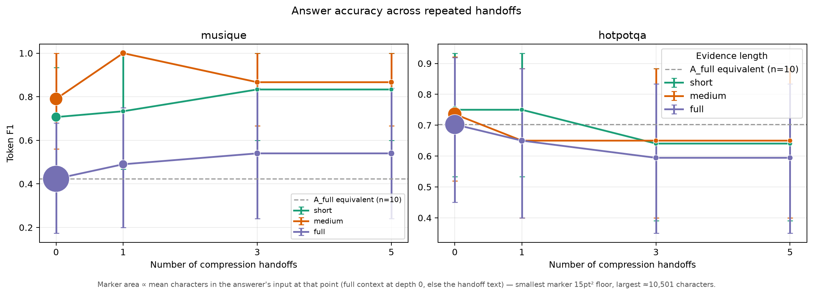

The same dataset and evidence-variant design was rerun with Qwen3 8B in non-thinking mode, but with 10 questions per dataset, one seed, and depths 0/1/3/5. It broadly reproduces the dataset split in the original probe: at depth 5, HotpotQA loses F1 at every noise level (no noise −0.110, medium noise −0.086, high noise −0.108), while MuSiQue is stable-to-improved (no noise +0.127, medium noise +0.077, high noise +0.117). None of the depth-5 intervals exclude zero at this small sample size, so this is directional replication evidence rather than a conclusive cross-model comparison.

Reconciled cost was **$0.0443** across Qwen-specific leakage filtering, 300 summary calls, 240 answer calls, and a compatibility smoke call. The raw outputs and full table are in [`chain_qwen/report.md`](chain_qwen/report.md).

### Comparable-size Qwen3 32B replication

> **Model:** `qwen/qwen3-32b` (non-thinking, via OpenRouter `reasoning.effort: none` and Qwen's native `/no_think` control) · **Dataset:** MuSiQue-Answerable + HotpotQA (distractor, validation) · **Prompts:** identical to Experiment 2 apart from the documented Qwen control token · **Design:** 30 model-specific C1-filtered questions/dataset, three evidence variants, depths 0–10, two summary seeds

This is the full repeated-handoff design rerun with a 32.8B-parameter Qwen3
model. Qwen3 defaults to hidden reasoning, so the client appends the model's
documented `/no_think` directive to the system prompt and includes the final
request text in the cache key. That keeps the fixed answer and handoff budgets
comparable to the non-reasoning Llama condition. The model-specific C1 filter
means the exact retained question IDs can differ from the Llama run, while the
dataset sampling protocol, prompts, depths, and evidence variants are held
fixed.

At depth 10, no context condition has a reliable negative F1 change. HotpotQA
is broadly flat: gold-only −0.063 (95% CI −0.154 to +0.019), medium −0.010
(−0.095 to +0.070), and full +0.033 (−0.075 to +0.144). MuSiQue gold-only is
−0.046 (−0.159 to +0.043) and medium is −0.071 (−0.170 to +0.013). In contrast,
MuSiQue full context improves by **+0.182 F1** (+0.064 to +0.312) and **+0.167
judge accuracy** (+0.017 to +0.317), consistent with repeated summaries
removing distractors rather than accumulating answer-critical loss.

The primary-model run cost **$0.3866** for 7,343 live and 697 cached calls; the
independent `gpt-4o-mini` judge added **$0.0088**. Full answer-level records,
bootstrap tables, and the figure are in [`chain_qwen32/report.md`](chain_qwen32/report.md).

### Matched question-omission replication

> **Model:** `meta-llama/llama-3.3-70b-instruct` (same as above) · **Dataset:** same as above, same 30-question sample · **Prompts:** [PROMPTS.md § Experiment 2](../PROMPTS.md#experiment-2), question-conditioned prompt set with the question block deleted — see `initial_compress()`/`recompress()` in `src/run_chain.py`

This is the minimal counterpart to the main serial chain: same Llama 3.3 70B model, fixed filtered question sample, all three evidence variants, depths 0–10, two seeds, system prompt, and handoff instructions. The sole difference is prompt visibility — neither the initial compressor nor any later compressor receives the final-question block; the fresh answerer still receives the question. An automated equivalence check (`prompt_difference_selftest` in the code) verifies that removing that block makes the two compressor prompts byte-identical, so the only variable is question visibility.

Depth-10 change from direct depth 0, question-conditioned vs question-omitted:

| Dataset | Context | Conditioned F1 | Omitted F1 | Conditioned judge | Omitted judge |
|---|---|---:|---:|---:|---:|
| MuSiQue | No noise (gold-only) | −0.027 | −0.035 | +0.017 | −0.033 |
| MuSiQue | Medium noise | −0.025 | −0.127 | −0.033 | −0.183 |
| MuSiQue | High noise (full) | **+0.080** | **−0.272** | −0.017 | **−0.467** |
| HotpotQA | No noise (gold-only) | −0.107 | −0.247 | +0.000 | −0.117 |
| HotpotQA | Medium noise | −0.035 | −0.218 | −0.050 | −0.250 |
| HotpotQA | High noise (full) | +0.014 | **−0.326** | −0.033 | **−0.400** |

Every condition is worse without the question, and the gap widens with more distractors: high-noise full-context degradation goes from mildly positive (conditioned) to the worst result in either chain (omitted). This is consistent with the denoising story in §2 — a compressor can only filter distractors *toward* a task it knows, and high-noise full context has the most distractor mass to filter. It also complements §5's finding below: §5 shows conditioning narrows a summary toward one task at the cost of others; this replication shows the opposite failure mode — a compressor with no task at all keeps too much noise and too little signal for any task.

**Judge update, 2026-08-20:** this replication now has real LLM-judge scores (added as a side effect of regenerating its plot with the new size-encoding — see §2 above). Unlike the main serial-degradation result, where the judge flattened the token-F1 signal almost to zero, **here the judge corroborates F1 rather than contradicting it**: question-omitted is worse than conditioned by the judge at every single dataset/context pair, matching F1's direction throughout, and often by a larger margin (MuSiQue high noise: −0.017 conditioned vs **−0.467** omitted; HotpotQA high noise: −0.033 vs **−0.400** omitted). This is the same asymmetry noted for §5's judge update below — some findings in this report survive judged-correctness scrutiny and some don't, and this one does.

Cost: **$0.9564** (7,000 live calls, 20 cached) for the original chain, plus **$0.0105** (341 live, 3,439 cached) for the judge pass.

## 3. Retrieval quality through repeated handoffs

> **Model:** `meta-llama/llama-3.1-8b-instruct` · **Dataset:** MS MARCO QA v2.1 (validation, via Hugging Face parquet mirror) · **Prompts:** [PROMPTS.md § Experiment 3](../PROMPTS.md#experiment-3) — local `SYSTEM`/`INITIAL`/`REWRITE` + shared `ANSWER_SYSTEM` (`src/run_retrieval_quality.py`)

### Design

#### Purpose

Experiment 3 tests whether an initial **retrieval-quality error** survives, widens, or is repaired by repeated handoffs. It holds context width at ten passages while varying how many BM25-findable gold passages are retained (all, half, or 15%) and independently varies candidate-distractor lexical difficulty (BM25-top hard vs BM25-bottom easy). It therefore separates a weak retrieval set at depth 0 from any additional loss caused by repeated summarisation.

**Revised 2026-08-20: retrieval is now real, not assumed.** MS MARCO QA v2.1 provides ten passages per query with `is_selected` relevance labels, but the original pilot treated any non-selected passage — from any query — as a valid distractor, which meant the low-retention arm's filler was often lexically unrelated to the question entirely (an “easy” candidate negative). This run replaces that with a self-contained Okapi BM25 index (`src/retrieval.py`, no external dependency) built over a 4,000-query pool:

- **Gold** = a passage MS MARCO's own `is_selected` label marks relevant **and** that this code's own BM25 ranking actually retrieves for that query ("top retrieved and relevant," not relevance judged in isolation — 22/22 originally-labelled passages turned out to be BM25-findable in this sample, i.e. `gold_bm25_findable == gold_labelled_by_msmarco`).
- **Hard candidate negative** = a passage BM25 ranks in that same query's top-50 but that is *not* gold — either the query's own non-selected passage, or another query's passage lexically on-topic enough to rank highly. These replace the previous random-unrelated-query filler.

The low-/medium-/high-noise knob keeps the original global-pool mechanic (one seeded shuffle-and-slice over every gold passage pooled across all 20 queries, not a per-query fraction — a per-query fraction breaks down when a query has only one findable gold passage, since `round(1 × 0.5) == 0` under Python's banker's rounding while the high-noise floor keeps at least one, inverting the intended ordering). Every context still has ten passages; the label refers to the *relative amount of retrieved gold retained*, not an assertion that any arm lacks distractors. Twenty questions, one seed, depths 0, 1, 3, and 5. Question text was passed at every handoff.

**Easy-negative matched rerun, 2026-08-21.** Each hard arm is now paired with an easy arm that keeps the same questions, gold passages, global recall target, ten-passage width, gold/distractor positions, prompts, depths, and model. The sole change is filler selection: hard fillers are eligible BM25 top-50 passages, while easy fillers are eligible passages drawn from that query's BM25 bottom-1,000 (including zero-overlap passages). `hard − easy` is bootstrapped over the same 20 question ids at each condition/depth. These are BM25-selected *candidate* distractors; neither dataset supplies an exhaustive target-question non-relevance judgment for every cross-query candidate.

**LLM-screened rerun, 2026-08-21.** Before selecting either arm, 1,200 candidates (30 hard and 30 easy per question) were independently screened against the target question and gold answer. Only `IRRELEVANT` verdicts were eligible: 562/600 hard and 600/600 easy candidates passed, with at least 23 screened negatives available for every question/type. The full handoff, answer, and judge run below uses these screened pools. This reduces relevance contamination, but is not a replacement for human adjudication.

Empirical recall-at-10 against BM25-findable gold:

| Noise level | Exact input composition across the 20 contexts | Recall@10 |
|---|---:|---:|
| Low noise | All 22 BM25-findable gold passages + 178 candidate distractors | 1.000 |
| Medium noise | 11/22 gold passages + 189 candidate distractors | 0.500 |
| High noise | 3/22 gold passages + 197 candidate distractors | 0.136 |

### Results

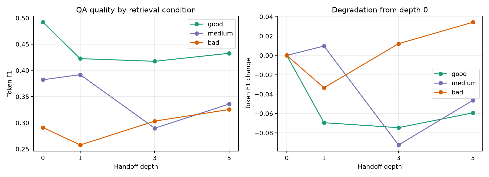

The combined figure reports token F1 (left) and LLM-judge correctness with bootstrap intervals (right). A depth-0-normalized panel was dropped: it only rescaled the same F1 curve already shown at left and added no information. The judge is `openai/gpt-4o-mini`, temperature 0, and scores only whether the predicted answer conveys the gold fact; EM/F1 remain the primary deterministic measures.

| Depth | Low-noise F1 | Medium-noise F1 | High-noise F1 |
|---:|---:|---:|---:|
| 0 | 0.443 | 0.380 | 0.189 |
| 1 | 0.497 | 0.318 | 0.167 |
| 3 | 0.453 | 0.302 | 0.167 |
| 5 | 0.465 | 0.361 | 0.166 |

Solid lines are BM25-top hard candidate distractors and dashed lines are BM25-bottom easy candidate distractors:

| Retrieval arm | Hard F1 d0 | Easy F1 d0 | Hard F1 d5 | Easy F1 d5 |
|---|---:|---:|---:|---:|
| Low noise | 0.443 | 0.538 | 0.465 | 0.449 |
| Medium noise | 0.380 | 0.353 | 0.361 | 0.318 |
| High noise | 0.189 | 0.157 | 0.166 | 0.141 |

| Retrieval arm | Hard judge d0 | Easy judge d0 | Hard judge d5 | Easy judge d5 |
|---|---:|---:|---:|---:|
| Low noise | 0.75 | 0.85 | 0.85 | 0.85 |
| Medium noise | 0.50 | 0.60 | 0.60 | 0.55 |
| High noise | 0.15 | 0.20 | 0.30 | 0.25 |

With screened pools, the former counterintuitive pattern disappears: every hard-minus-easy F1 and judge comparison at depths 3 and 5 spans zero. The largest depth-5 F1 difference is medium noise, +0.043 (−0.014 to +0.106), and the largest judge difference is +0.05 (intervals include zero). The remaining low-versus-high-noise gap is therefore attributable to retained gold evidence, not a reliable advantage of BM25-hard distractors.

The screened retrieval manipulation itself remains clear: the low-minus-high-noise hard-arm F1 gap is +0.254 at depth 0 (95% interval +0.132 to +0.387) and +0.299 at depth 5 (+0.151 to +0.459). What the screen removes is the prior claim that topical BM25-hard candidates are intrinsically more damaging or more helpful than BM25-bottom distractors.

Pilot cost: **$0.006587** (480 live calls, 60 cached).

## 4. Fixed-context redundant-evidence signal ratio

> **Model:** `meta-llama/llama-3.1-8b-instruct` · **Dataset:** SQuAD (validation) · **Prompts:** [PROMPTS.md § Experiment 4](../PROMPTS.md#experiment-4) — local `SYSTEM`/`INITIAL`/`REWRITE` + shared `ANSWER_SYSTEM` (`src/run_redundant_signal_ratio.py`)

### Design

#### Purpose

Experiment 4 tests **redundancy under a fixed context budget**, rather than live retrieval recall. Every retained gold passage independently contains sufficient evidence for the same answer; only the count of those answer-supporting passages changes from 10 to 5 to 1 while total width stays at ten. This asks whether redundant evidence protects a fact through repeated handoffs when distractor mass grows. It deliberately does not test independent-source corroboration: the gold passages share the same answer-bearing source paragraph.

This experiment holds the task fixed: every relevant passage independently contains the full answer-bearing SQuAD paragraph for the *same* question. The ten relevant documents differ through a real additional paragraph from the same Wikipedia article. Thus the three fixed-width input contexts are: **no noise** (10 answer-sufficient gold passages, 0 distractors), **medium noise** (5 gold, 5 distractors), and **high noise** (1 gold, 9 distractors). The manipulation changes the quantity of redundant answer-supporting evidence, not the number of facts required for a correct answer.

**Revised 2026-08-20:** the replaced (non-gold) documents now come from the same BM25 hard-negative mechanism introduced for §3, reusing `src/retrieval.py`. Previously, removed gold passages were replaced with a uniformly random cross-article SQuAD paragraph, filtered only to not contain an answer alias — with no requirement that it be topically related to the question at all. Now each base question's distractor pool is its own BM25 top-60 retrieval over all ~2,000 unique SQuAD paragraphs, excluding same-article and answer-alias-containing paragraphs — passages a real retriever would plausibly have surfaced for this question, not an arbitrary unrelated one. The signal-ratio manipulation (10/5/1 gold passages kept) is otherwise unchanged.

**Easy-negative matched rerun, 2026-08-21.** Each nontrivial signal ratio now has a companion arm that replaces hard top-60 filler with eligible paragraphs from the question's BM25 bottom-1,000. Same question, gold-document subset, count, positions, prompts, depth, model, and scoring are retained. The no-noise 10-gold/0-distractor control is identical by construction in both labels. As in §3, answer-alias exclusion and BM25 rank make these *candidate* distractors, not exhaustively dataset-verified non-relevant passages.

**LLM-screened rerun, 2026-08-21.** Of 1,144 candidates drawn from the first 30 available hard/easy candidates per question, 540/544 hard and 600/600 easy candidates were judged `IRRELEVANT`; every question/type retained at least 13 screened candidates. The full rerun below uses only these pools and is not described as human-verified.

### Results

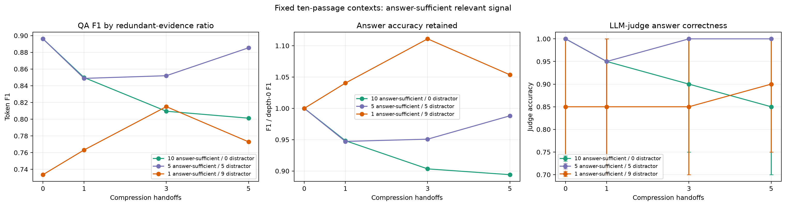

The combined figure reports token F1 (left) and LLM-judge correctness with bootstrap intervals (right). A depth-0-normalized panel was dropped for the same reason as Experiment 3's: it only rescaled the same F1 curve and added no information. The judge uses the same independent `openai/gpt-4o-mini` rubric as Experiment 3.

| Noise level and exact input composition | F1 depth 0 | F1 depth 5 | Judge depth 0 | Judge depth 5 |
|---|---:|---:|---:|---:|
| No noise — 10 answer-sufficient gold / 0 distractor | 0.896 | 0.801 | 1.000 | 0.850 |
| Medium noise — 5 answer-sufficient gold / 5 distractor | 0.887 | 0.891 | 0.950 | 1.000 |
| High noise — 1 answer-sufficient gold / 9 distractor | 0.787 | 0.776 | 0.900 | 0.900 |

Solid lines are BM25-top hard candidate distractors and dashed lines are BM25-bottom easy candidate distractors:

| Noise level and exact input composition | Hard F1 d0 | Easy F1 d0 | Hard F1 d5 | Easy F1 d5 |
|---|---:|---:|---:|---:|
| No noise — 10 answer-sufficient gold / 0 distractor | 0.896 | 0.896 | 0.801 | 0.801 |
| Medium noise — 5 answer-sufficient gold / 5 distractor | 0.887 | 0.921 | 0.891 | 0.847 |
| High noise — 1 answer-sufficient gold / 9 distractor | 0.787 | 0.778 | 0.776 | 0.767 |

| Noise level and exact input composition | Hard judge d0 | Easy judge d0 | Hard judge d5 | Easy judge d5 |
|---|---:|---:|---:|---:|
| No noise — 10 answer-sufficient gold / 0 distractor | 1.00 | 1.00 | 0.85 | 0.85 |
| Medium noise — 5 answer-sufficient gold / 5 distractor | 0.95 | 1.00 | 1.00 | 0.95 |
| High noise — 1 answer-sufficient gold / 9 distractor | 0.90 | 0.85 | 0.90 | 0.85 |

**LLM-judge update, 2026-08-21.** After screening, neither medium- nor high-noise hard-minus-easy comparison excludes zero at depths 3 or 5. At medium noise depth 5, the differences are +0.045 F1 (0.0 to +0.128) and +0.05 judge accuracy (0.0 to +0.15); at high noise they are +0.010 F1 (−0.190 to +0.220) and +0.05 judge accuracy (−0.15 to +0.25). The prior apparent hard-negative benefit was therefore not robust to relevance screening.

With screened candidate negatives, no noise retains a modest depth-0 F1 lead over high noise (+0.109, +0.009 to +0.235) that vanishes by depth 5 (+0.025, −0.134 to +0.180). This restores the conservative interpretation: at n=20, the experiment does not support a reliable hard-versus-easy distractor effect once direct or useful support has been screened out.

Pilot cost: **$0.009382** (357 live calls, 183 cached).

## 5. Question conditioning and cross-question generalization

> **Model:** `meta-llama/llama-3.1-8b-instruct` · **Dataset:** SQuAD validation, three A/B pairing designs (below) · **Prompts:** [PROMPTS.md § Experiment 5](../PROMPTS.md#experiment-5), reusing the question-conditioned chain prompt from Experiment 2

Three designs are reported, in the order they were run. Each changes exactly one thing about how A and B relate to their context, isolating a different candidate explanation for "does conditioning on A cost B":

1. **Separate-passage** — A and B have two *different* gold passages, glued into one context with 8 distractors. A generic summary must retain two competing answerable documents at once.
2. **Same-passage, with distractors** — A and B share *one* gold passage, placed among 9 unrelated distractors. Conditioning can no longer discard a whole competing document; there is only one document to compress, plus noise to filter.
3. **Same-passage, gold-only** — the same shared passage, but with the 9 distractors removed entirely and no length request, replicating Experiment 6's correction. There is now no noise to filter at all, isolating whatever narrowing happens *within* a single short passage.

### Separate-passage design: two competing gold documents

Each SQuAD example combines two independently labelled questions from different articles:

- Question A and its gold passage.
- A lexically unrelated Question B and its gold passage.
- Eight real SQuAD distractor passages.

Both A and B are therefore answerable from the same fixed simulated top-10 retrieval context. For either evaluation, the other question's gold passage is a **competing answerable document**, not a simple non-relevant distractor:

| Evaluation target | Target-question gold | Competing gold for the other question | Candidate distractors | Total context |
|---|---:|---:|---:|---:|
| Question A | 1 | 1 (Question B) | 8 | 10 passages |
| Question B | 1 | 1 (Question A) | 8 | 10 passages |

The conditioned and generic chains use the exact system prompt and handoff instructions from the repeated-degradation experiment. A runtime self-test verifies that the prompts become byte-identical when the single Question A block is deleted.

- **Conditioned:** Question A is appended to the documents/summary at every handoff.
- **Generic:** the same prompt is used without that question block.

The final answerer receives whichever question is being evaluated. Summaries have the same 700-token maximum in both arms.

#### Results

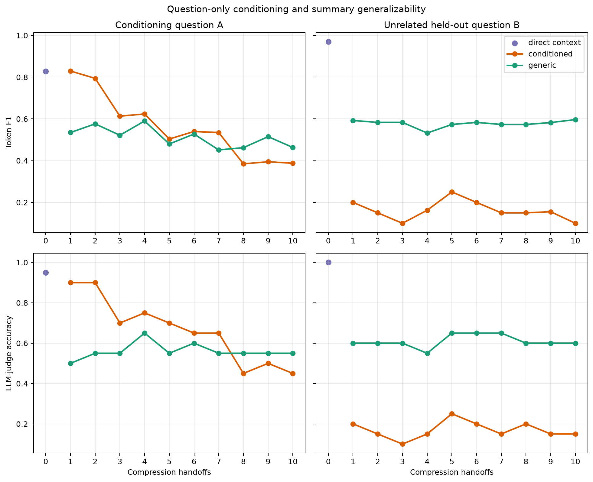

Dot area is proportional to the mean number of characters the answerer actually received at that point (the raw 10-passage context at depth 0, the generated summary at every depth after) — the same size encoding used for the repeated-degradation plot in §2. It makes the mechanism visible directly on the accuracy curve: conditioned summaries settle to 726–883 characters after the first handoff, while generic summaries, with no question to focus them, stay roughly 3–4x larger throughout (2,983–3,140 characters) despite sharing the identical 700-token cap. Conditioning is not just differently-focused here, it is writing a substantially shorter note.

The plot evaluates every depth from 0 to 10. Selected Token-F1 landmarks are:

| Evaluation | Direct | Conditioned d1 | Generic d1 | Conditioned d2 | Generic d2 | Conditioned d5 | Generic d5 | Conditioned d10 | Generic d10 |
|---|---:|---:|---:|---:|---:|---:|---:|---:|---:|
| Conditioning Question A | 0.828 | 0.829 | 0.535 | 0.794 | 0.576 | 0.504 | 0.480 | 0.388 | 0.463 |
| Unrelated Question B | 0.970 | 0.200 | 0.592 | 0.150 | 0.583 | 0.250 | 0.573 | 0.100 | 0.597 |

Paired conditioned-minus-generic F1 contrasts show that the target-specific benefit is real at depths 1–2, then becomes indistinguishable from zero. It is numerically negative at depths 8–10, but those later reversals are not distinguishable at this sample size.

| Evaluation | Depth | Difference | 95% interval | p-value |
|---|---:|---:|---|---:|
| Question A | 1 | **+0.295** | [+0.125, +0.476] | 0.0009 |
| Question A | 2 | **+0.218** | [+0.033, +0.417] | 0.0252 |
| Question A | 3 | +0.091 | [−0.111, +0.303] | 0.3948 |
| Question A | 5 | +0.024 | [−0.156, +0.208] | 0.8014 |
| Question A | 10 | −0.076 | [−0.309, +0.160] | 0.5262 |
| Question B | 1 | **−0.392** | [−0.600, −0.192] | 0.0001 |
| Question B | 5 | **−0.323** | [−0.540, −0.117] | 0.0023 |
| Question B | 10 | **−0.497** | [−0.700, −0.283] | <0.0001 |

The lower row of the figure repeats both panels under the LLM judge, and it **reinforces** this experiment's conclusion rather than softening it (unlike experiment 2, where the judge flattened the F1 signal). Paired conditioned-minus-generic judge contrasts:

| Evaluation | Depth | Judge difference | 95% interval | p-value |
|---|---:|---:|---|---:|
| Question A | 1 | **+0.400** | [+0.200, +0.600] | 0.0001 |
| Question A | 2 | **+0.350** | [+0.150, +0.550] | 0.0013 |
| Question A | 5 | +0.150 | [−0.050, +0.350] | 0.2349 |
| Question A | 10 | −0.100 | [−0.350, +0.150] | 0.5325 |
| Question B | 1 | **−0.400** | [−0.600, −0.200] | 0.0003 |
| Question B | 5 | **−0.400** | [−0.600, −0.200] | 0.0002 |
| Question B | 10 | **−0.450** | [−0.650, −0.250] | <0.0001 |

The same asymmetry appears with larger effect sizes: the target-question benefit is significant at depths 1–2 and gone by depth 5, while the damage to the unrelated question is significant at *every* depth and does not shrink with depth. Because the judge scores whether the answer is actually right rather than how many gold tokens it shares, this rules out the possibility that the held-out damage was merely a wording artefact.

The stronger conclusion is therefore asymmetric. Question conditioning is useful for its target in the first two handoffs, but that benefit does not survive reliably beyond depth 2. In contrast, it persistently removes information needed for the unrelated, answerable question. This supports generic summaries when long-horizon reuse is expected, but does not prove that generic summaries are better for a fixed task at every later depth: the target d8–10 reversal remains uncertain.

A complete side-by-side example is available in [`summary_generalization_v2_depth10/n20/example.md`](summary_generalization_v2_depth10/n20/example.md).

Original corrected pilot cost was approximately **$0.0100**; the depth-10 extension added **$0.013471** (698 live calls, 22 cache hits). Full metrics and contrasts are in [`summary_generalization_v2_depth10/n20/metrics.csv`](summary_generalization_v2_depth10/n20/metrics.csv) and [`summary_generalization_v2_depth10/n20/deltas.csv`](summary_generalization_v2_depth10/n20/deltas.csv).

### Same-passage design: random distractors, natural length

Each example selects one SQuAD passage that already has two independently human-written SQuAD questions targeting distinct facts — Question A, conditioned on, and held-out Question B. No question is model-generated. The gold passage sits at a stratified position among nine unrelated SQuAD distractor passages of matched length; conditioned and generic summaries are otherwise free to choose their own length under a non-binding 1,500-token cap.

- **20 pairs**, each built from its own gold passage (712–878 characters); full ten-passage contexts span 7,432–8,197 characters (10.3% spread).
- Gold position stratified exactly twice per slot across all ten positions.
- Closed-book C1 leakage probed both questions of every candidate pair: 85/220 candidate questions leaked; 20 fully-clean pairs were kept.
- Distractors are randomly sampled SQuAD passages of matched length, not screened for relevance to either question.

#### Results

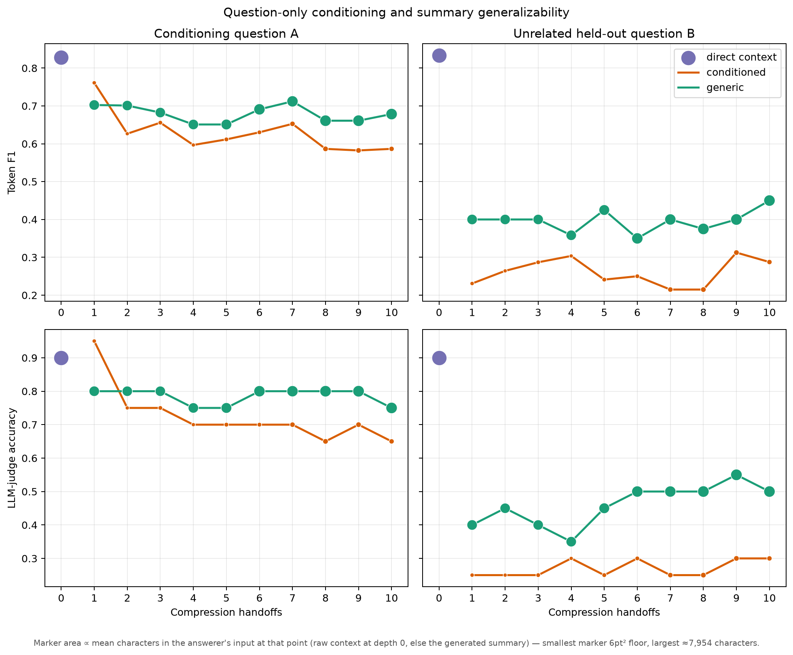

Paired conditioned-minus-generic contrasts:

| Evaluation | Metric | Depth 1 | Depth 2 | Depth 5 | Depth 10 |
|---|---|---:|---:|---:|---:|
| Target A | F1 | +0.059 [−0.149, +0.284] | −0.074 [−0.297, +0.155] | −0.039 [−0.218, +0.137] | −0.092 [−0.304, +0.112] |
| Target A | LLM judge | +0.150 [0.000, +0.300] | −0.050 [−0.250, +0.150] | −0.050 [−0.200, +0.100] | −0.100 [−0.350, +0.150] |
| Held-out B | F1 | −0.169 [−0.442, +0.091] | −0.136 [−0.414, +0.137] | −0.184 [−0.475, +0.125] | −0.163 [−0.450, +0.125] |
| Held-out B | LLM judge | −0.150 [−0.450, +0.150] | −0.200 [−0.500, +0.100] | −0.200 [−0.500, +0.100] | −0.200 [−0.500, +0.100] |

Every interval spans zero and every p-value exceeds 0.22. With one shared passage instead of two competing gold documents, conditioning no longer has a whole document it can discard — and the significant separate-passage effects above disappear. The held-out sign is still consistently negative at every depth, which the gold-only design below sharpens considerably.

Run cost: **$0.031**.

### Gold-only design: no distractors, no length request

Same underlying same-passage pairing, but replicating Experiment 6's correction: every context is reduced to the one shared gold passage that answers both A and B, with the nine distractors stripped before any model call by `gold_only_pairs()` — one shared function, imported by both this experiment and Experiment 6, not two copies of the same projection. There is no prompt-level length target here either; only the same non-binding 1,500-token guard as the design above, so any difference between the two isolates the effect of removing distractor noise, not a change in length policy.

- **10 pairs** — the same shared-passage pairs Experiment 6 also uses (`data/squad_same_passage/pairs_n10.jsonl`), reduced to their gold passage only: 721–866 characters, versus 7,841–8,467 characters for the ten-passage context above.
- **Truncation:** 0/200 handoffs hit the token cap.
- **Stage-1 exact fact survival:** conditioned retains A in 8/10 summaries and B in 3/10; generic retains A in 8/10 and B in 9/10.

#### Results

Paired conditioned-minus-generic contrasts:

| Evaluation | Metric | Depth 1 | Depth 2 | Depth 5 | Depth 10 |
|---|---|---:|---:|---:|---:|
| Target A | F1 | +0.096 [−0.137, +0.367] | −0.092 [−0.233, 0.000] | +0.040 [−0.253, +0.333] | +0.040 [−0.180, +0.300] |
| Target A | LLM judge | +0.100 [0.000, +0.300] | −0.200 [−0.500, 0.000] | +0.000 [−0.300, +0.300] | +0.000 [−0.300, +0.300] |
| Held-out B | F1 | **−0.600** [−0.900, −0.300] | **−0.700** [−1.000, −0.400] | **−0.500** [−0.800, −0.200] | **−0.433** [−0.800, 0.000] |
| Held-out B | LLM judge | **−0.600** [−0.900, −0.300] | **−0.700** [−1.000, −0.400] | **−0.500** [−0.800, −0.200] | **−0.500** [−0.900, −0.100] |

Held-out B is significant at **every landmark depth on both metrics** (p ranges 0.0001–0.0379 across F1, 0.0000–0.0276 across the judge), the sharpest result in this section. Target A shows no such effect: every interval spans zero at every depth.

Removing distractors, rather than adding a fair-comparison control, is what surfaces the effect. With nothing to filter, the generic arm's summary of one ~800-character paragraph is close to lossless for both facts (held-out F1 0.85–0.95 against a direct-context ceiling of 0.95, stage-1 survival 9/10) — a short passage does not force a choice. Conditioning makes that choice anyway: it does not improve target accuracy, which generic already gets right without help, but it still drops B's fact on most runs (stage-1 survival 3/10, held-out F1 0.25–0.45 across depths). This is task-induced narrowing in close to its purest form — the model discards an answerable, salient fact from a short, fully-retained passage for no compression reason, solely because it was told which question mattered.

Read across all three designs: the separate-passage design's effect (significant at depths 1–2, decaying by depth 5) comes from conditioning discarding an entire competing document. The same-passage-with-distractors design removes that mechanism and the effect vanishes. The gold-only design removes distractor noise too, and a *different*, larger, and more durable held-out effect reappears — one that cannot be attributed to document competition or noise filtering, since neither is present. These are two distinct mechanisms by which conditioning narrows a summary, not one effect appearing and disappearing.

Run cost: **$0.005** (597 live calls at `llama-3.1-8b-instruct`, 16 live judge calls, 404 judge calls served from cache).

### Paraphrase-only and pass-through controls: is repeated rewriting itself lossy?

The three designs above vary *what a compressor is told to select* — a question, a competing document, distractor noise. None of them can separate that from *the act of rewriting itself*, because `conditioned` and `generic` both compress. Two arms were added to the same gold-only design to isolate rewriting from compression and from question-conditioned selection:

- **`passthrough`** — no model call at all. Each stage forwards its input unchanged (the raw gold passage at stage 1). Zero rewriting, zero compression; the floor any other arm is read against.
- **`paraphrase`** — every stage rewrites the whole message in new words and is explicitly instructed *not* to condense, shorten, omit, prioritise, or select relevant content, and not to add anything. Maximum rewriting, no compression, no question.

Both are question-blind, like `generic`. Model, evidence, decoding, depths, seeds, and every prompt element except the condition-specific instruction are identical to the gold-only design above — including the same 10 pairs, the same 1,500-token non-binding guard (0/400 handoffs truncated across all four arms), and the same judge. `prompt_difference_selftest()` additionally asserts that substituting the generic instruction back into the paraphrase prompt reproduces the generic prompt exactly, so a `paraphrase`-vs-`generic` contrast measures only the instruction.

Read together, the four arms form a ladder: `passthrough → paraphrase` isolates the cost of rewriting; `paraphrase → generic` adds compression; `generic → conditioned` adds question-conditioned selection.

Stage-1 exact fact survival (10 pairs): `passthrough` retains A 10/10, B 10/10; `paraphrase` retains A 9/10, B 7/10; `generic` retains A 8/10, B 9/10; `conditioned` retains A 8/10, B 3/10.

#### Prompts used

All three model-calling arms share one system prompt, imported unchanged from Experiment 2:

> You are a research handoff agent. Preserve every fact needed to answer the question. Your output will replace your entire input for the next agent, so omitted information is lost.

`conditioned` and `generic` then share the identical instruction text — the load-bearing design property is that these two arms differ **only** by the question block, never by wording:

| Stage | Instruction (`conditioned` and `generic`, verbatim) |
|---|---|
| 1 | Write concise prose research notes that preserve all evidence needed to answer the question. Do not answer the question directly and do not add unsupported facts. |
| ≥2 | Rewrite the previous agent's notes into concise prose research notes for another agent. Preserve every answer-relevant fact, qualifier, date, number, relationship, uncertainty, and source id. Use only the previous notes. Do not answer the question directly. |

`paraphrase` replaces only that instruction, keeping the same system prompt and the same absence of a question block as `generic`:

| Stage | Instruction (`paraphrase`, verbatim) |
|---|---|
| 1 | Rewrite the source material in your own words for another agent. Restate every fact, qualifier, date, number, relationship, uncertainty, and source id it contains. This is a rewrite, not a summary: do not condense, shorten, omit, prioritise, or keep only what seems relevant, and do not add any fact that is not already present. |
| ≥2 | Rewrite the previous agent's notes in your own words for another agent. Restate every fact, qualifier, date, number, relationship, uncertainty, and source id they contain. This is a rewrite, not a summary: do not condense, shorten, omit, prioritise, or keep only what seems relevant, and do not add any fact that is not already present. Use only the previous notes. |

The user message assembles as `{material}\n\nQuestion the final agent must answer: {Question A}\n\n{instruction}` for `conditioned`, or `{material}\n\n{instruction}` for the three question-blind arms (`generic`, `paraphrase`, `passthrough`), where `material` is `Source material:\n{shared gold passage}` at stage 1 and `Previous agent's notes:\n{previous handoff text}` at every later stage.

`passthrough` has **no prompt and issues no model call**: `compress()` returns the incoming text unchanged (the raw gold passage at stage 1, the prior handoff verbatim at every later stage) — the one arm defined by the absence of a compressor rather than a different instruction to one.

`validate_modes()` refuses to run `paraphrase` together with a prompt-level word-count target, since a length budget is itself a compression instruction and would contradict the arm's own "do not condense" wording; none is used in this design regardless. Full prompt text, the runtime self-tests that verify each arm differs from the others only where intended, and the semantic-preservation judge's prompt are in [PROMPTS.md § Experiment 5](../PROMPTS.md#experiment-5).

#### Results

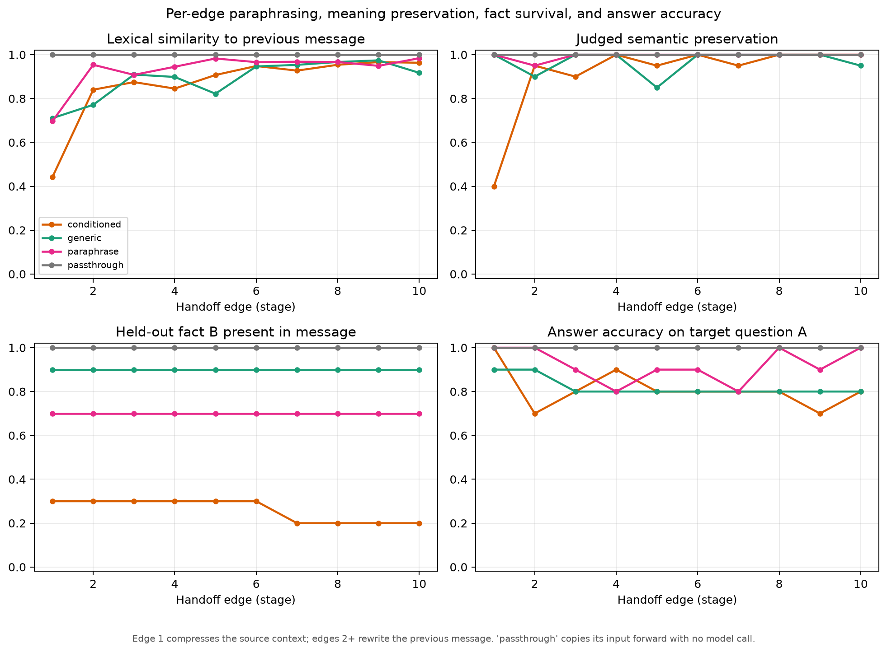

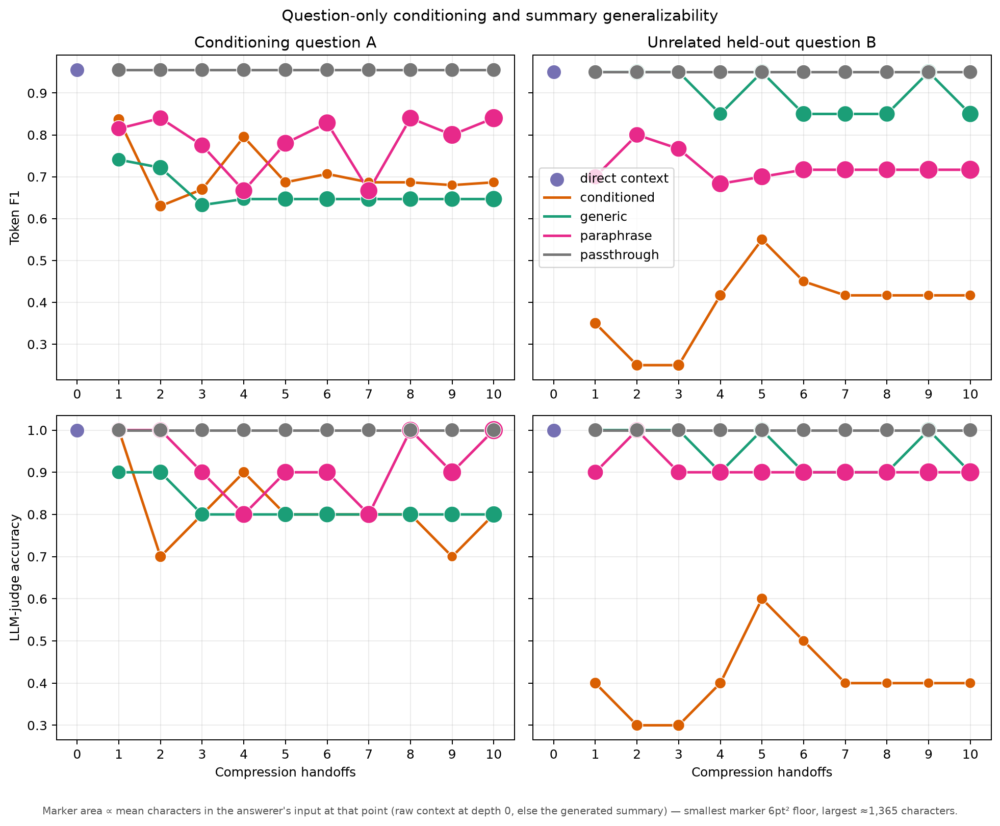

LLM-judge answer accuracy, all four arms:

| Evaluation | Arm | Depth 1 | Depth 2 | Depth 5 | Depth 10 |
|---|---|---:|---:|---:|---:|
| Target A | `passthrough` | 1.00 | 1.00 | 1.00 | 1.00 |
| Target A | `paraphrase` | 1.00 | 1.00 | 0.90 | 1.00 |
| Target A | `generic` | 0.90 | 0.90 | 0.80 | 0.80 |
| Target A | `conditioned` | 1.00 | 0.70 | 0.80 | 0.80 |
| Held-out B | `passthrough` | 1.00 | 1.00 | 1.00 | 1.00 |
| Held-out B | `paraphrase` | 0.90 | 1.00 | 0.90 | 0.90 |
| Held-out B | `generic` | 1.00 | 1.00 | 1.00 | 0.90 |
| Held-out B | `conditioned` | 0.40 | 0.30 | 0.60 | 0.40 |

Paired ladder contrasts, held-out B, at every landmark depth:

| Comparison | Metric | Depth 1 | Depth 2 | Depth 5 | Depth 10 |
|---|---|---:|---:|---:|---:|
| paraphrase − passthrough (rewriting alone) | F1 | −0.250 [−0.500, 0.000] | −0.150 [−0.350, 0.000] | −0.250 [−0.600, +0.050] | −0.233 [−0.500, 0.000] |
| paraphrase − passthrough (rewriting alone) | LLM judge | −0.100 [−0.300, 0.000] | 0.000 [0.000, 0.000] | −0.100 [−0.300, 0.000] | −0.100 [−0.300, 0.000] |
| generic − passthrough (+ compression) | F1 | 0.000 [0.000, 0.000] | 0.000 [0.000, 0.000] | 0.000 [0.000, 0.000] | −0.100 [−0.300, 0.000] |
| generic − passthrough (+ compression) | LLM judge | 0.000 [0.000, 0.000] | 0.000 [0.000, 0.000] | 0.000 [0.000, 0.000] | −0.100 [−0.300, 0.000] |
| conditioned − generic (+ question selection) | F1 | **−0.600** [−0.900, −0.300] | **−0.700** [−1.000, −0.400] | **−0.400** [−0.700, −0.100] | **−0.433** [−0.800, 0.000] |
| conditioned − generic (+ question selection) | LLM judge | **−0.600** [−0.900, −0.300] | **−0.700** [−1.000, −0.400] | **−0.400** [−0.700, −0.100] | **−0.500** [−0.900, −0.100] |

`conditioned − generic` reproduces the gold-only design's own numbers exactly (Gold-only design subsection, above), as it must — it is the identical two-arm contrast re-derived from the same 10 pairs. Neither rewriting alone nor adding compression moves held-out judge accuracy outside a single pair's worth of noise at any depth; every one of those eight intervals spans zero. Only the step that adds question-conditioned selection is significant, at every landmark depth, on both metrics, with the largest point estimates in the whole ladder.

**Per-edge measurement explains why.** Lexical similarity between consecutive messages collapses from a real transformation at stage 1 (`paraphrase` 0.697, `generic` 0.711, `conditioned` 0.442 — all substantially rewritten relative to the source) to near-copying by later stages (mean across stages 2–10: `paraphrase` 0.958, `generic` 0.907, `conditioned` 0.914; verbatim 5-gram copy rates 92%, 75%, and 81% respectively). Labelling every rewrite edge (stages 2–10, 90 edges per arm) against the four-way scheme confirms this directly: `passthrough` is 100% `verbatim_copy` by construction (the identity sanity check); `paraphrase` is 71% `verbatim_copy`, 24% `benign_paraphrase`, with only 3 `critical_detail_loss` edges on B; `generic` splits 44%/44% between copy and benign paraphrase, again with a handful of losses; `conditioned` is 58% `verbatim_copy` but **26% `critical_detail_loss` on B** — the semantic-preservation judge scores these rewrites as fully preserving *what the summary already contains*, while the fact was already excluded and stays excluded. The mechanism is not accumulating rewrite damage; it is a single narrowing decision at stage 1 that later stages faithfully reproduce.

**Read F1 alongside the judge here, not instead of it.** `paraphrase` target-A token F1 (0.78–0.84) sits well below `passthrough` (0.955) even though judge accuracy is 0.90–1.00 at every depth — the same F1-overstates-degradation pattern flagged for the main chain (§2, HotpotQA gold-only): a paraphraser instructed to use its own words does exactly that, and token overlap with the gold string drops accordingly without the fact being lost. Mean handoff length also diverges by arm in a way consistent with the instructions: `paraphrase` and `generic` both grow with repeated rewriting (980→1,365 and 792→1,125 characters, stage 1 to stage 10), while `conditioned` shrinks (507→425) — only the arm told to select for one question gets shorter over time.

Run cost: **$0.036** total — $0.0034 on the primary model (265 live calls; `conditioned`/`generic` mostly reuse the gold-only design's cache keys and `passthrough` issues none), $0.0321 on the preservation judge (392 live calls, one per rewrite-or-compression edge), $0.0005 on the answer judge (16 live calls, 804 served from cache).

## 6. Multilingual fixed vs switching handoffs

> **Model:** `meta-llama/llama-3.1-8b-instruct` · **Dataset:** 10 corrected SQuAD same-passage examples / 20 native question IDs, projected to gold-only · **Config:** `multilingual_handoff_config.yaml` · **Prompts:** [PROMPTS.md § Experiment 6](../PROMPTS.md#experiment-6)

### Design and input composition

The active experiment removes the retrieval confound. The reusable SQuAD file still stores one `gold_AB` passage plus nine screened distractors for other experiments, but `gold_only_pairs()` validates and removes all nine distractors before fingerprinting, prompting, or answering. Each Experiment 6 input is therefore one 721–866-character passage containing both answer facts.

| Arm | Question visible to compressors? | Language schedule | Experimental input |
|---|---|---|---|
| Conditioned, fixed | Question A | One assigned language at every handoff | 1 shared gold passage / 0 distractors |
| Conditioned, switching | Question A | A different language at every handoff | Same gold-only passage |
| Generic, fixed | No question | One assigned language at every handoff | Same gold-only passage |
| Generic, switching | No question | A different language at every handoff | Same gold-only passage |

Depth 0 answers directly from that one English passage. At depths 1–6, the answerer sees only the latest handoff and the original English A or B question. Starting language is stratified by passage. A fixed chain keeps that language; a switching chain cycles through English → German → French → Italian → Portuguese → Spanish, rotated by starting language, so each switching chain uses all six once. Fixed and switching share the exact stored stage-1 handoff and answer; the schedule treatment begins only at stage 2.

Question A is the conditioning target and B is held out. The same examples, source passage, decoding, answer budget, depths, judge, and final English answer prompt are paired across all arms. Removing distractors means generic versus conditioned now tests information selection *inside the gold passage*, not which document is found.

### Prompts used

The compressor system prompt is imported unchanged from Experiment 2:

> You are a research handoff agent. Preserve every fact needed to answer the question. Your output will replace your entire input for the next agent, so omitted information is lost.

At stage 1 the user message is `Source material:\n{one shared gold passage}`, optionally followed only in the conditioned arm by `Question the final agent must answer: {Question A}`, then:

> Write concise prose research notes that preserve all evidence needed to answer the question. Do not answer the question directly and do not add unsupported facts.

At later stages, `Previous agent's notes:\n{previous handoff}` replaces the source material and the instruction is:

> Rewrite the previous agent's notes into concise prose research notes for another agent. Preserve every answer-relevant fact, qualifier, date, number, relationship, uncertainty, and source id. Use only the previous notes. Do not answer the question directly.

Every arm then receives the same directive, formatted with its assigned language:

> OUTPUT LANGUAGE (mandatory): {language}. Write the entire replacement handoff in {language}. Proper names, identifiers, numbers, and short source quotations may remain unchanged when translation would alter them. Do not mix in another language for the prose. Summarize; do not translate or rewrite the source passage by passage. Do not use headings or one section per passage.

The final-answer message is `Research material:\n{material}\n\nQuestion:\n{A or B}\nAnswer:` under the shared answer persona. The complete prompt assembly and language-audit prompt are reproduced in [PROMPTS.md](../PROMPTS.md#experiment-6).

### Language relevance to Llama 3.1 pretraining

Meta reports Llama 3.1 as trained on more than 15T pretraining tokens from a multilingual corpus and officially supports eight languages, but it does **not** publish per-language token counts or proportions. Consequently, the experiment cannot claim an exact “pretraining relevance” share for any single language. The defensible operational proxy is official support plus Meta's published 8B-Instruct multilingual MMLU result. [Official Llama 3.1 model card](https://github.com/meta-llama/llama-models/blob/main/models/llama3_1/MODEL_CARD.md), [official evaluation details](https://github.com/meta-llama/llama-models/blob/main/models/llama3_1/eval_details.md).

| Language | Used? | Officially supported | Meta 8B-Instruct multilingual MMLU | Role |
|---|---:|---:|---:|---|
| English | Yes | Yes | Not separately reported in this table | Source passages and final questions are English; also one handoff language |
| German | Yes | Yes | 60.59 | Handoff language |
| French | Yes | Yes | 62.34 | Handoff language |
| Italian | Yes | Yes | 61.63 | Handoff language |
| Portuguese | Yes | Yes | 62.12 | Handoff language |
| Spanish | Yes | Yes | 62.45 | Handoff language |
| Hindi | No | Yes | 50.88 | Not in the retained six-language schedule |
| Thai | No | Yes | 50.32 | Not in the retained six-language schedule |

The gold-only correction deliberately retains the same six-language schedule as the retired noisy pilot so context composition is the principal design change. Hindi and Thai failures observed under the retired 10-passage preflight are not treated as evidence about the gold-only setting. This remains a mostly high-resource Latin-script test, not a test of every supported language.

### Diagnostics

- **Handoffs and answers:** 240 handoffs and 500 answers (20 direct plus 4 arms × 6 depths × 20 questions); all 500 answer-judge verdicts parsed.
- **Source and compression:** the direct input averages 810 characters / 129 words. There is no requested summary length. Across all depths, conditioned-fixed, conditioned-switching, generic-fixed, and generic-switching average 583/87, 665/101, 759/113, and 804/122 characters/words respectively; those differences are observed outcomes, not compliance targets.
- **Budget compliance:** no handoff hit the 1,500-token API guard (0/240). It is a non-binding safety limit, not a prompt instruction.
- **Language compliance:** deterministic predominant-language detection matches 237/240 requested languages (98.75%). The raw GPT-4o-mini audit remains available, while deterministic detection is the reported primary compliance diagnostic.
- **Generic baseline:** B is no longer a retrieval floor. At stage 1, generic B F1/judge is 0.400/0.800 versus conditioned 0.200/0.500. Both remain below direct gold-passage answering (0.950/1.000), so compression still loses substantial within-passage evidence.

### Results

Each schedule is shown separately in the same 2×2 grammar as the Experiment 5
conditioning plot: Question A/B are the columns, token F1/LLM-judge accuracy
are the rows, and direct context/conditioned/generic are the three series.
This avoids conflating the conditioning comparison with the language-schedule
comparison by overlaying four tracks in each panel. Dot **area** is
proportional to mean answer-input size.

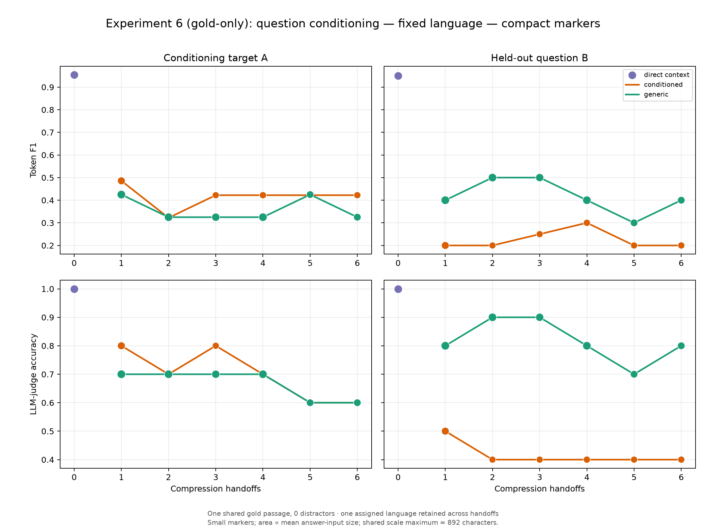

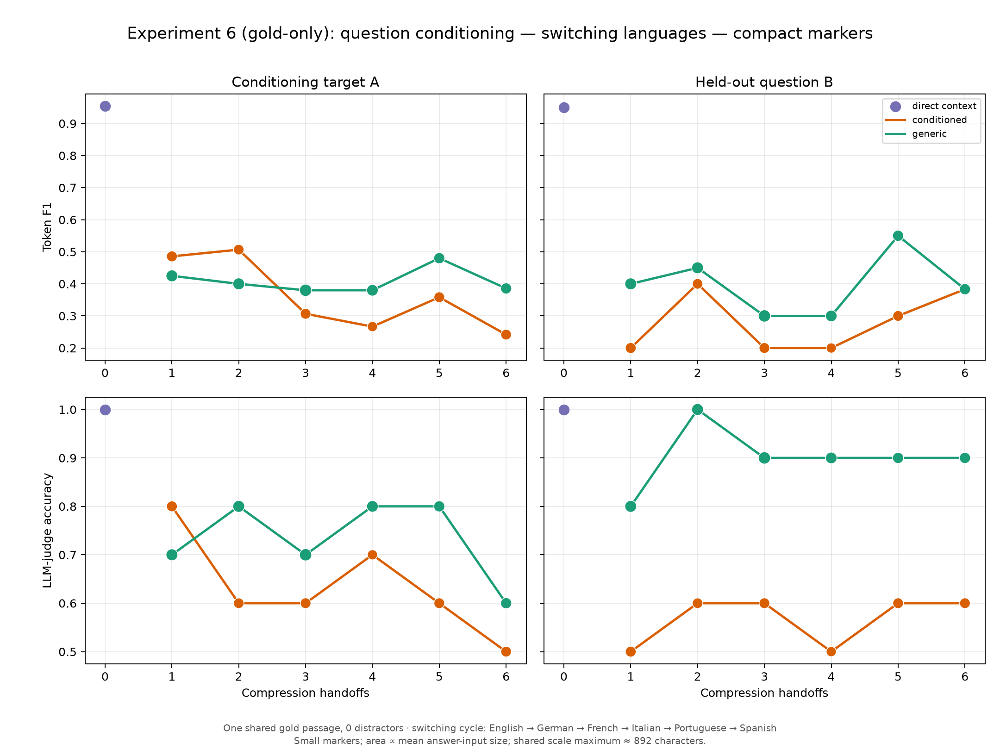

The matching smaller-marker versions remain available as
`multilingual_handoffs_fixed_compact.png` and
`multilingual_handoffs_switching_compact.png`; they contain the same data with
a smaller visual scale, while preserving marker area proportional to the
answerer's input size.

**Reading the reference-style plots.** Fixed and switching share their
stage-1 point by construction. Within each schedule, generic is generally
stronger on held-out B—most visibly for the fixed-language judge track at
depths 2–3—whereas target A alternates between the arms. The larger generic
markers show why this is not a pure conditioning effect: generic often passes
more characters to the answerer. Splitting the figures improves readability;
it does not change the paired estimates or the conclusion that the n=10
language-schedule contrasts are inconclusive.

Paired switching-minus-fixed contrasts (95% paired-bootstrap intervals):

| Evaluation | Conditioning | Metric | Depth 1 | Depth 3 | Depth 6 |
|---|---|---|---:|---:|---:|
| Target A | Conditioned | F1 | 0.000 [0.000, 0.000] | −0.116 [−0.416, +0.153] | −0.181 [−0.550, +0.183] |
| Target A | Conditioned | LLM judge | 0.000 [0.000, 0.000] | −0.200 [−0.500, 0.000] | −0.100 [−0.400, +0.200] |
| Target A | Generic | F1 | 0.000 [0.000, 0.000] | +0.055 [−0.075, +0.240] | +0.061 [−0.225, +0.332] |
| Target A | Generic | LLM judge | 0.000 [0.000, 0.000] | 0.000 [0.000, 0.000] | 0.000 [−0.300, +0.300] |
| Held-out B | Conditioned | F1 | 0.000 [0.000, 0.000] | −0.050 [−0.350, +0.250] | +0.183 [0.000, +0.400] |
| Held-out B | Conditioned | LLM judge | 0.000 [0.000, 0.000] | +0.200 [0.000, +0.500] | +0.200 [0.000, +0.500] |
| Held-out B | Generic | F1 | 0.000 [0.000, 0.000] | −0.200 [−0.600, +0.200] | −0.017 [−0.267, +0.183] |
| Held-out B | Generic | LLM judge | 0.000 [0.000, 0.000] | 0.000 [−0.300, +0.300] | +0.100 [−0.200, +0.400] |

The stage-1 zeroes are a design check: schedules are identical until stage 2. From depths 2–6, **no switching-minus-fixed F1 or LLM-judge interval excludes zero**. The depth-6 conditioning × switching interactions are also uncertain: target F1 −0.241 [−0.592, +0.089], target judge −0.100 [−0.600, +0.500], held-out F1 +0.200 [0.000, +0.600], and held-out judge +0.100 [−0.400, +0.600].

The corrected conclusion is narrow: cycling among six supported languages does not produce a reliably detectable accuracy penalty or benefit relative to staying in one language. The document-selection explanation is eliminated. With no prompt-level length request, generic summaries are also longer at stage 1 (836 versus 696 characters), so its B advantage is not clean evidence of selective preservation: conditioned-minus-generic B is −0.200 F1 [−0.500, 0.000] and −0.300 judge [−0.600, 0.000]. At depth 3 the fixed-language B judge difference is larger (−0.500 [−0.800, −0.200]), whereas the F1 difference remains uncertain. This is a descriptive n=10 result, not a confirmed specialization–generalization effect.

The active gold-only run used **$0.0078** for handoff generation and answering, **$0.0085** for language auditing, and **$0.0026** for answer judging. The retired noisy run remains in `results/multilingual_handoff/n10` for auditability but is no longer interpreted as Experiment 6 evidence; the active artifacts are under `multilingual_handoff_gold_only/n10`.

## 7. Incremental-evidence handoff chain

> **Model:** `meta-llama/llama-3.3-70b-instruct` · **Dataset:** MuSiQue-Answerable (validation) · **Sample:** 30 model-filtered questions, two seeds, 2–4 supporting-paragraph packets/question · **Prompts:** [PROMPTS.md § Experiment 2](../PROMPTS.md#experiment-2) plus the incremental specialist update (`src/run_incremental_chain.py`)

### Design

Experiment 2 asks what happens when a *fixed* evidence set is repeatedly
compressed. This experiment asks a different systems question: what remains of
older evidence when later agents acquire new evidence. Each MuSiQue supporting
paragraph is an ordered packet `E_i`. Specialist `i` receives only the sealed
previous handoff `M_{i-1}` and `E_i`, then emits `M_i`. Between specialists,
exactly 0, 1, 3, or 5 relay-only agents rewrite the sealed message; relays have
no packet parameter and never receive source text.

The complete underlying evidence, packet order, model, prompts, token budgets,
and decoding are held fixed across relay depths. Packet order is exactly
counterbalanced forward/reverse across questions and stays fixed for every
condition and seed. The two conditions differ only in whether the main question
is shown to specialists and relays. The final answerer always receives the main
question. Each packet also supplies a hidden decomposition probe, which is never
shown to the chain agents. A fact's *handoff age* is the number of message
transformations since the specialist that introduced its packet.

This gives three complementary tests: final multi-hop QA, whether the answer
string from each packet remains literally present in the handoff, and whether a
fresh answerer can answer a hidden probe from the evolving message. Future-query
regret is `score(probe | complete original evidence) − score(probe | final
handoff)`, so positive values would be evidence that the final representation is
less reusable than the original packet set.

### Results

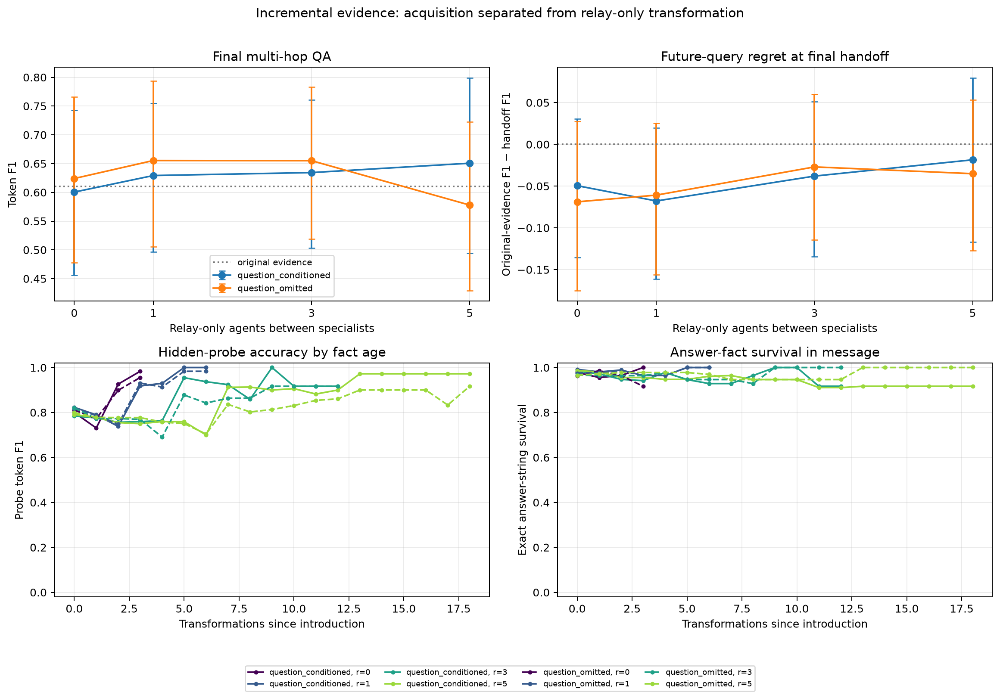

The main outcome is a **null relay-depth effect at this scale**, not monotonic
degradation. The original-evidence baseline is EM/F1/judge = 0.500/0.610/0.667.
The table reports the final multi-hop answer after the complete evidence stream.

| Relays between specialists | Question conditioned: F1 / judge | Question omitted: F1 / judge |
|---:|---:|---:|
| 0 | 0.601 / 0.667 | 0.624 / 0.700 |
| 1 | 0.629 / 0.700 | 0.655 / 0.733 |
| 3 | 0.634 / 0.717 | 0.655 / 0.717 |
| 5 | 0.651 / 0.683 | 0.578 / 0.633 |

None of the paired relay-depth-minus-zero-relay F1 intervals excludes zero. At
five relays, the conditioned estimate is +0.050 [−0.050, +0.152] and the
question-omitted estimate is −0.046 [−0.174, +0.067]. Thus the apparent
conditioned improvement and omitted-condition drop are both compatible with
sampling variation at `n = 30`.

The hidden probes make the interpretation sharper. Every final-handoff
future-query F1 regret is negative (conditioned: −0.050, −0.068, −0.038,
−0.018 at 0/1/3/5 relays; omitted: −0.069, −0.061, −0.027, −0.035). Their F1
intervals all include zero, while several judge contrasts favour the final
handoff. This is not information creation: the original-evidence probe asks a
fresh model to extract one relation from the entire packet set, whereas staged
specialists have already turned each packet into a compact, query-friendly
representation. The result says that this re-encoding can offset, or exceed,
the loss due to relays under the present model and budget.

Literal answer-string survival is high but not perfect: across the longest
five-relay chains, it is 0.986 at age 0 and about 0.91 for the early packets at
ages 11–12 in the conditioned condition; the corresponding omitted-condition
values are 0.965 and 0.946. Topic survival is somewhat lower. The age curves
should be read descriptively, not as a clean causal decay rate: high ages contain
only early packets from the 3–4-hop subset, whereas age 0 contains the newest
packet from every example. The experiment nevertheless provides direct evidence
that many individually introduced facts survive long relay stretches even when
the main QA metric is flat.

The bounded conclusion is therefore architectural. In an incremental-evidence
workflow, relay-only transformations do not by themselves dominate the benefits
of later specialist updates. A depth comparison that lets agents gain new
evidence tests the combined system, not an isolated communication channel. The
fixed-evidence serial chain (§2) and this incremental chain are complementary:
the former measures degradation after acquisition stops; the latter measures
whether that degradation survives an ongoing acquire–summarize–relay loop.

Generation/answering spend was **$0.6942** (7,019 live and 1,693 cached calls;
2.88M prompt and 0.61M completion tokens). The independent answer judge is
accounted separately under its own cap. Full tables and raw records are in
[`incremental_chain/`](incremental_chain/).

## Cross-experiment interpretation

The results support six distinct roles for handoffs:

1. **Denoising:** one summary can remove distractors and improve answer accuracy.
2. **Serial information loss:** repeated compression can progressively remove precise evidence, especially when the starting evidence is already minimal — though the rewriting-vs-selection ladder (below) shows that repeated *rewriting alone*, without compression, is not this mechanism.
3. **Rewriting is not the culprit; selection is.** Isolating rewriting from compression from question-conditioned selection on the gold-only design, only the step that adds question-conditioned selection produces a significant held-out effect; a pass-through control and a paraphrase-only control both stay within noise of each other at every depth.
4. **Task conditioning:** supplying a question changes what a compressor emphasizes, but the corrected same-passage-with-distractors pilot is too small to establish either target benefit or held-out harm — the effect requires removing distractors entirely to surface (§5, gold-only design).
5. **Representation language:** changing language between handoffs can alter compression length and occasionally trigger refusal behavior, but this six-language pilot does not isolate a robust accuracy effect.
6. **Acquisition-compensated communication:** when new evidence arrives between relay stretches, packet-specific specialist updates can offset relay-only degradation. Depth is then a property of the whole acquire–summarize–relay architecture, not a pure measure of message-channel loss (§7).

These mechanisms can coexist. A handoff may improve the current answer by filtering noise while simultaneously making the representation less reusable for future tasks.

## Limitations

- All completed runs are pilots: 10, 20, or 30 questions per condition.
- The baseline and long-chain experiments used Llama 3.3 70B, whereas the low-cost retrieval and generalization pilots used Llama 3.1 8B.
- The repeated-chain experiment used two seeds, but the low-cost pilots used one deterministic seed.
- The incremental-evidence experiment uses one model and 30 MuSiQue questions, despite two generation seeds. Its highest handoff ages contain only the early packets from the 3–4-packet subset (6 or 14 questions), so the plotted age profile is not a balanced causal estimate of per-transformation loss. Its complete-evidence probe baseline also measures fresh-model extraction from a multi-packet context; specialist re-encoding can improve that extraction without creating information.
- SQuAD A/B contexts are simulated retrieval packs rather than outputs from a live retriever.
- SQuAD is a heavily-pretrained public benchmark: 85/220 candidate questions failed the original design's closed-book leakage check (a separate audit on the 10-pair pool used by the gold-only rerun and Experiment 6 found 84/220). The surviving pairs are drawn from SQuAD's harder tail, not from SQuAD at large.
- Both same-passage designs use one seed; the original design (20 pairs) is underpowered for its own small, non-significant effects, and even the gold-only design's large, significant held-out effect (10 pairs) has not been checked against a second seed.
- The rewriting-vs-selection ladder reuses the gold-only design's 10 pairs and one seed, and inherits every limitation of that design (including the leakage-check caveat above); the null on the pass-through and paraphrase-only arms is a null at n=10, not a proof that rewriting is harmless at scale. The semantic-preservation judge is new in this experiment and has not been cross-checked against a second judge model.
- The original design's distractors are randomly sampled, not screened for relevance to either question; a separate, no-longer-reported build applied an LLM relevance screen instead (`negative_verification_n10.csv`) without changing the qualitative null result, before the gold-only rerun replaced screening with removing distractors entirely.
- The redundant-evidence signal-ratio gold passages share an answer-bearing source paragraph. The experiment controls answer sufficiency, but not independent-source diversity.
- Direct scores for Question A and B should not be compared as measures of relative difficulty. Valid causal comparisons are paired within the same question type.
- Bootstrap intervals are exploratory and were not corrected for multiple comparisons.
- The multilingual experiment uses only 10 passages and one deterministic seed. Language order is coupled to depth within each pair, although starting languages are stratified across pairs; order-specific and depth-specific effects cannot be fully separated.
- Its active run covers six high-resource supported languages. Three handoffs fail deterministic language compliance; the 1,500-token safety guard did not bind. The result cannot be generalized to all supported languages or writing systems.
- Meta does not publish per-language Llama 3.1 pretraining shares. Official support and multilingual MMLU are capability proxies, not measurements of corpus prevalence.

## Recommended next steps

1. Scale the gold-only same-passage design (§5) to at least 100 pairs and two seeds. It is the cleanest of the three variants tried (original distractors, LLM-screened distractors, gold-only) and already produces the report's most significant single result at n=10; confirming it holds at scale is higher priority than further distractor-realism work on the 20-pair design. Scale the pass-through/paraphrase-only ladder alongside it on the same larger pool, since it shares the design and would otherwise stay the more underpowered of the two.
2. Replicate it with Llama 3.3 70B or another stronger model to test whether the specialization–generalization asymmetry survives model scaling.
3. Replicate the incremental-evidence chain (§7) at n≥100 with independent evidence orders and a within-packet age analysis. Pair it with an extractive/oracle packet-update control to distinguish genuine factual retention from query-friendly specialist re-encoding.
4. Expand the MS MARCO retrieval pilot to at least 100 questions before interpreting the medium-noise behavior.
5. Keep the v2 question-only prompt audit as a required self-test in all subsequent conditioning experiments, and report the truncation rate and generic-arm fact survival before interpreting any conditioning contrast — a summariser silently hitting its token cap produces a degenerate baseline that reads as a large treatment effect.
6. Scale the corrected redundant-evidence signal-ratio experiment to 100 packs, then replace shared-source redundancy with independently sourced, answer-sufficient documents where a suitable labelled corpus permits it.
7. Replicate gold-only Experiment 6 at n≥100 with two seeds, enforced length-matching rather than prompt-only targets, and balanced reversed or Latin-square language orders. Add Hindi/Thai only as a separately preregistered language-set expansion.

## Result artifacts

- Baseline: [`report.md`](report.md), [`summary.csv`](summary.csv), [`contrasts.csv`](contrasts.csv)
- Serial degradation: [`chain/report.md`](chain/report.md), [`chain/stage_metrics.csv`](chain/stage_metrics.csv)
- Serial degradation, question omitted: [`chain_generic/report.md`](chain_generic/report.md), [`chain_generic/stage_metrics.csv`](chain_generic/stage_metrics.csv), [`chain_generic/conditioning_comparison.png`](chain_generic/conditioning_comparison.png)
- Incremental-evidence chain: [`incremental_chain/report.md`](incremental_chain/report.md), [`incremental_chain/stage_metrics.csv`](incremental_chain/stage_metrics.csv), [`incremental_chain/future_query_regret.csv`](incremental_chain/future_query_regret.csv), [`incremental_chain/survival_by_age.csv`](incremental_chain/survival_by_age.csv), [`incremental_chain/incremental_chain.png`](incremental_chain/incremental_chain.png), raw records [`../runs/incremental_chain/`](../runs/incremental_chain/)
- Retrieval quality: [`retrieval_quality/n20/metrics.csv`](retrieval_quality/n20/metrics.csv), [`retrieval_quality/n20/deltas.csv`](retrieval_quality/n20/deltas.csv)
- Corrected redundant-evidence signal ratio: [`redundant_signal_ratio/n20/metrics.csv`](redundant_signal_ratio/n20/metrics.csv), [`redundant_signal_ratio/n20/deltas.csv`](redundant_signal_ratio/n20/deltas.csv), [`redundant_signal_ratio/n20/redundant_signal_ratio.png`](redundant_signal_ratio/n20/redundant_signal_ratio.png)
- Generalization, separate-passage design (20 pairs): [`summary_generalization_v2_depth10/n20/metrics.csv`](summary_generalization_v2_depth10/n20/metrics.csv), [`summary_generalization_v2_depth10/n20/deltas.csv`](summary_generalization_v2_depth10/n20/deltas.csv), [`summary_generalization_v2_depth10/n20/summary_generalization.png`](summary_generalization_v2_depth10/n20/summary_generalization.png), example [`summary_generalization_v2_depth10/n20/example.md`](summary_generalization_v2_depth10/n20/example.md)
- Generalization, same-passage design with distractors (20 pairs): [`squad_same_passage/n20/metrics.csv`](squad_same_passage/n20/metrics.csv), [`squad_same_passage/n20/deltas.csv`](squad_same_passage/n20/deltas.csv), [`squad_same_passage/n20/summary_generalization.png`](squad_same_passage/n20/summary_generalization.png), construction report [`../data/squad_same_passage/construction_n20.csv`](../data/squad_same_passage/construction_n20.csv)
- Generalization, gold-only design (10 pairs): [`squad_same_passage_goldonly/n10/metrics.csv`](squad_same_passage_goldonly/n10/metrics.csv), [`squad_same_passage_goldonly/n10/deltas.csv`](squad_same_passage_goldonly/n10/deltas.csv), [`squad_same_passage_goldonly/n10/summary_generalization.png`](squad_same_passage_goldonly/n10/summary_generalization.png), shared pair pool also used by Experiment 6: construction report [`../data/squad_same_passage/construction_n10.csv`](../data/squad_same_passage/construction_n10.csv), distractor audit [`../data/squad_same_passage/negative_verification_n10.csv`](../data/squad_same_passage/negative_verification_n10.csv)
- Generalization, rewriting-vs-selection ladder (pass-through/paraphrase-only/generic/conditioned, same 10 pairs): [`squad_same_passage_paraphrase/n10/metrics.csv`](squad_same_passage_paraphrase/n10/metrics.csv), [`squad_same_passage_paraphrase/n10/deltas.csv`](squad_same_passage_paraphrase/n10/deltas.csv), [`squad_same_passage_paraphrase/n10/transition_metrics.csv`](squad_same_passage_paraphrase/n10/transition_metrics.csv), [`squad_same_passage_paraphrase/n10/paraphrase_transitions.png`](squad_same_passage_paraphrase/n10/paraphrase_transitions.png), [`squad_same_passage_paraphrase/n10/summary_generalization.png`](squad_same_passage_paraphrase/n10/summary_generalization.png), per-edge records [`../runs/squad_same_passage_paraphrase/n10/transitions.jsonl`](../runs/squad_same_passage_paraphrase/n10/transitions.jsonl)
- Retired (no longer in this report, still on disk): LLM-screened-distractor natural-length run `squad_same_passage/n10`, its length-matched control `squad_same_passage_matched/n10`
- Multilingual handoffs, **active gold-only run**: [`multilingual_handoff_gold_only/n10/metrics.csv`](multilingual_handoff_gold_only/n10/metrics.csv), [`multilingual_handoff_gold_only/n10/deltas.csv`](multilingual_handoff_gold_only/n10/deltas.csv), [`multilingual_handoff_gold_only/n10/diagnostics.csv`](multilingual_handoff_gold_only/n10/diagnostics.csv), size-encoded [`multilingual_handoffs.png`](multilingual_handoff_gold_only/n10/multilingual_handoffs.png), compact-marker [`multilingual_handoffs_compact.png`](multilingual_handoff_gold_only/n10/multilingual_handoffs_compact.png), raw handoffs [`../runs/multilingual_handoff_gold_only/n10/handoffs.jsonl`](../runs/multilingual_handoff_gold_only/n10/handoffs.jsonl), raw answers [`../runs/multilingual_handoff_gold_only/n10/answers.jsonl`](../runs/multilingual_handoff_gold_only/n10/answers.jsonl). Retired noisy artifacts remain under `multilingual_handoff/n10`.
