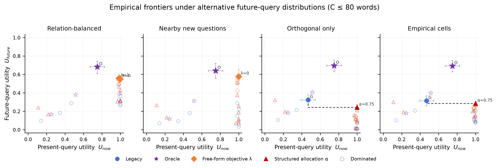
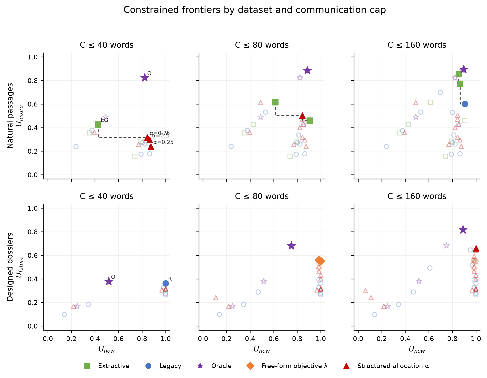
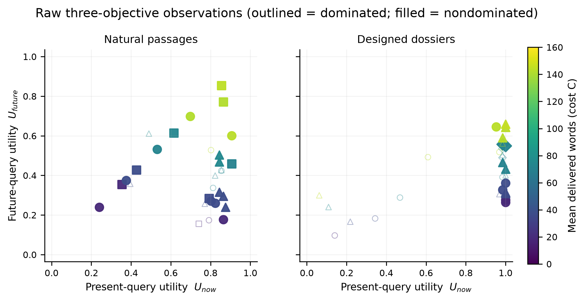
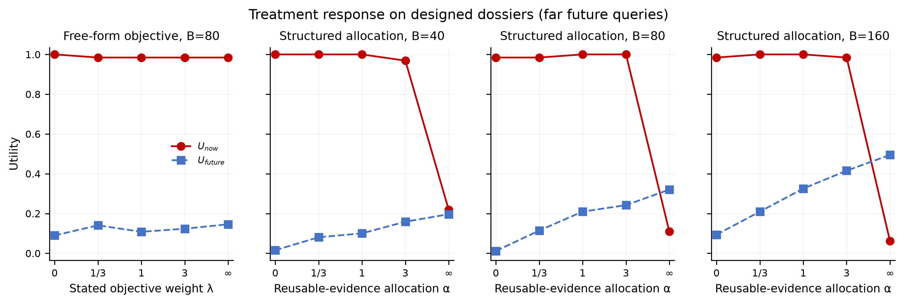
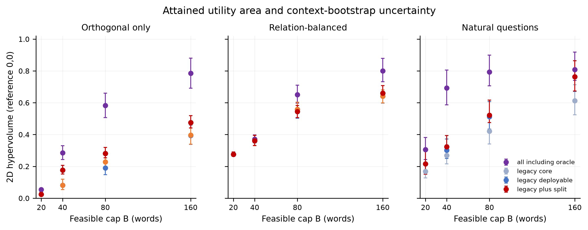
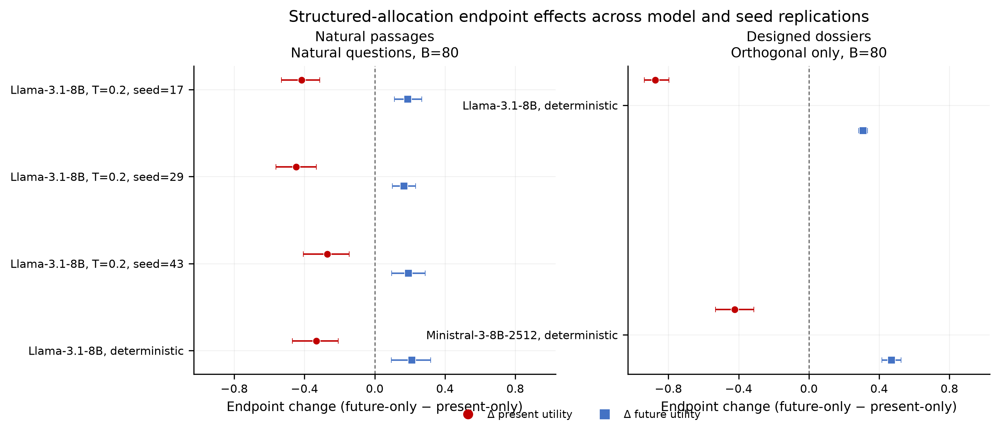

# Bounded Agent Communication: Empirical Frontier Study

## Paper claim

The structured allocation-α sweep traces the predicted present–future trade-off, and its policy set increases attained hypervolume in at least one designated primary cell. That outward shift is not consistent across every prespecified metric and query-distribution sensitivity, so it is reported as setting-specific rather than robust policy dominance.

- 7 completed Experiment 11 dataset/replication cells were available.
- 10/10 primary structured allocation-α trends pass the simultaneous bootstrap sign-stability threshold (present slope down, future slope up, with matching endpoints).
- 0/1 free-form objective-λ trends pass the same directional threshold; this is reported separately from allocation control.
- 5/9 declared-primary structured policy-set additions have a paired ΔHV lower bound above numerical zero.
- 0/4 primary improvements with a declared distribution-sensitivity grid also survive every designated metric and query-distribution cell.
- Across all completed stacks, the design-mapped α arm is an empirical λ-objective winner in 25/40 matched selections; 13/40 are also nondominated with bootstrap frontier probability at least 0.80.

The strongest supported claim is that an explicit evidence-allocation quota α reproducibly controls the present–future trade-off in the declared future-query regimes, whereas a numerical λ instruction did not do so in its dedicated probe. Any outward frontier shift remains setting-specific and is claimed only where paired incremental hypervolume excludes the numerical zero tolerance.

## Formal target

We preserve the three-objective formulation

\[
\max_\pi \left(U_{\mathrm{now}}, U_{\mathrm{future}}, -C\right)
\]

and its scalarized constrained form

\[
\max_\pi \left[U_{\mathrm{now}} + \lambda U_{\mathrm{future}}\right]
\quad\text{subject to}\quad C\le B.
\]

Utility is answer correctness in [0,1] (primary: independent binary judge; EM and token F1 are
robustness metrics). Cost C is the **mean number of delivered words**, not the requested cap. Hard
feasibility additionally requires the maximum delivered message length to be at most B. Higher
utility is better; lower cost is better in every figure and computation.

## Design in plain language

- **Natural passages:** 24 real SQuAD paragraphs, each paired with four human-written questions.
  Example: the Super Bowl passage separately asks who received Newton’s 45-yard pass, who missed a
  field goal, who intercepted a later pass, and who recovered a fumble.
- **Designed dossiers:** 16 fictional, leakage-screened, four-aspect dossiers with 16 questions each.
  Example: the Vellunar canal dossier asks an incorporation-date question, its paraphrase, a new
  question about the same company, a related-topic question, and questions about orthogonal aspects
  such as facilities or finance. Their fictional facts make closed-book leakage measurable rather
  than assumed; the exact model-specific baselines are reported below.
- **Budgets:** the source experiment uses 20/40/80/160 delivered-word caps; structured allocation is
  prespecified at 40/80/160 because a 20-word message cannot support two meaningful labeled sections.
- **Two distinct treatment sweeps:** the free-form writer receives objective weight
  λ∈{0, 1/3, 1, 3, ∞}. The structured writer instead receives a reusable-evidence allocation
  share α∈{0,.25,.5,.75,1}. We paired the grids by the design convention α=λ/(1+λ) to span
  comparable endpoints and interior levels; α is a word-allocation control and is **not
  mathematically equivalent** to the utility weight λ.
- **Future distributions:** relation categories are averaged first and then weighted. This makes a
  relation-balanced target genuinely 25% per category rather than letting the 12 orthogonal cells
  silently outweigh each one-cell category. Near, graded-orthogonality, far, empirical-cell, and
  paraphrase-sanity regimes are never allowed to dominate one another.
- **Primary dossier estimand:** the structured reusable section was instructed not to repeat the
  current answer. A paraphrase asks for that same answer, so the far/orthogonal distribution is the
  primary allocation test. This interpretation was declared during internal design audit after the
  mismatch was identified; the far distribution itself was already in the analysis grid, and every
  alternative remains visible. Relation-balanced results are a prompt–estimand stress test, not
  evidence for a distribution-invariant frontier.

## Run status

| Study cell | Dataset | Contexts | Status |
|---|---:|---:|---|
| Experiment 10 | relation_dossiers | 16 | included |
| Experiment 10 | squad_groups | 24 | included |
| mistral_controls (Experiment 10 controls) | relation_dossiers | 16 | included |
| mistral_stack | relation_dossiers | 16 | included |
| primary | relation_dossiers | 16 | included |
| primary | squad_groups | 24 | included |
| scalar_probe | relation_dossiers | 16 | included |
| seed17 | squad_groups | 24 | included |
| seed29 | squad_groups | 24 | included |
| seed43 | squad_groups | 24 | included |

Incomplete/smoke result directories are audited but excluded by default. Run this renderer again
after any matrix completes; discovery and all summaries update without editing the report code.
Bootstrap: 5,000 paired context resamples, 95% percentile intervals.

### Capacity and leakage controls

- Llama-3.1-8B reader, designed dossiers: direct-context accuracy 0.992 [0.977, 1.000]; closed-book accuracy 0.000 [0.000, 0.000].
- Llama-3.1-8B reader, natural passages: direct-context accuracy 0.875 [0.812, 0.938]; closed-book accuracy 0.031 [0.010, 0.059].
- Ministral-3-8B-2512 reader, designed dossiers: direct-context accuracy 0.996 [0.988, 1.000]; closed-book accuracy 0.004 [0.000, 0.010].

## Main numerical results

### Existing specialization contrast

- Natural corpus, Natural questions, B=20: conditioning changes present utility by +0.625 and future utility by -0.062 versus generic.
- Natural corpus, Natural questions, B=80: conditioning changes present utility by +0.281 and future utility by -0.194 versus generic.
- Natural corpus, Natural questions, B=160: conditioning changes present utility by +0.104 and future utility by -0.170 versus generic.
- Designed corpus, Empirical cells, B=20: conditioning changes present utility by +0.859 and future utility by -0.026 versus generic.
- Designed corpus, Empirical cells, B=80: conditioning changes present utility by +0.516 and future utility by -0.198 versus generic.
- Designed corpus, Empirical cells, B=160: conditioning changes present utility by +0.359 and future utility by -0.342 versus generic.
- Designed corpus, Relation-balanced, B=20: conditioning changes present utility by +0.859 and future utility by +0.167 versus generic.
- Designed corpus, Relation-balanced, B=80: conditioning changes present utility by +0.516 and future utility by +0.103 versus generic.
- Designed corpus, Relation-balanced, B=160: conditioning changes present utility by +0.359 and future utility by +0.026 versus generic.
- Designed corpus, Orthogonal only, B=20: conditioning changes present utility by +0.859 and future utility by -0.096 versus generic.
- Designed corpus, Orthogonal only, B=80: conditioning changes present utility by +0.516 and future utility by -0.307 versus generic.
- Designed corpus, Orthogonal only, B=160: conditioning changes present utility by +0.359 and future utility by -0.475 versus generic.

### Structured allocation-share response

- relation_dossiers / Orthogonal only at B=160: α=1 minus α=0 gives ΔU_now=-0.922 [-0.969, -0.859], ΔU_future=0.401 [0.353, 0.448]; simultaneous sign stability=1.000; direction stable.
- relation_dossiers / Orthogonal only at B=40: α=1 minus α=0 gives ΔU_now=-0.781 [-0.859, -0.703], ΔU_future=0.181 [0.143, 0.219]; simultaneous sign stability=1.000; direction stable.
- relation_dossiers / Orthogonal only at B=80: α=1 minus α=0 gives ΔU_now=-0.875 [-0.953, -0.797], ΔU_future=0.309 [0.284, 0.333]; simultaneous sign stability=1.000; direction stable.
- relation_dossiers / Relation-balanced at B=160: α=1 minus α=0 gives ΔU_now=-0.922 [-0.969, -0.859], ΔU_future=-0.290 [-0.343, -0.238]; simultaneous sign stability=0.000; direction not stable.
- relation_dossiers / Relation-balanced at B=40: α=1 minus α=0 gives ΔU_now=-0.781 [-0.859, -0.688], ΔU_future=-0.142 [-0.192, -0.090]; simultaneous sign stability=0.000; direction not stable.
- relation_dossiers / Relation-balanced at B=80: α=1 minus α=0 gives ΔU_now=-0.875 [-0.938, -0.797], ΔU_future=-0.263 [-0.318, -0.206]; simultaneous sign stability=0.000; direction not stable.
- squad_groups / Natural questions at B=40: α=1 minus α=0 gives ΔU_now=-0.375 [-0.490, -0.260], ΔU_future=0.101 [0.038, 0.167]; simultaneous sign stability=1.000; direction stable.
- squad_groups / Natural questions at B=80: α=1 minus α=0 gives ΔU_now=-0.333 [-0.469, -0.198], ΔU_future=0.212 [0.090, 0.316]; simultaneous sign stability=1.000; direction stable.

### Objective-λ selection over structured allocation arms

- Across 25 primary metric × distribution × cap × λ selections, the design-mapped α arm is a scalar-objective winner in 12; median intended-α scalar regret is 0.007 (maximum 0.104).
- 5/25 mapped levels are simultaneously λ-objective winners, point-estimate nondominated, and bootstrap-stable (frontier probability ≥0.80). Other α levels are described only as tracing a trade-off, not as lying on a stable frontier.
- Objective maximization is computed over every feasible structured arm with C≤B, including cheaper budget rungs; all exact winner ties are retained.

### Free-form scalar-objective response

- relation_dossiers / Orthogonal only at B=80: stated λ=∞ minus λ=0 gives ΔU_now=-0.016 [-0.047, 0.000], ΔU_future=0.056 [0.026, 0.089]; simultaneous sign stability=0.634; direction not stable.
- relation_dossiers / Relation-balanced at B=80: stated λ=∞ minus λ=0 gives ΔU_now=-0.016 [-0.047, 0.000], ΔU_future=-0.060 [-0.099, -0.022]; simultaneous sign stability=0.000; direction not stable.

### Model and sampling-seed replication at B=80

- Designed dossiers, Llama-3.1-8B, deterministic: future-only minus present-only ΔU_now=-0.875 [-0.938, -0.797], ΔU_future=0.309 [0.284, 0.333] (B=80; n=16 contexts).
- Designed dossiers, Ministral-3-8B-2512, deterministic: future-only minus present-only ΔU_now=-0.422 [-0.531, -0.312], ΔU_future=0.470 [0.415, 0.525] (B=80; n=16 contexts).
- Natural passages, Llama-3.1-8B, T=0.2, seed=17: future-only minus present-only ΔU_now=-0.417 [-0.531, -0.312], ΔU_future=0.188 [0.111, 0.267] (B=80; n=24 contexts).
- Natural passages, Llama-3.1-8B, T=0.2, seed=29: future-only minus present-only ΔU_now=-0.448 [-0.562, -0.333], ΔU_future=0.167 [0.101, 0.233] (B=80; n=24 contexts).
- Natural passages, Llama-3.1-8B, T=0.2, seed=43: future-only minus present-only ΔU_now=-0.271 [-0.406, -0.146], ΔU_future=0.191 [0.097, 0.288] (B=80; n=24 contexts).
- Natural passages, Llama-3.1-8B, deterministic: future-only minus present-only ΔU_now=-0.333 [-0.469, -0.208], ΔU_future=0.212 [0.094, 0.319] (B=80; n=24 contexts).

- Temperature-0.2 seed sweep (3/3 runs): expected-sign agreement=yes; ΔU_now range [-0.448, -0.271] and ΔU_future range [0.167, 0.191]. All individual paired intervals support both directions=yes.
- Matched cross-stack frontier overlap on designed dossiers: median Jaccard 1.000 (range 1.000–1.000; 1 stack pair). Each pair was first restricted to shared semantic configurations and common contexts, then nondominance was recomputed separately in each stack.
- Matched cross-stack frontier overlap on natural passages: median Jaccard 0.833 (range 0.667–1.000; 6 stack pairs). Each pair was first restricted to shared semantic configurations and common contexts, then nondominance was recomputed separately in each stack.

### Does a new policy shift the frontier?

- Llama-3.1-8B, legacy plus scalar, relation_dossiers / Orthogonal only, C≤80: ΔHV=0.039 [0.026, 0.059], dominated-area reduction=0.048 (primary; robust in this cell).
- Llama-3.1-8B, legacy plus scalar, relation_dossiers / Orthogonal only, C≤160: ΔHV=0.003 [0.000, 0.008], dominated-area reduction=0.004 (primary; not robust in this cell).
- Llama-3.1-8B, legacy plus split, relation_dossiers / Orthogonal only, C≤40: ΔHV=0.095 [0.074, 0.119], dominated-area reduction=0.103 (primary; robust in this cell).
- Llama-3.1-8B, legacy plus split, relation_dossiers / Orthogonal only, C≤80: ΔHV=0.091 [0.070, 0.117], dominated-area reduction=0.113 (primary; robust in this cell).
- Llama-3.1-8B, legacy plus split, relation_dossiers / Orthogonal only, C≤160: ΔHV=0.081 [0.051, 0.120], dominated-area reduction=0.134 (primary; robust in this cell).
- Ministral-3-8B-2512, legacy plus split, relation_dossiers / Orthogonal only, C≤40: ΔHV=0.039 [0.024, 0.062], dominated-area reduction=0.053 (primary; robust in this cell).
- Ministral-3-8B-2512, legacy plus split, relation_dossiers / Orthogonal only, C≤80: ΔHV=0.005 [0.000, 0.020], dominated-area reduction=0.011 (primary; not robust in this cell).
- Ministral-3-8B-2512, legacy plus split, relation_dossiers / Orthogonal only, C≤160: ΔHV=0.005 [0.000, 0.020], dominated-area reduction=0.011 (primary; not robust in this cell).
- Llama-3.1-8B, legacy plus split, squad_groups / Natural questions, C≤40: ΔHV=0.021 [0.006, 0.045], dominated-area reduction=0.030 (primary; robust in this cell).
- Llama-3.1-8B, legacy plus split, squad_groups / Natural questions, C≤80: ΔHV=0.010 [0.000, 0.078], dominated-area reduction=0.021 (primary; not robust in this cell).
- Llama-3.1-8B, legacy plus split, relation_dossiers / Relation-balanced, C≤80: ΔHV=0.000 [0.000, 0.018], dominated-area reduction=0.000 (prompt–estimand stress test; not robust in this cell).
- Ministral-3-8B-2512, legacy plus split, relation_dossiers / Relation-balanced, C≤80: ΔHV=0.000 [0.000, 0.012], dominated-area reduction=0.000 (prompt–estimand stress test; not robust in this cell).

### Quantitative frontier summary

- natural passages, Natural questions, C≤80: deployable HV=0.511 [0.434, 0.608]; oracle-inclusive HV=0.794; 3 distinct deployable frontier coordinates (extractive 67%, split 33%).
- designed dossiers, Empirical cells, C≤80: deployable HV=0.299 [0.278, 0.331]; oracle-inclusive HV=0.590; 2 distinct deployable frontier coordinates (legacy 50%, split 50%).
- designed dossiers, Relation-balanced, C≤80: deployable HV=0.558 [0.537, 0.603]; oracle-inclusive HV=0.651; 2 distinct deployable frontier coordinates (scalar 100%).
- designed dossiers, Orthogonal only, C≤80: deployable HV=0.281 [0.254, 0.319]; oracle-inclusive HV=0.582; 2 distinct deployable frontier coordinates (legacy 50%, split 50%).

## How the frontier is computed

1. For each context, policy, requested budget, metric, and future distribution, rotations are averaged
   **within context**. Contexts then receive equal weight.
2. Invalid or missing utilities and incomplete relation support are excluded with an auditable reason;
   positive distribution weights are never silently renormalized.
3. Exact duplicate objective coordinates are one geometric equivalence point but retain every policy
   identity. Ties do not dominate each other.
4. In the raw frontier, point a dominates b only if it is no worse in both utilities and no more costly,
   with at least one strict improvement. In a constrained frontier at cap B, a configuration is
   eligible only when its maximum delivered message length is ≤B; eligible points are then compared
   on the two utilities. Mean delivered words remains the third objective. A cheaper budget rung
   remains eligible at larger B.
5. Nondominance is computed separately for every dataset × writer/reader/seed stack × future-query
   distribution × metric. Pooling incomparable regimes is rejected by construction.
6. Hypervolume is exact union area in [0,1]² from reference (0,0). Raw 3D hypervolume maps cost to
   1−C/160 and uses reference (0,0,0); it is reported only inside one regime. Frontier-membership
   probabilities and HV intervals use the same paired context resample across all policies.
7. For each λ and cap, the empirical supported set contains **all** feasible structured α arms
   tying for the maximum of U_now+λU_future (future utility alone at λ=∞). Intended-α scalar
   regret is that best observed score minus the score of the same-cap α arm paired with λ in the
   treatment grid. This evaluates the pairing; it does not identify α with λ.

Frontier coverage counts distinct nondominated coordinate groups, so several policies tied at exactly
the same point do not inflate geometric coverage. “Dominated-area reduction” is ΔHV divided by the
unit-square area not already covered by the full legacy deployable set (including extractive controls
where they exist).

## Figures

### Fig1 Distribution Frontiers

Each panel changes only the assumed distribution of later questions. Filled colored markers are nondominated deployable observations; pale/open markers are dominated; the purple star is the non-deployable query-aware oracle. Error bars are marginal context-bootstrap intervals (paired resampling is used for differences and frontier membership). The right-angle envelope is the boundary of the area dominated by attained points, not an interpolated policy. [Vector PDF](figures/fig1_distribution_frontiers.pdf).

### Fig2 Budget Frontiers

Every panel recomputes the feasible set C≤B, so a cheaper observation remains eligible at a larger cap. No line joins categorical policies or crosses budget panels. This reveals nonmonotonic budget effects instead of assuming that more words always help. [Vector PDF](figures/fig2_budget_frontiers.pdf).

### Fig3 Raw Three Objective

This is the direct projection of max(U_now,U_future,−C). Color is mean delivered words; filled markers are nondominated in all three objectives and outlined markers are dominated. A cheap point can remain on this raw frontier even if it is below a high-cap two-utility frontier. [Vector PDF](figures/fig3_raw_three_objective.pdf).

### Fig4 Preference Response

This figure contains two distinct within-family interventions. Free-form panels use the stated utility-objective weight λ; structured panels use the reserved reusable-evidence share α. Lines only guide the eye through each ordered treatment grid and are not Pareto interpolation. The paired grid α∈{0,.25,.5,.75,1} was chosen using α=λ/(1+λ) for coverage, but an allocation share is not mathematically equivalent to an objective weight. [Vector PDF](figures/fig4_preference_response.pdf).

### Fig5 Hypervolume

Hypervolume is the exact union area dominated by observed feasible utility pairs, using reference (0,0). Caps are discrete markers with context-bootstrap intervals; no line interpolates between budgets. A higher marker for a nested policy set means additional attained area. Interval overlap is not a test of the paired difference; robustness is decided from the paired ΔHV interval reported separately. [Vector PDF](figures/fig5_hypervolume.pdf).

### Fig6 Replication Endpoint Deltas

Each marker is the within-context endpoint change from the present-only structured allocation to the future-only allocation at B=80; whiskers are paired context-bootstrap intervals. The predicted trade-off is a negative red ΔU_now and positive blue ΔU_future. Corpora are faceted, stacks and seeds are not pooled, and no line or cross-regime dominance comparison is drawn. [Vector PDF](figures/fig6_replication_endpoint_deltas.pdf).

## Robustness and non-robust improvements

- 49 point-estimate constrained-frontier memberships have bootstrap probability below
  0.80. These are visually plausible frontier points but are not stable enough to support a dominance
  claim.
- Frontier membership agreement between the binary judge and EM/F1 has median Jaccard
  0.500 across available matched cells.
- Changing the relation-query distribution gives median frontier Jaccard
  0.500. Low agreement is substantive:
  a policy useful for paraphrases need not be useful for orthogonal later questions.
- Seed and model replications remain separate regimes. Agreement is summarized through endpoint
  direction and matched frontier-set overlap. For overlap, both stacks are restricted to shared
  semantic configurations and common contexts before their frontiers are recomputed separately;
  one model’s point is never allowed to dominate another model’s point.
- Requested budget is not treated as achieved cost. Maximum delivered length enforces hard
  feasibility; mean delivered words is the plotted cost. Nonmonotonic outcomes remain in the tables
  and can be dominated by a cheaper rung.
- Intervals are prespecified descriptive bootstrap intervals, not family-wise-error-adjusted tests.
  The report therefore qualifies an outward-shift claim only when the primary ΔHV lower bound is
  above the numerical zero tolerance. The stronger robustness label additionally requires every
  designated metric and future-distribution sensitivity cell; favorable panels are not selected
  after the fact.

The free-form control hypothesis would be falsified if increasing the stated objective weight λ does
not reproducibly trade present for future utility. Separately, the allocation-control hypothesis would
be falsified if increasing α does not produce that directional response. Failure of the latter does
not by itself falsify the mathematical scalarized objective, because α and λ are different
quantities. A structured method **does not shift the frontier** merely because one plotted point looks
higher: its paired ΔHV interval must exclude the numerical zero tolerance. A robustness claim further
requires every explicitly designated metric and future-distribution sensitivity cell; model and seed
replications are reported separately rather than used as interchangeable significance filters.

## Glossary

- **Generic:** a message written without seeing the current question; a reusable baseline.
- **Conditioned:** a message optimized for the one question currently known.
- **Reusable:** sees the current question and is warned that unknown later questions will follow.
- **Oracle:** sees all evaluated questions. It is a non-deployable channel-capacity control, not a
  proposed policy and not direct access to the source at answer time.
- **Objective weight λ / scalar free-form:** λ multiplies measured future utility in
  U_now+λU_future; the writer receives this priority but chooses its own internal allocation.
- **Allocation share α / structured split:** α is the fraction of the evidence-word allowance
  reserved for reusable evidence; 1−α is reserved for current-task evidence. It is an intervention,
  not an objective coefficient.
- **Nondominated / Pareto point:** no comparable observation is at least as good in every objective
  and strictly better in one. **Dominated** means such an observation exists.
- **Reusable evidence:** facts likely to answer later questions beyond the one currently known.
- **Communication budget B:** hard maximum per delivered message. **Cost C** is mean observed
  delivered words for the policy point; both are audited rather than conflated.
- **Frontier membership probability:** fraction of paired bootstrap resamples in which a configuration
  is nondominated; it measures sampling stability, not posterior probability of a theory.

## Reproducible artifacts

- [Capacity and leakage baselines](analysis/baselines.csv)
- [Point estimates and intervals](analysis/points.csv)
- [Raw three-objective frontier](analysis/raw_frontier.csv)
- [Constrained feasible frontiers](analysis/constrained_frontiers.csv)
- [Bootstrap frontier membership](analysis/frontier_membership.csv)
- [Hypervolume summaries](analysis/hypervolume.csv)
- [Hypervolume gains / dominated-area reduction](analysis/hypervolume_effects.csv)
- [Frontier coverage](analysis/frontier_coverage.csv)
- [Preference trends](analysis/preference_trends.csv)
- [Objective-λ winners and intended-α scalar regret](analysis/scalar_selection.csv)
- [Model/seed endpoint and matched-frontier robustness](analysis/replication_robustness.csv)
- [Robustness checks](analysis/robustness.csv)
- [Input and panel audit](analysis/panel_audit.csv)
- [Semantic plot snapshot](plot_spec.json)

Generated 2026-09-04 12:28 UTC by
`python src/render_frontier_study.py`. The CSV files are audit artifacts; raw tables are intentionally
kept out of this concise narrative.
