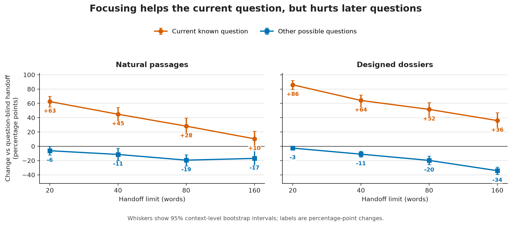
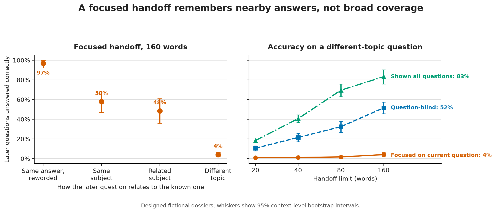
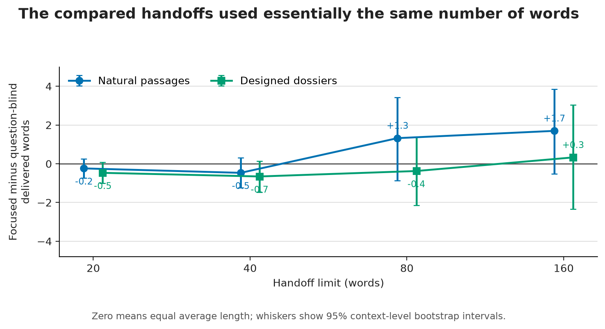
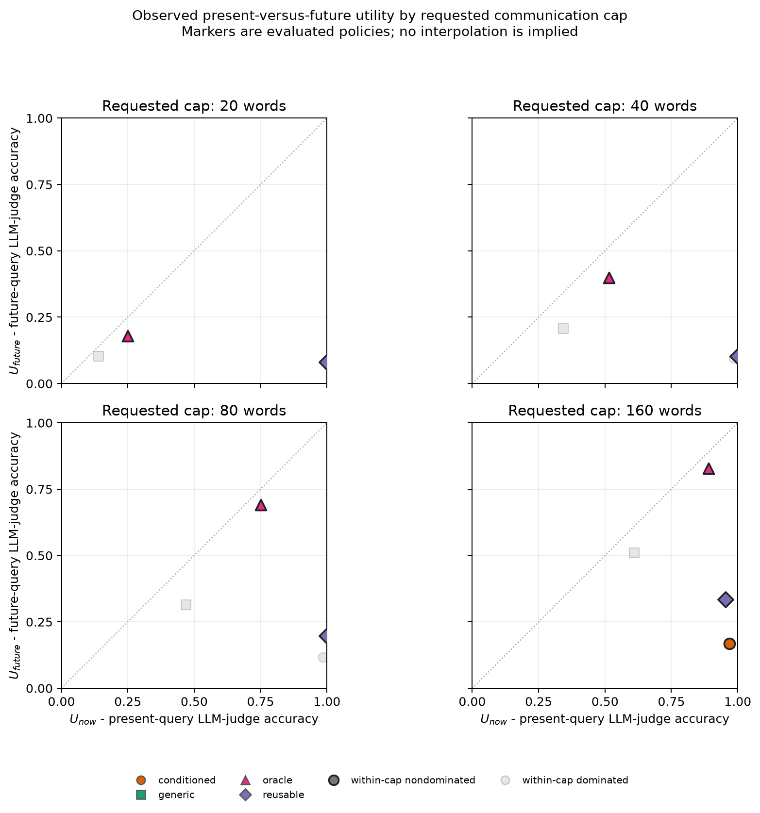
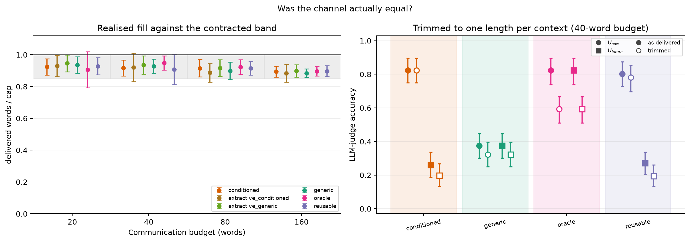
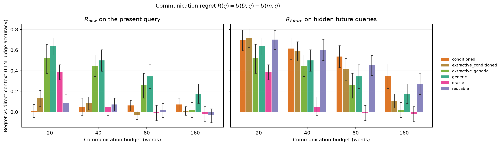
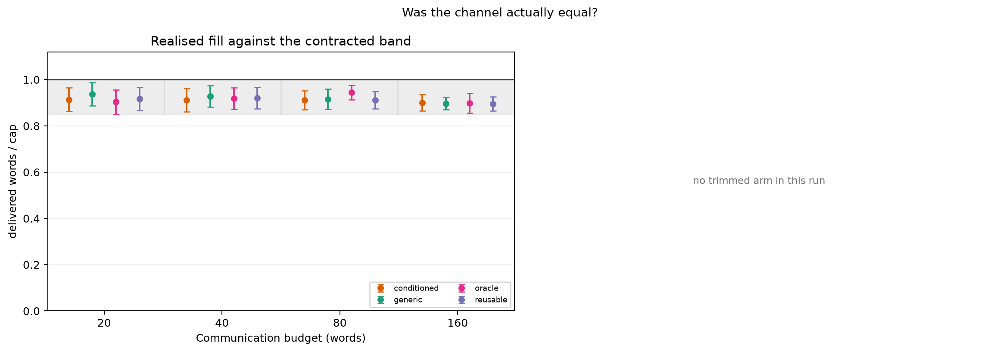
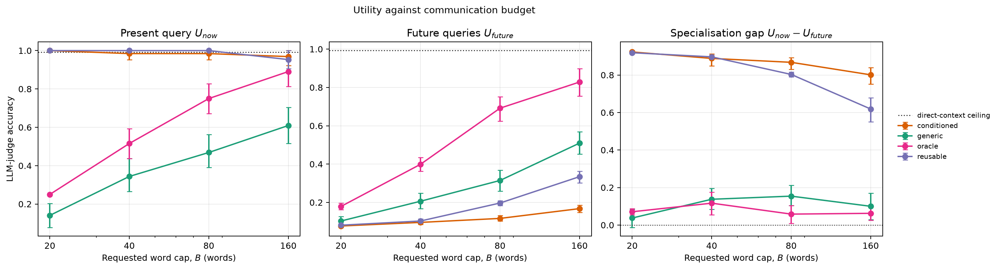
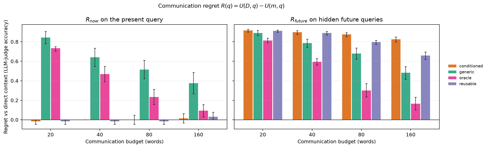

# What a Question-Specific Handoff Forgets

**A plain-language brief of Experiment 10: communication regret**

> **Bottom line.** When an agent writes a fixed-length handoff for one known question, it becomes much better for that question and less useful for questions that arrive later. The missing information would often have fit; the sender simply chose not to preserve it.

Here, **communication regret** means accuracy lost because evidence in the source did not survive the handoff.

## What was tested

A sender compressed each source into a 20-, 40-, 80-, or 160-word handoff. In 24 natural SQuAD passages with 96 questions, every question took a turn as the known question; each resulting handoff was then tested on that question and on the other questions from the same passage. The test was repeated on 16 fictional dossiers with 256 questions, where the distance between questions was designed in advance.

Every handoff policy received the same source and the same word band. The policies differed only in which questions the sender could see and, for the extractive controls, whether it could rewrite the source.

## What “natural passages” and “designed dossiers” mean

### Natural passages

These are pre-existing Wikipedia-derived passages and human-written questions from the SQuAD reading-comprehension dataset. They were not written for this experiment and do not impose a designed relationship among their questions. That makes them the more realistic test, although it also means question distance cannot be controlled precisely.

**Example — Harvard University.** Its 162-word passage surveys the university’s history. Four naturally co-occurring facts become separate questions:

- *What individual is the school named after?* → **John Harvard**

- *When did the undergraduate program become coeducational?* → **1977**

- *What was the name of the leader through the Great Depression and World War II?* → **James Bryant Conant**

- *What organization did Harvard found in 1900?* → **Association of American Universities**

A focused handoff written for any one of these questions may omit the facts needed for the other three.

### Designed dossiers

These are fictional documents created specifically for the experiment, using invented names and facts that the answering model could not already know. Each dossier has four aspects—founding, facilities, finance, and a document-specific custom—with four questions per aspect. An anchor question supplies the known question, while the other questions create controlled near and far comparisons. This lets the experiment control how far a later question is from the known question.

**Example — Vellunar Inland Canal Company.** Relative to its founding question:

- **Known question:** *On what date was the Vellunar Inland Canal Company incorporated?* → **13 Frostfall 1827**

- **Same answer, reworded:** *What incorporation date is recorded for the company in its earliest registration record?* → **13 Frostfall 1827**

- **Same subject:** *Which compact granted the company early towpath access and marker-setting rights?* → **Mirren Charter**

- **Related subject:** *Who is credited with the route’s original alignment survey?* → **Orin Dastel**

- **Different topic:** *What was the basic lockage and towpath fee in 1912 for a loaded mast-boat?* → **six ravels**

The labels are built into the document design rather than estimated afterward: a rewording asks for the same answer, the next two ask for other facts within the same aspect, and a different-topic question comes from another aspect.

## Policy and plot-label glossary

These code labels appear in the original diagnostic plots:

- **`generic` — question-blind.** The sender reads the source and knows that the next agent will answer a question, but it is not told which question. It writes a general prose handoff and is not warned that further questions may follow.

- **`conditioned` — focused on the current question.** The sender reads the source and one specific question, then preserves the information needed to answer that question. The plain-language plots call this the **focused handoff**.

- **`reusable` — focused, with a reuse warning.** The sender sees the same current question as `conditioned`, but is also told that unknown questions may follow and is asked to retain other useful evidence within the same word limit. This tests whether a simple instruction can prevent over-specialisation.

- **`oracle` — shown all evaluated questions.** The sender sees the complete set of questions used to evaluate that source before writing one handoff. This is a diagnostic capacity benchmark, not a perfect-answer oracle or a deployable strategy when future questions are genuinely unknown. The plain-language plots call it **shown all questions**.

- **`extractive_generic` — question-blind sentence selection.** It receives the same information as `generic`, but may only copy source sentences verbatim; it cannot paraphrase, merge, shorten, or add text.

- **`extractive_conditioned` — focused sentence selection.** It sees the current question like `conditioned`, but must build the handoff only from verbatim source sentences. Comparing the two extractive policies isolates evidence selection from abstractive rewriting.

The extractive controls were included in the natural-passage run, not the designed-dossier replication.

Other labels describe controls or scores rather than new sender policies:

- **`@trim` — shared-truncation-cap sensitivity control.** At the 40-word setting, each prose handoff within one natural-passage context was re-truncated using the same context-specific cap: the shortest original delivered length. Because truncation prefers a complete sentence, final messages can end below that cap and need not be exactly equal in length. This is a post-hoc check, not a deployable policy.

- **Direct-context ceiling.** The answerer reads the complete source instead of a handoff. Despite the plot label, this is an empirical no-handoff reference rather than a guaranteed mathematical maximum; sampling can occasionally put a handoff above it. It appears as a dotted reference line.

- **`U_now`, `U_future`, and specialisation gap.** `U_now` is accuracy on the question known during writing; `U_future` is average accuracy on the other questions. Their difference is the specialisation gap: zero is balanced, while a large positive value means the handoff strongly favours the known question.

- **Communication regret.** This is direct-context accuracy minus handoff accuracy. Unlike the utility plots, lower is better: zero means the handoff lost no measured accuracy relative to reading the full source.

## Focus helps now and hurts later

**How to read Plot 1.** The horizontal axis is the word limit. The vertical axis is focused minus question-blind accuracy, in percentage points: above zero means focusing helped, while below zero means it hurt. Orange circles score the known question, blue squares score the other questions, and whiskers are 95% context-level intervals.

**What it shows.** On the natural passages, focused handoffs improved the known question by +63, +45, +28 percentage points at 20, 40, and 80 words, while changing later-question accuracy by -6, -11, -19 points. The 95% intervals excluded zero in both directions. At 160 words, the present gain had shrunk to +10 points and was uncertain, but the later-question loss remained -17 points.

Scarcity sharpened the trade-off: the focus-induced gap between current and later accuracy was 41 points wider at 20 than at 160 words (95% interval 33 to 50). The designed dossiers replicated the pattern; even at 160 words, focusing gained +36 points on the known question and lost 34 points on later ones.

## The loss comes from evidence selection

**How to read Plot 2.** The left panel holds a focused handoff at 160 words and moves from a rewording of the known question to a different topic. The right panel follows only different-topic accuracy as the budget grows. Higher is better; whiskers are 95% context-level intervals.

**What it shows.** At the widest 160-word budget, a focused dossier handoff answered 97% of rewordings of the known question, but only 4% of questions on a different topic. A question-blind handoff answered 52% of those different-topic questions, and the all-questions benchmark answered 83%.

The clearest capacity check came at 40 words in the natural corpus. Focused and all-questions handoffs both scored 82.3% on the current question, but later-question accuracy was 26.0% for the focused handoff versus 82.3% for the all-questions handoff. Their average lengths were 36.7 and 37.9 words. The channel could carry the answers; the focused sender did not select them.

Verbatim, sentence-selection handoffs reproduced the same trade-off, so abstractive rewriting is not the main cause. Telling the focused sender to keep the handoff reusable recovered some nearby facts at larger budgets, but future-question accuracy still stayed below the question-blind baseline at every budget in both corpora.

## The comparison really used the same channel

**How to read Plot 3.** Each point is focused minus question-blind delivered words. Zero means equal average length, positive means the focused handoff was longer, and negative means it was shorter. Colours separate the corpora; whiskers are 95% context-level intervals.

**What it shows.** Across both corpora and all four limits, the mean length difference between focused and question-blind handoffs stayed within two words, and every interval included zero. No delivered message exceeded its cap. A separate 40-word check applied the same stricter, context-specific truncation cap to every prose policy and preserved the qualitative result.

## Pareto frontier

**How to read Plots 4 and 5.** Each panel is one requested word cap, and each marker is one evaluated handoff policy. Moving right means better accuracy on the current question; moving up means better accuracy on later questions. Saturated markers with black outlines are nondominated within that cap; dominated observations are muted. Markers are not joined because the policies are categories, not samples from an achievable continuous path. The dotted diagonal means equal current and later performance.

### Plot 4 — Natural-passage Pareto frontier

**What it shows.** Focused handoffs move right toward high current-question accuracy but remain low on later-question accuracy. Question-blind and all-questions handoffs sit nearer the diagonal; the all-questions condition reaches the strongest balanced accuracy as its budget grows.

### Plot 5 — Designed-dossier Pareto frontier

**What it shows.** The same trade-off is sharper: focused and reusable handoffs cluster near perfect current accuracy but weak later accuracy, while larger all-questions handoffs move toward the upper-right. No point is universally best because current accuracy, future reuse, and message length compete.

## What this means

- For a one-off known question, a focused handoff is effective.

- If the handoff may be reused, keep the source available or tell the sender which downstream questions matter. A vague request to “stay reusable” is weak protection.

- More space does not automatically create broader coverage; a focused sender may spend it deepening the same topic.

## Limits

This experiment used one sender/answerer model stack and one judge model. The effective sample sizes were 24 natural contexts and 16 fictional contexts, not the much larger number of question evaluations. The fictional corpus supports a clear near-versus-far result, but not a strict ranking of its two middle distance categories.

## Complete figure set

The three simplified figures and both Pareto plots appear above. The remaining machine-generated diagnostics are collected here so every plot from both final runs is visible without adding the raw tables. Original code labels are retained: `generic` means question-blind, `conditioned` means focused, and `oracle` means shown all questions; `extractive` variants copy source sentences.

### Natural passages

#### Plot 6 — Word-budget and shared-truncation-cap controls

**How to read it.** In the left panel, each dot is mean delivered words divided by the cap; the grey band is the required 85–100% fill range and whiskers show one standard deviation. In the right panel, circles are current accuracy, squares are later accuracy, filled marks are the original 40-word messages, and hollow marks are messages after a shared context-specific truncation cap; those whiskers are 95% intervals. The plot’s “one length” title names the shared cap—sentence-boundary truncation can make delivered lengths shorter and unequal.

**What it shows.** All policies used similar amounts of space. Applying the common, stricter cap preserves the large current-versus-later gap for focused and reusable handoffs, supporting the conclusion from the direct word-count comparison.

#### Plot 7 — Accuracy across word budgets

**How to read it.** The first panel shows current-question accuracy, the second shows later-question accuracy, and the third subtracts later from current accuracy. Higher is better in the first two panels; zero in the third means no specialisation. Lines are policies, whiskers are 95% intervals, and the dotted horizontal line is the accuracy available from the full source (or zero in the gap panel).

**What it shows.** Focused handoffs remain strong on the known question but weak on later questions. Broader policies gain future accuracy as the budget grows, and the focused specialisation gap narrows but does not disappear.

#### Plot 8 — Accuracy lost through the handoff

**How to read it.** Each bar is full-source accuracy minus handoff accuracy, so lower is better and zero means no measured loss. The left panel scores the current question, the right scores later questions, colours identify policies, and whiskers are 95% context-level intervals.

**What it shows.** Focused handoffs lose almost nothing on the current question but much more on later questions. All-questions regret falls toward zero as the budget grows, showing that the channel can preserve broad evidence when the sender knows it is needed.

### Designed dossiers

#### Plot 9 — Word-budget control

**How to read it.** The left panel plots mean delivered words divided by the cap; the grey band is the required 85–100% range and whiskers show one standard deviation. The right panel is intentionally blank because this run did not create a separately re-trimmed sensitivity arm.

**What it shows.** All four policies filled the same contracted bands closely at every budget. Their accuracy differences therefore reflect what they selected, not one policy being allowed a longer message.

#### Plot 10 — Accuracy across word budgets

**How to read it.** The panels show current accuracy, later accuracy, and their difference from left to right. Higher is better in the first two; a larger value in the third means stronger specialisation. Lines identify policies, whiskers are 95% intervals, and the dotted line marks the empirical full-dossier reference or zero gap.

**What it shows.** Focused and reusable handoffs stay almost perfect on the known question across all budgets, yet remain poor on unseen questions. Question-blind and all-questions handoffs convert extra words into much broader coverage.

#### Plot 11 — Accuracy lost through the handoff

**How to read it.** Bars measure full-dossier accuracy minus handoff accuracy: zero is best and taller bars mean more information was lost. The left panel covers the current question, the right covers later questions, and whiskers are 95% intervals.

**What it shows.** Focused and reusable handoffs have almost no current-question regret but retain high future regret even as the budget expands. All-questions regret drops steeply with more words because that sender spreads evidence across possible questions.

#### Plot 12 — Loss by distance from the known question

**How to read it.** Each panel fixes one word budget. The horizontal categories move from a paraphrase of the known question to a different dossier aspect; the vertical axis is later-question regret, so lower is better. Lines identify policies and whiskers are 95% intervals. The two middle categories are related types, not a guaranteed strict ordering.

**What it shows.** Focused handoffs have almost no loss on a rewording but near-total loss on a different topic, even at 160 words. The distance gradient is much weaker for question-blind and all-questions handoffs, confirming that it is created by focus.

For full methods, uncertainty intervals, robustness checks, and machine-readable results, see the [complete communication-regret report](REPORT.md).
