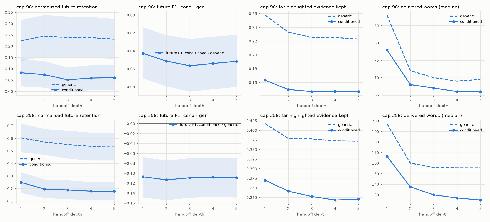

# exp5_cap_only repeated handoff — mistral24

Run `b58e4132a923-repeated` (parent `b58e4132a923`), 50 documents, caps [96, 256], depths [1, 2, 3, 4, 5]. Depth 1 is the main run's message; each later depth rewrites the previous message under the same cap, visibility and conditioning question. Intervals are 95% document-bootstrap intervals; p values are Holm-corrected across depths within a cap.

## Conditioned minus generic, by depth (F1)

| cap | depth | Δ future [95% CI] | p (Holm) | Δ now | Δ retention [95% CI] | docs |
|---:|---:|---|---:|---:|---|---:|
| 96 | 1 | -0.043 [-0.071, -0.013] | 0.0030 | +0.224 | -0.141 [-0.238, -0.051] | 50 |
| 256 | 1 | -0.107 [-0.149, -0.067] | 0.0000 | +0.092 | -0.355 [-0.482, -0.228] | 50 |
| 96 | 2 | -0.051 [-0.079, -0.022] | 0.0030 | +0.231 | -0.170 [-0.263, -0.079] | 50 |
| 256 | 2 | -0.113 [-0.154, -0.074] | 0.0000 | +0.095 | -0.376 [-0.494, -0.260] | 50 |
| 96 | 3 | -0.057 [-0.085, -0.026] | 0.0000 | +0.218 | -0.188 [-0.285, -0.095] | 50 |
| 256 | 3 | -0.109 [-0.149, -0.070] | 0.0000 | +0.087 | -0.362 [-0.484, -0.239] | 50 |
| 96 | 4 | -0.054 [-0.083, -0.024] | 0.0000 | +0.219 | -0.179 [-0.272, -0.083] | 50 |
| 256 | 4 | -0.108 [-0.147, -0.069] | 0.0000 | +0.095 | -0.358 [-0.479, -0.236] | 50 |
| 96 | 5 | -0.052 [-0.080, -0.022] | 0.0030 | +0.221 | -0.171 [-0.266, -0.078] | 50 |
| 256 | 5 | -0.109 [-0.149, -0.069] | 0.0000 | +0.096 | -0.360 [-0.482, -0.236] | 50 |

## Levels by depth (F1)

| cap | depth | U_future generic | U_future conditioned | U_now conditioned | retention generic | retention conditioned |
|---:|---:|---:|---:|---:|---:|---:|
| 96 | 1 | 0.098 | 0.055 | 0.322 | 0.224 | 0.082 |
| 96 | 2 | 0.104 | 0.053 | 0.335 | 0.245 | 0.074 |
| 96 | 3 | 0.102 | 0.046 | 0.320 | 0.239 | 0.051 |
| 96 | 4 | 0.102 | 0.048 | 0.321 | 0.238 | 0.059 |
| 96 | 5 | 0.100 | 0.048 | 0.322 | 0.231 | 0.060 |
| 256 | 1 | 0.212 | 0.105 | 0.304 | 0.604 | 0.249 |
| 256 | 2 | 0.203 | 0.089 | 0.298 | 0.571 | 0.196 |
| 256 | 3 | 0.196 | 0.087 | 0.283 | 0.551 | 0.189 |
| 256 | 4 | 0.192 | 0.084 | 0.287 | 0.537 | 0.179 |
| 256 | 5 | 0.193 | 0.084 | 0.288 | 0.538 | 0.178 |

## Highlighted evidence kept, by depth

| cap | depth | tier | generic | conditioned | cond − gen [95% CI] |
|---:|---:|---|---:|---:|---|
| 96 | 1 | now | 0.257 | 0.563 | +0.307 [+0.271, +0.347] |
| 96 | 1 | shared | 0.267 | 0.463 | +0.195 [+0.104, +0.299] |
| 96 | 1 | near | 0.250 | 0.194 | -0.056 [-0.095, -0.009] |
| 96 | 1 | far | 0.258 | 0.163 | -0.095 [-0.121, -0.071] |
| 256 | 1 | now | 0.417 | 0.656 | +0.240 [+0.203, +0.277] |
| 256 | 1 | shared | 0.499 | 0.536 | +0.037 [-0.034, +0.102] |
| 256 | 1 | near | 0.412 | 0.305 | -0.107 [-0.176, -0.036] |
| 256 | 1 | far | 0.418 | 0.270 | -0.147 [-0.186, -0.108] |
| 96 | 2 | now | 0.235 | 0.515 | +0.279 [+0.242, +0.319] |
| 96 | 2 | shared | 0.250 | 0.409 | +0.159 [+0.076, +0.251] |
| 96 | 2 | near | 0.230 | 0.182 | -0.048 [-0.084, -0.008] |
| 96 | 2 | far | 0.233 | 0.150 | -0.083 [-0.108, -0.062] |
| 256 | 2 | now | 0.379 | 0.591 | +0.212 [+0.173, +0.254] |
| 256 | 2 | shared | 0.465 | 0.495 | +0.029 [-0.040, +0.095] |
| 256 | 2 | near | 0.374 | 0.270 | -0.104 [-0.168, -0.039] |
| 256 | 2 | far | 0.379 | 0.241 | -0.137 [-0.175, -0.097] |
| 96 | 3 | now | 0.228 | 0.501 | +0.273 [+0.234, +0.314] |
| 96 | 3 | shared | 0.237 | 0.389 | +0.152 [+0.078, +0.229] |
| 96 | 3 | near | 0.223 | 0.178 | -0.045 [-0.080, -0.005] |
| 96 | 3 | far | 0.225 | 0.147 | -0.078 [-0.103, -0.057] |
| 256 | 3 | now | 0.377 | 0.577 | +0.200 [+0.159, +0.241] |
| 256 | 3 | shared | 0.464 | 0.485 | +0.021 [-0.053, +0.090] |
| 256 | 3 | near | 0.372 | 0.255 | -0.117 [-0.182, -0.047] |
| 256 | 3 | far | 0.378 | 0.228 | -0.150 [-0.187, -0.110] |
| 96 | 4 | now | 0.226 | 0.495 | +0.268 [+0.229, +0.309] |
| 96 | 4 | shared | 0.238 | 0.387 | +0.150 [+0.075, +0.227] |
| 96 | 4 | near | 0.217 | 0.176 | -0.041 [-0.076, -0.003] |
| 96 | 4 | far | 0.225 | 0.147 | -0.078 [-0.102, -0.057] |
| 256 | 4 | now | 0.371 | 0.572 | +0.201 [+0.162, +0.240] |
| 256 | 4 | shared | 0.450 | 0.472 | +0.022 [-0.042, +0.083] |
| 256 | 4 | near | 0.363 | 0.249 | -0.114 [-0.176, -0.048] |
| 256 | 4 | far | 0.373 | 0.218 | -0.154 [-0.190, -0.116] |
| 96 | 5 | now | 0.225 | 0.493 | +0.268 [+0.230, +0.309] |
| 96 | 5 | shared | 0.235 | 0.386 | +0.151 [+0.077, +0.229] |
| 96 | 5 | near | 0.218 | 0.176 | -0.042 [-0.076, -0.004] |
| 96 | 5 | far | 0.223 | 0.147 | -0.076 [-0.100, -0.055] |
| 256 | 5 | now | 0.369 | 0.564 | +0.194 [+0.156, +0.234] |
| 256 | 5 | shared | 0.446 | 0.459 | +0.013 [-0.045, +0.069] |
| 256 | 5 | near | 0.359 | 0.244 | -0.116 [-0.177, -0.052] |
| 256 | 5 | far | 0.372 | 0.221 | -0.151 [-0.187, -0.113] |

## Chain health

| depth | policy | cap | chains | valid | words (median) | truncated |
|---:|---|---:|---:|---:|---:|---:|
| 1 | summary_conditioned | 96 | 190 | 1.00 | 78 | 1 |
| 1 | summary_conditioned | 256 | 190 | 1.00 | 166 | 14 |
| 1 | summary_generic | 96 | 50 | 1.00 | 88 | 5 |
| 1 | summary_generic | 256 | 50 | 1.00 | 198 | 2 |
| 2 | summary_conditioned | 96 | 190 | 1.00 | 68 | 0 |
| 2 | summary_conditioned | 256 | 190 | 1.00 | 138 | 0 |
| 2 | summary_generic | 96 | 50 | 1.00 | 72 | 0 |
| 2 | summary_generic | 256 | 50 | 1.00 | 160 | 0 |
| 3 | summary_conditioned | 96 | 190 | 1.00 | 67 | 0 |
| 3 | summary_conditioned | 256 | 190 | 1.00 | 130 | 0 |
| 3 | summary_generic | 96 | 50 | 1.00 | 70 | 0 |
| 3 | summary_generic | 256 | 50 | 1.00 | 156 | 0 |
| 4 | summary_conditioned | 96 | 190 | 1.00 | 66 | 0 |
| 4 | summary_conditioned | 256 | 190 | 1.00 | 127 | 0 |
| 4 | summary_generic | 96 | 50 | 1.00 | 69 | 0 |
| 4 | summary_generic | 256 | 50 | 1.00 | 156 | 0 |
| 5 | summary_conditioned | 96 | 190 | 1.00 | 66 | 0 |
| 5 | summary_conditioned | 256 | 190 | 1.00 | 125 | 0 |
| 5 | summary_generic | 96 | 50 | 1.00 | 70 | 0 |
| 5 | summary_generic | 256 | 50 | 1.00 | 156 | 0 |

