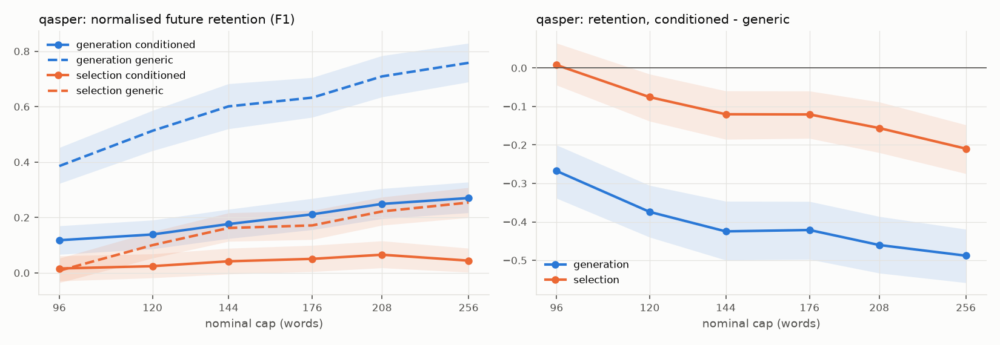
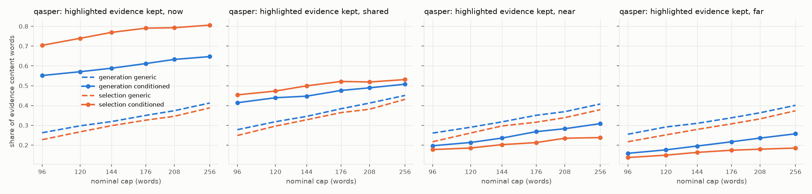
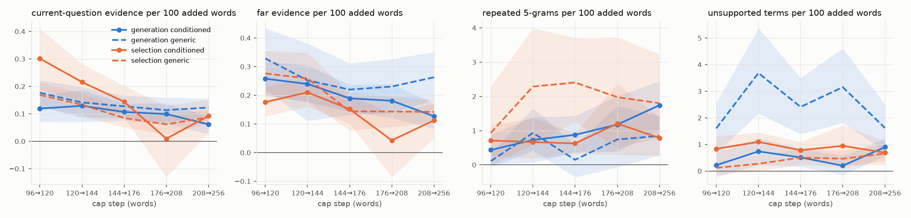

# exp5_cap_only follow-up analyses — mistral24

Run `b58e4132a923-xqwen32`, split `main`, caps [96, 120, 144, 176, 208, 256]. Intervals are 95% document-bootstrap intervals.

## Normalised future retention

R = (U_future − U_closed_book) / (U_full_source − U_closed_book), F1, with the reference answers scored on each message's own future questions.

| corpus | cap | summary gen | summary cond | Δ summary [95% CI] | selection gen | selection cond | Δ selection [95% CI] |
|---|---:|---:|---:|---|---:|---:|---|
| qasper | 96 | 0.386 | 0.118 | -0.268 [-0.339, -0.200] | 0.008 | 0.016 | +0.008 [-0.045, +0.065] |
| qasper | 120 | 0.513 | 0.139 | -0.374 [-0.440, -0.305] | 0.100 | 0.024 | -0.076 [-0.138, -0.016] |
| qasper | 144 | 0.601 | 0.176 | -0.425 [-0.500, -0.346] | 0.162 | 0.042 | -0.120 [-0.186, -0.060] |
| qasper | 176 | 0.633 | 0.211 | -0.421 [-0.497, -0.347] | 0.171 | 0.051 | -0.121 [-0.183, -0.060] |
| qasper | 208 | 0.709 | 0.249 | -0.460 [-0.533, -0.386] | 0.222 | 0.066 | -0.156 [-0.220, -0.088] |
| qasper | 256 | 0.758 | 0.270 | -0.488 [-0.558, -0.419] | 0.254 | 0.044 | -0.210 [-0.275, -0.148] |

Reference levels on the generic arm's questions: closed book 0.050, full source 0.243 F1.

## Evidence survival from highlighted evidence

Share of each question's highlighted-evidence content words present in the message (best annotator).

| corpus | family | cap | tier | generic | conditioned | cond − gen [95% CI] |
|---|---|---:|---|---:|---:|---|
| qasper | generation | 96 | now | 0.262 | 0.551 | +0.289 [+0.271, +0.307] |
| qasper | generation | 96 | shared | 0.278 | 0.414 | +0.136 [+0.097, +0.174] |
| qasper | generation | 96 | near | 0.260 | 0.196 | -0.064 [-0.085, -0.042] |
| qasper | generation | 96 | far | 0.255 | 0.158 | -0.096 [-0.110, -0.084] |
| qasper | generation | 120 | now | 0.297 | 0.571 | +0.273 [+0.256, +0.291] |
| qasper | generation | 120 | shared | 0.318 | 0.439 | +0.121 [+0.084, +0.159] |
| qasper | generation | 120 | near | 0.290 | 0.213 | -0.077 [-0.099, -0.055] |
| qasper | generation | 120 | far | 0.291 | 0.176 | -0.116 [-0.130, -0.101] |
| qasper | generation | 144 | now | 0.319 | 0.588 | +0.270 [+0.252, +0.286] |
| qasper | generation | 144 | shared | 0.345 | 0.447 | +0.102 [+0.065, +0.139] |
| qasper | generation | 144 | near | 0.317 | 0.235 | -0.082 [-0.109, -0.056] |
| qasper | generation | 144 | far | 0.310 | 0.195 | -0.115 [-0.131, -0.099] |
| qasper | generation | 176 | now | 0.350 | 0.612 | +0.262 [+0.243, +0.282] |
| qasper | generation | 176 | shared | 0.383 | 0.476 | +0.093 [+0.053, +0.130] |
| qasper | generation | 176 | near | 0.350 | 0.268 | -0.083 [-0.111, -0.056] |
| qasper | generation | 176 | far | 0.338 | 0.217 | -0.121 [-0.137, -0.105] |
| qasper | generation | 208 | now | 0.374 | 0.633 | +0.259 [+0.241, +0.276] |
| qasper | generation | 208 | shared | 0.412 | 0.489 | +0.077 [+0.038, +0.115] |
| qasper | generation | 208 | near | 0.369 | 0.283 | -0.086 [-0.112, -0.063] |
| qasper | generation | 208 | far | 0.363 | 0.235 | -0.128 [-0.143, -0.114] |
| qasper | generation | 256 | now | 0.413 | 0.647 | +0.234 [+0.218, +0.250] |
| qasper | generation | 256 | shared | 0.451 | 0.508 | +0.057 [+0.024, +0.089] |
| qasper | generation | 256 | near | 0.408 | 0.308 | -0.099 [-0.130, -0.071] |
| qasper | generation | 256 | far | 0.401 | 0.257 | -0.144 [-0.163, -0.126] |
| qasper | selection | 96 | now | 0.227 | 0.704 | +0.477 [+0.448, +0.506] |
| qasper | selection | 96 | shared | 0.248 | 0.453 | +0.205 [+0.156, +0.255] |
| qasper | selection | 96 | near | 0.217 | 0.177 | -0.039 [-0.064, -0.014] |
| qasper | selection | 96 | far | 0.217 | 0.137 | -0.080 [-0.094, -0.065] |
| qasper | selection | 120 | now | 0.267 | 0.739 | +0.472 [+0.445, +0.501] |
| qasper | selection | 120 | shared | 0.296 | 0.473 | +0.177 [+0.123, +0.229] |
| qasper | selection | 120 | near | 0.261 | 0.185 | -0.076 [-0.103, -0.048] |
| qasper | selection | 120 | far | 0.251 | 0.149 | -0.102 [-0.119, -0.086] |
| qasper | selection | 144 | now | 0.298 | 0.769 | +0.471 [+0.445, +0.497] |
| qasper | selection | 144 | shared | 0.328 | 0.499 | +0.172 [+0.118, +0.227] |
| qasper | selection | 144 | near | 0.297 | 0.202 | -0.094 [-0.128, -0.061] |
| qasper | selection | 144 | far | 0.279 | 0.163 | -0.116 [-0.133, -0.099] |
| qasper | selection | 176 | now | 0.326 | 0.791 | +0.465 [+0.438, +0.490] |
| qasper | selection | 176 | shared | 0.364 | 0.521 | +0.157 [+0.104, +0.212] |
| qasper | selection | 176 | near | 0.315 | 0.213 | -0.103 [-0.132, -0.071] |
| qasper | selection | 176 | far | 0.307 | 0.174 | -0.133 [-0.151, -0.115] |
| qasper | selection | 208 | now | 0.345 | 0.793 | +0.448 [+0.418, +0.474] |
| qasper | selection | 208 | shared | 0.381 | 0.519 | +0.138 [+0.080, +0.194] |
| qasper | selection | 208 | near | 0.339 | 0.235 | -0.104 [-0.139, -0.070] |
| qasper | selection | 208 | far | 0.332 | 0.179 | -0.153 [-0.172, -0.133] |
| qasper | selection | 256 | now | 0.388 | 0.806 | +0.418 [+0.389, +0.446] |
| qasper | selection | 256 | shared | 0.431 | 0.531 | +0.100 [+0.040, +0.157] |
| qasper | selection | 256 | near | 0.379 | 0.238 | -0.141 [-0.177, -0.103] |
| qasper | selection | 256 | far | 0.373 | 0.185 | -0.188 [-0.211, -0.166] |

## Marginal allocation (ratio of totals)

Per 100 added words: change in summed evidence recall by tier (question-equivalents), repeated 5-grams and unsupported terms. `not longer` is the share of message pairs that did not grow.

| corpus | policy | step | added words | not longer | now | near | far | repeated 5-grams | unsupported |
|---|---|---|---:|---:|---|---|---|---|---|
| qasper | summary_conditioned | 96->120 | 15.9 | 0.09 | +0.12 [+0.07, +0.17] | +0.08 [+0.04, +0.12] | +0.26 [+0.20, +0.32] | +0.44 [+0.02, +0.88] | +0.22 [-0.23, +0.69] |
| qasper | summary_conditioned | 120->144 | 13.0 | 0.20 | +0.13 [+0.07, +0.19] | +0.10 [+0.06, +0.16] | +0.24 [+0.18, +0.30] | +0.73 [+0.07, +1.40] | +0.74 [+0.23, +1.25] |
| qasper | summary_conditioned | 144->176 | 23.3 | 0.11 | +0.11 [+0.08, +0.14] | +0.09 [+0.06, +0.13] | +0.19 [+0.14, +0.24] | +0.88 [+0.37, +1.43] | +0.51 [+0.16, +0.84] |
| qasper | summary_conditioned | 176->208 | 18.5 | 0.22 | +0.10 [+0.06, +0.14] | +0.04 [+0.01, +0.07] | +0.18 [+0.12, +0.24] | +1.18 [+0.39, +2.01] | +0.20 [-0.15, +0.57] |
| qasper | summary_conditioned | 208->256 | 26.1 | 0.26 | +0.06 [+0.03, +0.09] | +0.05 [+0.02, +0.08] | +0.13 [+0.08, +0.17] | +1.74 [+1.04, +2.44] | +0.90 [+0.57, +1.23] |
| qasper | summary_generic | 96->120 | 19.7 | 0.03 | +0.18 [+0.13, +0.22] | +0.11 [+0.06, +0.17] | +0.33 [+0.22, +0.43] | +0.11 [-0.07, +0.32] | +1.60 [+0.67, +2.56] |
| qasper | summary_generic | 120->144 | 15.3 | 0.16 | +0.14 [+0.08, +0.20] | +0.10 [+0.05, +0.16] | +0.25 [+0.11, +0.38] | +0.93 [+0.42, +1.66] | +3.68 [+2.16, +5.37] |
| qasper | summary_generic | 144->176 | 23.9 | 0.11 | +0.13 [+0.09, +0.17] | +0.08 [+0.04, +0.13] | +0.22 [+0.13, +0.31] | +0.15 [-0.35, +0.59] | +2.41 [+1.38, +3.50] |
| qasper | summary_generic | 176->208 | 20.9 | 0.16 | +0.11 [+0.07, +0.16] | +0.06 [+0.02, +0.10] | +0.23 [+0.14, +0.33] | +0.74 [-0.07, +1.72] | +3.15 [+1.81, +4.61] |
| qasper | summary_generic | 208->256 | 32.5 | 0.16 | +0.12 [+0.09, +0.16] | +0.07 [+0.04, +0.10] | +0.26 [+0.18, +0.35] | +0.85 [+0.29, +1.43] | +1.62 [+0.75, +2.50] |
| qasper | selection_conditioned | 96->120 | 11.7 | 0.42 | +0.30 [+0.19, +0.41] | +0.05 [+0.00, +0.09] | +0.18 [+0.13, +0.23] | +0.71 [+0.26, +1.14] | +0.83 [+0.29, +1.31] |
| qasper | selection_conditioned | 120->144 | 13.5 | 0.46 | +0.22 [+0.15, +0.28] | +0.08 [+0.05, +0.11] | +0.21 [+0.16, +0.26] | +0.67 [+0.19, +1.37] | +1.10 [+0.78, +1.45] |
| qasper | selection_conditioned | 144->176 | 15.7 | 0.49 | +0.14 [+0.09, +0.20] | +0.05 [+0.02, +0.08] | +0.15 [+0.10, +0.20] | +0.63 [+0.34, +0.93] | +0.78 [+0.49, +1.09] |
| qasper | selection_conditioned | 176->208 | 9.4 | 0.57 | +0.01 [-0.13, +0.13] | +0.11 [+0.05, +0.18] | +0.04 [-0.09, +0.14] | +1.21 [+0.29, +2.36] | +0.95 [+0.20, +1.72] |
| qasper | selection_conditioned | 208->256 | 13.3 | 0.63 | +0.09 [+0.03, +0.15] | +0.03 [+0.00, +0.05] | +0.11 [+0.05, +0.17] | +0.79 [+0.27, +1.40] | +0.69 [+0.24, +1.13] |
| qasper | selection_generic | 96->120 | 23.7 | 0.00 | +0.17 [+0.12, +0.21] | +0.11 [+0.07, +0.17] | +0.28 [+0.20, +0.35] | +0.93 [-0.02, +2.29] | +0.12 [-0.14, +0.36] |
| qasper | selection_generic | 120->144 | 24.0 | 0.00 | +0.13 [+0.09, +0.18] | +0.09 [+0.06, +0.14] | +0.26 [+0.18, +0.35] | +2.29 [+0.59, +3.99] | +0.27 [-0.01, +0.61] |
| qasper | selection_generic | 144->176 | 32.2 | 0.00 | +0.08 [+0.05, +0.12] | +0.05 [+0.02, +0.08] | +0.14 [+0.08, +0.21] | +2.41 [+1.25, +3.71] | +0.50 [+0.25, +0.81] |
| qasper | selection_generic | 176->208 | 32.1 | 0.00 | +0.06 [+0.02, +0.10] | +0.05 [+0.01, +0.08] | +0.14 [+0.09, +0.20] | +1.98 [+0.50, +3.73] | +0.46 [+0.15, +0.78] |
| qasper | selection_generic | 208->256 | 48.1 | 0.00 | +0.09 [+0.07, +0.11] | +0.06 [+0.03, +0.09] | +0.14 [+0.10, +0.18] | +1.80 [+0.79, +3.23] | +0.66 [+0.38, +0.99] |

