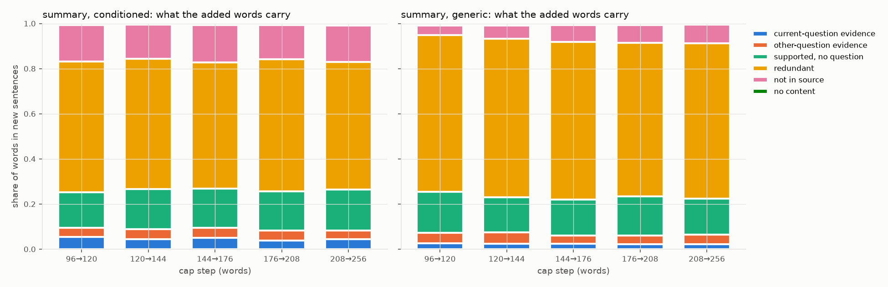

# exp5_cap_only: where added capacity goes (run `b58e4132a923`)

20519 new sentences across all cap steps; 20494 put to the study's judge, 0 left unanswered. Each sentence gets up to three yes/no questions and its category follows from the answers. Shares are of words in new sentences, ratio of totals with 95% document-bootstrap intervals.

| policy | step | new sentences | current-question evidence | other-question evidence | supported, no question | redundant | not in source | no content |
|---|---|---:|---|---|---|---|---|---|
| summary_generic | 96->120 | 840 | 0.03 [0.02, 0.03] | 0.05 [0.04, 0.06] | 0.18 [0.15, 0.21] | 0.69 [0.66, 0.73] | 0.04 [0.03, 0.06] | 0.01 [0.01, 0.01] |
| summary_generic | 120->144 | 994 | 0.02 [0.02, 0.03] | 0.05 [0.04, 0.06] | 0.16 [0.13, 0.18] | 0.70 [0.67, 0.73] | 0.06 [0.04, 0.08] | 0.01 [0.01, 0.01] |
| summary_generic | 144->176 | 1269 | 0.02 [0.02, 0.03] | 0.04 [0.03, 0.05] | 0.16 [0.14, 0.18] | 0.70 [0.67, 0.73] | 0.07 [0.06, 0.09] | 0.01 [0.00, 0.01] |
| summary_generic | 176->208 | 1426 | 0.02 [0.02, 0.03] | 0.04 [0.03, 0.05] | 0.17 [0.15, 0.20] | 0.68 [0.65, 0.71] | 0.08 [0.06, 0.10] | 0.01 [0.01, 0.01] |
| summary_generic | 208->256 | 1722 | 0.02 [0.02, 0.03] | 0.04 [0.03, 0.05] | 0.16 [0.14, 0.18] | 0.69 [0.66, 0.72] | 0.08 [0.07, 0.10] | 0.01 [0.00, 0.01] |
| summary_conditioned | 96->120 | 2289 | 0.05 [0.04, 0.07] | 0.04 [0.03, 0.05] | 0.16 [0.14, 0.18] | 0.58 [0.56, 0.60] | 0.16 [0.14, 0.18] | 0.01 [0.00, 0.01] |
| summary_conditioned | 120->144 | 2064 | 0.04 [0.03, 0.06] | 0.04 [0.03, 0.06] | 0.18 [0.16, 0.20] | 0.58 [0.55, 0.60] | 0.15 [0.13, 0.17] | 0.00 [0.00, 0.01] |
| summary_conditioned | 144->176 | 3093 | 0.05 [0.04, 0.06] | 0.05 [0.04, 0.05] | 0.17 [0.16, 0.19] | 0.56 [0.54, 0.58] | 0.17 [0.15, 0.19] | 0.01 [0.00, 0.01] |
| summary_conditioned | 176->208 | 2956 | 0.04 [0.03, 0.05] | 0.04 [0.03, 0.05] | 0.17 [0.15, 0.19] | 0.59 [0.56, 0.61] | 0.15 [0.13, 0.17] | 0.01 [0.01, 0.01] |
| summary_conditioned | 208->256 | 3866 | 0.04 [0.04, 0.05] | 0.04 [0.03, 0.05] | 0.18 [0.16, 0.20] | 0.57 [0.54, 0.59] | 0.16 [0.14, 0.18] | 0.01 [0.01, 0.01] |

Finer categories (share of added words):

| policy | step | current | related | distant | supported_other | restated | repetition | plausible_unsupported | unsupported | no_content | unanswered |
|---|---|---:|---:|---:|---:|---:|---:|---:|---:|---:|---:|
| summary_generic | 96->120 | 0.03 | 0.02 | 0.03 | 0.18 | 0.69 | 0.00 | 0.04 | 0.00 | 0.01 | 0.00 |
| summary_generic | 120->144 | 0.02 | 0.02 | 0.03 | 0.16 | 0.70 | 0.00 | 0.05 | 0.00 | 0.01 | 0.00 |
| summary_generic | 144->176 | 0.02 | 0.02 | 0.02 | 0.16 | 0.70 | 0.00 | 0.07 | 0.00 | 0.01 | 0.00 |
| summary_generic | 176->208 | 0.02 | 0.01 | 0.03 | 0.17 | 0.68 | 0.00 | 0.07 | 0.01 | 0.01 | 0.00 |
| summary_generic | 208->256 | 0.02 | 0.02 | 0.03 | 0.16 | 0.69 | 0.00 | 0.08 | 0.01 | 0.01 | 0.00 |
| summary_conditioned | 96->120 | 0.05 | 0.02 | 0.02 | 0.16 | 0.58 | 0.00 | 0.16 | 0.00 | 0.01 | 0.00 |
| summary_conditioned | 120->144 | 0.04 | 0.02 | 0.02 | 0.18 | 0.58 | 0.00 | 0.15 | 0.00 | 0.00 | 0.00 |
| summary_conditioned | 144->176 | 0.05 | 0.02 | 0.02 | 0.17 | 0.56 | 0.00 | 0.16 | 0.00 | 0.01 | 0.00 |
| summary_conditioned | 176->208 | 0.04 | 0.02 | 0.02 | 0.17 | 0.59 | 0.00 | 0.15 | 0.00 | 0.01 | 0.00 |
| summary_conditioned | 208->256 | 0.04 | 0.02 | 0.02 | 0.18 | 0.56 | 0.00 | 0.16 | 0.00 | 0.01 | 0.00 |

## Judge audit

Each question is checked against a deterministic signal it should move with. `best source-sentence overlap` is the largest share of the sentence's content words found in a single source sentence, so a YES to "source states it" should sit above a NO. `earlier note overlap` is the share the shorter message already carried, so a YES to "earlier note has it" should sit above a NO. A signal that does not separate the answers means the labels are not trustworthy.

| question | answer | sentences | share | deterministic signal | mean |
|---|---|---:|---:|---|---:|
| source states it | YES | 16643 | 0.81 | `best_source_sentence_overlap` | 0.59 |
| source states it | NO | 3401 | 0.17 | `best_source_sentence_overlap` | 0.51 |
| source states it | NONE | 450 | 0.02 | `best_source_sentence_overlap` | 0.47 |
| source states it | unanswered | 0 | 0.00 | `best_source_sentence_overlap` | — |
| earlier note has it | YES | 11609 | 0.70 | `earlier_note_overlap` | 0.64 |
| earlier note has it | NO | 5034 | 0.30 | `earlier_note_overlap` | 0.34 |
| earlier note has it | unanswered | 0 | 0.00 | `earlier_note_overlap` | — |
| plausible | YES | 3118 | 0.92 | `best_source_sentence_overlap` | 0.50 |
| plausible | NO | 283 | 0.08 | `best_source_sentence_overlap` | 0.70 |
| plausible | unanswered | 0 | 0.00 | `best_source_sentence_overlap` | — |

