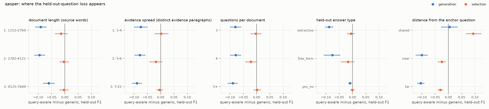

# exp5_cap_only: when does the held-out-question loss appear? (run `b58e4132a923`)

## Boundary corpus

From the calibration decision and the data. `pairs` is the share of (anchor, held-out question) pairs at each evidence distance; `best retention` is the highest normalised future retention any calibration budget gave generic messages.

| corpus | docs | source words | paragraphs | questions/doc | answer words | pairs shared / near / far / unknown | closed book | full source | natural words gen / cond | best retention | useful region |
|---|---:|---:|---:|---:|---:|---|---:|---:|---|---:|---|
| qasper | 200 | 3600 | 58 | 4 | 6 | 0.19 / 0.19 / 0.62 / 0.00 | 0.020 | 0.240 | 289 / 198 | 0.60 | yes |
| squad | 200 | 3932 | 34 | 4 | 2 | 0.03 / 0.18 / 0.79 / 0.00 | 0.063 | 0.442 | 486 / 87 | 0.09 | no |

## Moderators

Query-aware minus generic score on held-out questions (F1), pooled over the six caps. Documents weigh equally within a group; 95% document-bootstrap intervals. The last row of each block is the last group minus the first, on the same resamples. Descriptive splits: the moderators are not randomised and some travel together.

### qasper: document length (source words)

| group | generation [95% CI] | selection [95% CI] | docs | pairs (generation) |
|---|---|---|---:|---:|
| 1: 1152-2769 | -0.091 [-0.113, -0.069] | -0.015 [-0.038, +0.011] | 67 | 4824 |
| 2: 2782-4121 | -0.095 [-0.116, -0.074] | -0.003 [-0.021, +0.015] | 66 | 5292 |
| 3: 4125-7689 | -0.060 [-0.083, -0.038] | -0.003 [-0.021, +0.015] | 67 | 4692 |
| **3: 4125-7689 minus 1: 1152-2769** | +0.030 [-0.002, +0.062] | +0.011 [-0.019, +0.039] | 200 |  |

### qasper: evidence spread (distinct evidence paragraphs)

| group | generation [95% CI] | selection [95% CI] | docs | pairs (generation) |
|---|---|---|---:|---:|
| 1: 1-4 | -0.075 [-0.101, -0.050] | +0.001 [-0.024, +0.028] | 57 | 2892 |
| 2: 5-6 | -0.079 [-0.099, -0.058] | -0.018 [-0.043, +0.007] | 60 | 4404 |
| 3: 7-22 | -0.089 [-0.108, -0.071] | -0.005 [-0.017, +0.008] | 83 | 7512 |
| **3: 7-22 minus 1: 1-4** | -0.014 [-0.047, +0.018] | -0.007 [-0.037, +0.022] | 200 |  |

### qasper: questions per document

| group | generation [95% CI] | selection [95% CI] | docs | pairs (generation) |
|---|---|---|---:|---:|
| 3 | -0.080 [-0.100, -0.058] | -0.003 [-0.023, +0.018] | 92 | 3312 |
| 4 | -0.079 [-0.100, -0.058] | -0.021 [-0.043, -0.001] | 58 | 4176 |
| 5+ | -0.090 [-0.110, -0.072] | +0.002 [-0.013, +0.016] | 50 | 7320 |
| **5+ minus 3** | -0.010 [-0.039, +0.017] | +0.005 [-0.019, +0.030] | 200 |  |

### qasper: held-out answer type

| group | generation [95% CI] | selection [95% CI] | docs | pairs (generation) |
|---|---|---|---:|---:|
| extractive | -0.088 [-0.103, -0.073] | -0.006 [-0.020, +0.009] | 198 | 11760 |
| free_form | -0.076 [-0.108, -0.046] | -0.017 [-0.044, +0.007] | 55 | 1476 |
| yes_no | -0.009 [-0.016, -0.003] | -0.001 [-0.009, +0.007] | 69 | 1572 |
| **yes_no minus extractive** | +0.079 [+0.063, +0.095] | +0.005 [-0.011, +0.020] | 200 |  |

### qasper: distance from the anchor question

| group | generation [95% CI] | selection [95% CI] | docs | pairs (generation) |
|---|---|---|---:|---:|
| shared | +0.004 [-0.028, +0.035] | +0.093 [+0.065, +0.124] | 121 | 2856 |
| near | -0.100 [-0.124, -0.078] | -0.025 [-0.040, -0.010] | 121 | 2832 |
| far | -0.104 [-0.118, -0.090] | -0.030 [-0.041, -0.020] | 179 | 9120 |
| **far minus shared** | -0.108 [-0.140, -0.076] | -0.123 [-0.152, -0.096] | 200 |  |

