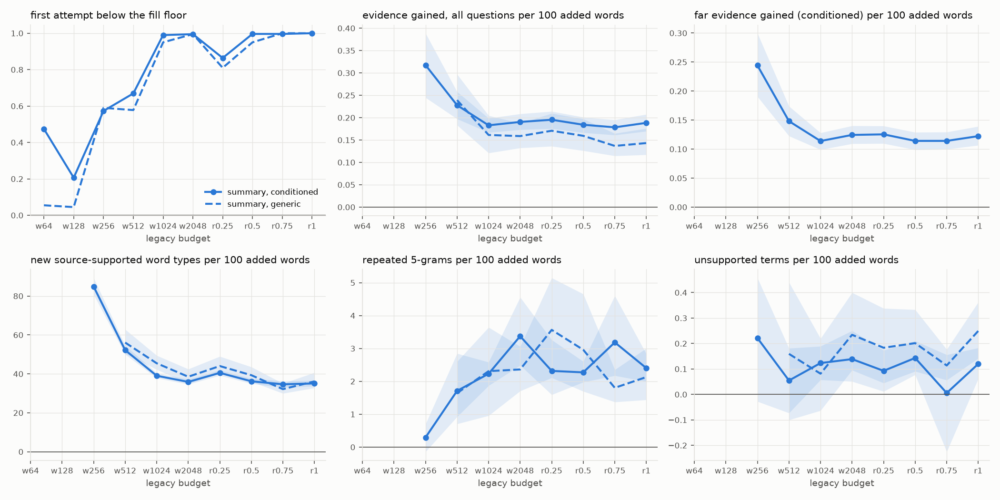

# Forced-fill diagnostic — legacy fill-corrected run `69f770571d22`, mistral24, qasper

Legacy prompt: aim for ceil(0.85 × cap) to cap words; shorter messages were re-prompted. Per 100 words added by correction, first attempt versus delivered message, same prompt and question. Ratio of totals with 95% document-bootstrap intervals.

## How often the writer stopped short on its own

| policy | budget | messages | first attempt short | in band | over cap | first words (median) | delivered words (median) |
|---|---|---:|---:|---:|---:|---:|---:|
| summary_conditioned | w64 | 780 | 0.47 | 0.39 | 0.14 | 55 | 57 |
| summary_conditioned | w128 | 780 | 0.21 | 0.49 | 0.30 | 121 | 119 |
| summary_conditioned | w256 | 780 | 0.57 | 0.24 | 0.18 | 210 | 232 |
| summary_conditioned | w512 | 780 | 0.67 | 0.18 | 0.15 | 386 | 467 |
| summary_conditioned | w1024 | 780 | 0.99 | 0.01 | 0.00 | 380 | 566 |
| summary_conditioned | w2048 | 780 | 0.99 | 0.00 | 0.00 | 312 | 526 |
| summary_conditioned | r0.25 | 780 | 0.86 | 0.08 | 0.05 | 384 | 532 |
| summary_conditioned | r0.5 | 780 | 1.00 | 0.00 | 0.00 | 335 | 546 |
| summary_conditioned | r0.75 | 780 | 1.00 | 0.00 | 0.00 | 313 | 536 |
| summary_conditioned | r1 | 708 | 1.00 | 0.00 | 0.00 | 290 | 513 |
| summary_generic | w64 | 200 | 0.06 | 0.40 | 0.55 | 66 | 58 |
| summary_generic | w128 | 200 | 0.04 | 0.40 | 0.56 | 131 | 119 |
| summary_generic | w256 | 200 | 0.59 | 0.26 | 0.15 | 210 | 224 |
| summary_generic | w512 | 199 | 0.58 | 0.22 | 0.20 | 415 | 449 |
| summary_generic | w1024 | 200 | 0.95 | 0.03 | 0.03 | 437 | 531 |
| summary_generic | w2048 | 200 | 0.99 | 0.01 | 0.00 | 388 | 512 |
| summary_generic | r0.25 | 200 | 0.81 | 0.07 | 0.12 | 446 | 532 |
| summary_generic | r0.5 | 200 | 0.95 | 0.03 | 0.02 | 421 | 536 |
| summary_generic | r0.75 | 200 | 1.00 | 0.00 | 0.00 | 385 | 550 |
| summary_generic | r1 | 180 | 1.00 | 0.00 | 0.00 | 362 | 500 |

## What the words added under correction contain

Evidence is highlighted-evidence recall summed over questions (question-equivalents). The corrected message is a fresh generation, so each value compares two complete messages per 100 net added words; where the net gain is small (see `net added`), rewording dominates and the values are unstable.

| policy | budget | pairs | net added (mean words) | evidence, all questions | now | far | new supported types | new unsupported types | repeated 5-grams | unsupported terms |
|---|---|---:|---:|---|---|---|---|---|---|---|
| summary_conditioned | w64 | 370 | 5 | +0.60 [+0.19, +1.02] | -0.14 [-0.38, +0.07] | +0.58 [+0.32, +0.83] | +148.20 [+134.74, +163.44] | +37.98 [+33.73, +42.96] | +0.05 [-0.58, +0.74] | +0.05 [-1.03, +1.06] |
| summary_conditioned | w128 | 161 | 17 | +0.67 [+0.40, +0.98] | -0.17 [-0.29, -0.05] | +0.65 [+0.44, +0.92] | +132.10 [+121.88, +143.77] | +35.47 [+31.82, +39.49] | +0.34 [-0.83, +1.71] | -0.41 [-1.41, +0.43] |
| summary_conditioned | w256 | 447 | 40 | +0.32 [+0.24, +0.39] | -0.01 [-0.04, +0.02] | +0.24 [+0.19, +0.30] | +84.90 [+80.78, +89.33] | +24.35 [+22.73, +25.95] | +0.29 [-0.14, +0.70] | +0.22 [-0.03, +0.46] |
| summary_conditioned | w512 | 522 | 130 | +0.23 [+0.20, +0.26] | +0.01 [+0.00, +0.02] | +0.15 [+0.12, +0.17] | +52.21 [+50.06, +54.60] | +14.28 [+13.31, +15.36] | +1.71 [+0.92, +2.85] | +0.05 [-0.07, +0.18] |
| summary_conditioned | w1024 | 772 | 217 | +0.18 [+0.17, +0.20] | +0.02 [+0.01, +0.02] | +0.11 [+0.10, +0.13] | +39.05 [+37.84, +40.43] | +9.51 [+8.82, +10.31] | +2.23 [+1.87, +2.58] | +0.12 [+0.06, +0.19] |
| summary_conditioned | w2048 | 776 | 252 | +0.19 [+0.17, +0.21] | +0.01 [+0.01, +0.02] | +0.12 [+0.11, +0.14] | +35.88 [+34.66, +37.20] | +7.93 [+7.25, +8.67] | +3.37 [+2.49, +4.56] | +0.14 [+0.05, +0.25] |
| summary_conditioned | r0.25 | 674 | 199 | +0.20 [+0.18, +0.21] | +0.02 [+0.01, +0.02] | +0.13 [+0.11, +0.14] | +40.53 [+39.19, +41.98] | +9.68 [+8.89, +10.52] | +2.32 [+1.59, +3.26] | +0.09 [+0.01, +0.17] |
| summary_conditioned | r0.5 | 777 | 255 | +0.18 [+0.17, +0.20] | +0.02 [+0.01, +0.02] | +0.11 [+0.10, +0.13] | +36.20 [+35.00, +37.56] | +8.20 [+7.45, +9.03] | +2.27 [+1.98, +2.61] | +0.14 [+0.08, +0.21] |
| summary_conditioned | r0.75 | 777 | 279 | +0.18 [+0.16, +0.20] | +0.02 [+0.01, +0.02] | +0.11 [+0.10, +0.13] | +34.66 [+33.03, +36.36] | +7.71 [+6.88, +8.64] | +3.18 [+2.17, +4.60] | +0.01 [-0.23, +0.16] |
| summary_conditioned | r1 | 708 | 277 | +0.19 [+0.17, +0.21] | +0.02 [+0.01, +0.02] | +0.12 [+0.11, +0.14] | +35.11 [+33.72, +36.64] | +7.61 [+6.74, +8.52] | +2.40 [+1.99, +2.83] | +0.12 [+0.06, +0.18] |
| summary_generic | w64 | 11 | 3 | +0.27 [-2.66, +3.13] | — | — | +105.71 [+45.81, +203.85] | +65.71 [+34.60, +105.01] | +0.00 [+0.00, +0.00] | +2.86 [+0.00, +12.12] |
| summary_generic | w128 | 9 | 4 | +0.42 [-3.13, +1.32] | — | — | +157.89 [+62.26, +745.91] | +76.32 [+21.95, +473.71] | +0.00 [+0.00, +0.00] | -2.63 [-9.09, +0.00] |
| summary_generic | w256 | 118 | 20 | +0.34 [+0.17, +0.53] | — | — | +93.18 [+82.34, +105.94] | +29.61 [+25.08, +34.88] | +0.94 [+0.25, +1.66] | +0.00 [-0.58, +0.60] |
| summary_generic | w512 | 115 | 71 | +0.24 [+0.18, +0.30] | — | — | +56.09 [+50.48, +62.85] | +16.86 [+14.34, +19.87] | +1.64 [+0.71, +2.60] | +0.16 [-0.10, +0.44] |
| summary_generic | w1024 | 190 | 116 | +0.16 [+0.12, +0.20] | — | — | +45.45 [+42.24, +49.47] | +11.67 [+10.02, +13.75] | +2.31 [+0.96, +3.64] | +0.08 [-0.06, +0.22] |
| summary_generic | w2048 | 199 | 150 | +0.16 [+0.13, +0.19] | — | — | +38.54 [+35.06, +42.48] | +9.78 [+8.08, +11.88] | +2.36 [+1.71, +3.06] | +0.23 [+0.10, +0.40] |
| summary_generic | r0.25 | 162 | 135 | +0.17 [+0.14, +0.21] | — | — | +44.03 [+40.23, +48.98] | +11.06 [+9.22, +13.52] | +3.57 [+2.11, +5.15] | +0.18 [+0.04, +0.34] |
| summary_generic | r0.5 | 190 | 162 | +0.16 [+0.13, +0.20] | — | — | +39.33 [+36.04, +43.57] | +9.62 [+7.83, +11.91] | +2.96 [+1.70, +4.66] | +0.20 [+0.09, +0.33] |
| summary_generic | r0.75 | 200 | 273 | +0.14 [+0.11, +0.16] | — | — | +32.16 [+29.98, +35.11] | +6.20 [+4.92, +7.99] | +1.80 [+1.37, +2.35] | +0.11 [+0.06, +0.18] |
| summary_generic | r1 | 180 | 183 | +0.14 [+0.12, +0.18] | — | — | +36.16 [+32.82, +40.69] | +8.08 [+6.36, +10.57] | +2.13 [+1.44, +3.01] | +0.25 [+0.14, +0.36] |

First attempts whose text was not in the cache: 0.

## Legacy forced fill and exp5_cap_only side by side at 256 words

The prompts differ beyond the fill instruction, so this compares protocols, not fill alone. Evidence columns are mean highlighted-evidence recall per question.

| protocol | policy | messages | words | all questions | now | near | far | repeated 5-grams /100w | unsupported /100w |
|---|---|---:|---:|---:|---:|---:|---:|---:|---:|
| legacy forced fill | summary_conditioned | 780 | 229 | 0.438 | 0.585 | 0.389 | 0.342 | 0.35 | 0.42 |
| legacy forced fill | summary_generic | 200 | 222 | 0.374 | — | — | — | 0.21 | 0.26 |
| exp5_cap_only | summary_conditioned | 780 | 175 | 0.396 | 0.648 | 0.305 | 0.250 | 0.69 | 0.73 |
| exp5_cap_only | summary_generic | 200 | 198 | 0.413 | — | — | — | 0.32 | 1.76 |

